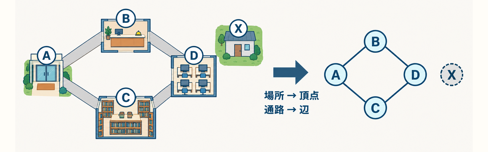
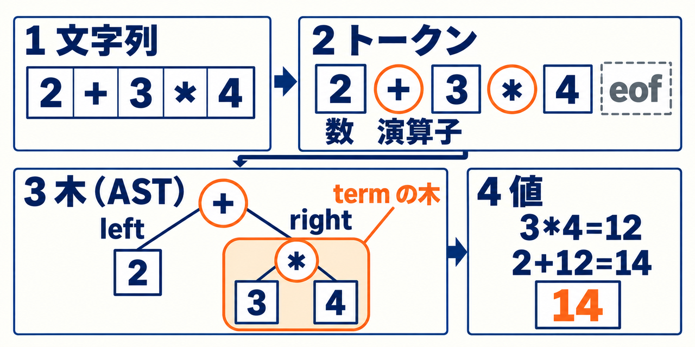

# ソフトウェアデザイン 2026


情報システム学科3年生向け、選択2単位の授業教材です。2026年度シラバスに沿う第2〜15回の14回分を収録しています。第1回ガイダンスは実施済みとして、環境準備から接続します。

Pythonの基礎から始め、データ構造とアルゴリズム、グラフによる問題のモデル化へ進みます。後半は電卓とLispで小さな言語処理系を作り、最後にLispで書いた評価器とREPLをPython host上で動かします。読取や入出力などはhostに残し、式の意味を決める核心をLispで書きます。生成AIは学習相手として使い、結果を予測し、自分の言葉で説明し、実行して確かめます。

|入口|内容|
|---|---|
|[PDF一覧](docs/pdf-manifest.json)|各回のスライドPDF14冊、学生向け演習冊子、教師用補足の全16冊・640ページ|
|[演習冊子](output/pdf/student-workbook.pdf)|学生向けの自習演習（A4・64ページ）|
|[検証済みGist](docs/gist-samples.md)|第03〜11回から選んだ公開学習サンプル6件と、その検証結果|
|[examples](examples/)|各回で単独に動く段階別referenceとstarter|

各回の原稿・PDF・演習は、次の配布資料の表から開けます。

## 学習の流れ

|段階|回|学ぶ内容|確かめること|
|---|---|---|---|
|1 基礎|02–03|Pythonの基礎、AI時代の学習と開発|入力・途中の状態・出力を順に追う。期待値は実装の出力から写さず、仕様と手計算から決める|
|2 データ構造とグラフ|04–07|データ構造とアルゴリズム、グラフによる問題のモデル化、実装と提出の演習、講評|入力が2倍のときの回数の増え方（時間の測定ではない）と二分探索の前提。BFSのparentと移動数 `len(path) - 1`。DFSとBFSを区別できるテスト|
|3 電卓からLispへ|08–11|電卓の解析と実行、LispのREPLと四則、変数と関数定義、スクリプトと準備|文字列がトークン・木・値14へ変わる流れと、止まる段階。defineと環境。closureが定義時の環境を保持すること（第10回の図ではC5がE5を参照）。スクリプトの複数の式が大域環境Gを共有すること|
|4 Lispで書く評価器|12–15|Lispで書く評価器、理解確認と討論、Lisp製評価器とREPL、処理系の講評・総括|第12回は、自己評価される値だけを扱うstarterにquote、算術適用の順で加える（対象環境は空）。第14回で名前・関数・closure・REPLへ進む。大域で定義したfactのclosureはGのコピーではなくGへの参照を保存し、`(fact 4)` は24になる。講評では、1つの動作を実行ログ・受入例・環境図・コードで裏付ける|

第14回の評価器とREPLはPython host上で動きます。式の意味を決める評価はLisp側で行い、読取・primitive・入出力・guardはhostが担います。Pythonから独立したネイティブbootstrapは到達範囲に含みません。

## 配布資料

|回|内容|Slidev原稿|配布PDF|学生演習|
|---|---|---|---|---|
|02|Pythonの基礎|[原稿](lectures/02.md)|[PDF](output/pdf/02-python-basics.pdf)|[演習](exercises/02.md)|
|03|AI時代の学習と開発|[原稿](lectures/03.md)|[PDF](output/pdf/03-ai-workflow.pdf)|[演習](exercises/03.md)|
|04|データ構造とアルゴリズム|[原稿](lectures/04.md)|[PDF](output/pdf/04-algorithms.pdf)|[演習](exercises/04.md)|
|05|グラフによる問題のモデル化|[原稿](lectures/05.md)|[PDF](output/pdf/05-graphs.pdf)|[演習](exercises/05.md)|
|06|実装と提出の演習|[原稿](lectures/06.md)|[PDF](output/pdf/06-route-project.pdf)|[演習](exercises/06.md)|
|07|講評とディスカッション|[原稿](lectures/07.md)|[PDF](output/pdf/07-review.pdf)|[演習](exercises/07.md)|
|08|電卓の解析と実行|[原稿](lectures/08.md)|[PDF](output/pdf/08-calculator.pdf)|[演習](exercises/08.md)|
|09|LispのREPLと四則|[原稿](lectures/09.md)|[PDF](output/pdf/09-lisp-arithmetic.pdf)|[演習](exercises/09.md)|
|10|変数と関数定義|[原稿](lectures/10.md)|[PDF](output/pdf/10-lisp-functions.pdf)|[演習](exercises/10.md)|
|11|スクリプトと準備|[原稿](lectures/11.md)|[PDF](output/pdf/11-lisp-scripts.pdf)|[演習](exercises/11.md)|
|12|Lispで書く評価器|[原稿](lectures/12.md)|[PDF](output/pdf/12-meta-evaluator.pdf)|[演習](exercises/12.md)|
|13|理解確認と討論|[原稿](lectures/13.md)|[PDF](output/pdf/13-language-review.pdf)|[演習](exercises/13.md)|
|14|Lisp製評価器とREPL|[原稿](lectures/14.md)|[PDF](output/pdf/14-selfhosting.pdf)|[演習](exercises/14.md)|
|15|処理系の講評・総括|[原稿](lectures/15.md)|[PDF](output/pdf/15-showcase.pdf)|[演習](exercises/15.md)|

[学生向け演習冊子（A4）](output/pdf/student-workbook.pdf)と[教師用補足・公開解説（A4）](output/pdf/instructor-notes.pdf)もあります。教師用のMarkdownは[instructor/](instructor/)です。解説・referenceは学習のために公開した例であり、実際の学生回答や採点結果を含みません。

第2回は62ページの自習用教材です。変数と値、条件分岐、反復、リストと辞書、関数とreturn、スコープ、例外を、入力・途中の状態・出力の順に追います。編集可能な図、誤りと修正の比較、理由付きの確認問題を含み、提出の案内は末尾の付録にまとめています。[第2回の概念デモ](examples/02-basics/README.md)は12ケースを個別に実行できます。

第4・8・10・11・12・14回も、入力・途中状態・戻り値の接続を補い、確認問題の後に理由付き解答を置いています。第12回の最小評価器から第14回の名前・関数・REPLへ進む経路を示し、完成参照で観察したことと自作部分を区別して学べます。

## 図で見る授業の例

授業スライドの説明図から2枚を紹介します。画像を選ぶと原寸で開きます。図の用語と数値は、対応するPDFのページと照合してください。

**第05回 校内図からグラフへ**（[第05回PDF](output/pdf/05-graphs.pdf) p6）

[](lectures/assets/illustrations/05-campus-map-to-graph.png)

場所を頂点に、通路を辺に写します。1本の通路を1辺と数えます。通路のないXには辺がありません。

**第08回 カードと木**（[第08回PDF](output/pdf/08-calculator.pdf) p7）

[](lectures/assets/illustrations/08-cards-to-tree.png)

文字列 `2+3*4` がトークン、木（AST）、値14へと変わる流れです。`3*4` はtermの木としてまとまり、`eof` は終端の印です。

## 実行環境

サンプルはPython **3.12以上**と標準ライブラリで動きます。自由に使えるPCとエディタを用意し、実行コマンドが使用する版を確認します。

```sh
python3 --version
python3 examples/02-basics/concepts.py for-trace
python3 examples/02-basics/order_summary.py
python3 examples/08-calculator/calculator.py --eval '2+3*4'
python3 examples/09-lisp-arithmetic/lisp.py --eval '(+ 1 (* 2 3))'
```

Macでpython3が古い場合はPython3.12以上をPATHに設定するか、コマンドをpython3.12に置き換えます。Makefileの検証はpython3.12を既定にしています。

```sh
make test
make test PYTHON=python3.13
```

## SlidevとPDFの再生成

Node.js22以上とnpmを使用します。package-lock.jsonで依存を固定し、日本語・コードのフォントをローカル依存から読み込みます。PDF閲覧時にフォントの追加インストールは不要です。

```sh
npm ci
npx playwright install chromium
npm run dev
npx slidev lectures/10.md --port 3030
npm run export
node scripts/export-workbooks.mjs
```

`npm run export`は14回のスライドPDFを出力します。`make export`はそれに加えて学生冊子と教師用補足も生成します。特定回だけなら `node scripts/export-pdfs.mjs 02 10`。静的なSlidev閲覧用サイトは `npm run build` で `dist/02`〜`dist/15`に生成します。リポジトリは授業資料の保管先で、サイトの公開を自動実行しません。

スライドPDF出力後は、原稿のスライド数とPDFページ数、および描画エラーの有無を自動照合します。図の意味と紙面の読みやすさは、実PDFの目視確認も必要です。

## 段階的なプロジェクト

[examples/](examples/)の各フォルダは単独で動く段階別referenceです。後の回のファイルへ依存せず、前段階の動作を保って拡張できます。各READMEの仕様・入口・starterの変更場所を確認してください。

第10回には、クロージャが保持する環境と再帰の戻り順を観察する[実行追跡](examples/10-lisp-functions/README.md#環境寿命と再帰を観察する補足)があります。第14回には、最小評価器・名前・関数・REPLを順に確かめる[チェックポイント](examples/14-selfhosting/README.md#完成評価器で確かめる段階チェックポイント)があります。先に結果を予測し、実行後に講義の途中状態と照合して復習できます。

```sh
python3 examples/10-lisp-functions/learning_trace.py closure
python3 examples/14-selfhosting/checkpoints.py all
```

- 第06回は、同一点・隣接点で動く未完成の経路starterと、公開referenceを分けています。
- 第09〜15回のstarterは、完成処理系にsquareを追加した実行可能な拡張の入口です。TODO穴埋めではなく、仕様を変えてテストする演習です。
- 第12回以降には、自己評価される値から始めるLisp製評価器のstarterがあります。
- 第14回はLispで書いた評価器とREPLをPython host上で動かします。字句・構文の読取や入出力などのhost支援を残し、式の意味を決める核心をLispで実装します。Pythonを除去したネイティブbootstrapは到達範囲に含みません。

```sh
python3 examples/14-selfhosting/lisp.py --meta --eval '((lambda (x) (+ x 1)) 4)'
python3 examples/14-selfhosting/lisp.py --selfhost-repl
python3 examples/15-showcase/check_compatibility.py
```

## シラバスとの対応と授業での扱い

[カリキュラム対応表](docs/curriculum.md)に各回の到達点・演習・検証・過年度との対比を記載しています。第06回は授業内の実装・提出、第07回は講評と質疑、第13回は理解確認の討論、第15回は講評・総括を中心にします。評価はシラバスの**知識・理解100%、演習課題100%**に従います。

生成AIは学習と開発の両方で利用を推奨します。目的、採用判断、検証、振り返りを残し、AIが提案した部分も説明できることを目指します。予習・復習は授業時間と同程度を想定します。

2026年度の1コマの正確な分数、提出先・期限、課題ごとの点数配分、Lisp方言・host言語はシラバスで指定されていません。本教材のPython host、Lispの仕様、フォルダ構成・提出物の例は教材上の設計です。授業内の案内が優先します。

## 出典・公開範囲・利用条件

図、データ、コード、講評用の提出例はこの教材のために新規作成しています。原シラバス・過年度資料のファイル、個人情報、第三者画像、学生提出物、実採点データは収録していません。[出典とフォント](docs/sources.md)に公式文書と依存のライセンスを記載しています。

新作教材全体の包括的な再利用ライセンスは指定していません。リポジトリの公開と授業での配布のために収録しています。依存パッケージ・フォントには、それぞれの既存ライセンスが適用されます。npmへのパッケージ公開は行いません。

## 検証

```sh
make test
make privacy
python3.12 scripts/render-pdfs.py
```

render-pdfs.pyはPopplerのpdftoppmを使い、全ページをtmp/pdf-qaへ出力します。生成後は画像と実際のPDF/Slidevを確認してください。検証記録は[docs/verification.md](docs/verification.md)、再現可能な自動チェックは[GitHub Actions](.github/workflows/verify.yml)にあります。

リポジトリを配布の正本として参照してください。今回の全体調整ではZIPとLibraryを更新していません。

## 図解と公開サンプル

第02〜15回の授業スライドに説明図のPNG 26枚と、説明用のスライド27ページを追加しました（[説明図の第二次改訂](docs/visual-explanation-v2.md)）。配布PDFは、授業スライド14冊・533ページ、自習演習64ページ、教師用補足43ページの全16冊・640ページです。図のカードや名札などは説明模型で、実際のメモリ配置や番地を表すものではありません。図・コード・実行結果は同じ例で照合しています。[概念と図解の対応](docs/visual-learning-map.md)、[各回の完成記録](docs/course-rollout.md)、[検証済み公開Gist](docs/gist-samples.md)も参照してください。提出・採点・受入例と、必須・発展の区分は変更していません。

ローカルでは、Python 3.12.13と3.14.7で回帰テスト・互換fixture・共通runnerが合格し、PDF検証も合格しています。授業図解を確定したcommit 5a6de3cの遠隔CIでは、Python 3.12と3.14のexamplesが成功しました。exportsは依存監査（`npm audit --audit-level=low`）で失敗しています。原因はSlidev側の既存依存にある既知のadvisoryで、同じログにはbraces・KaTeX・sprintf-jsなどが含まれます（監査表示は17 vulnerabilities）。これはPDF検証の合格とは別の結果として扱い、依存と監査gateは変えずに残しています。
