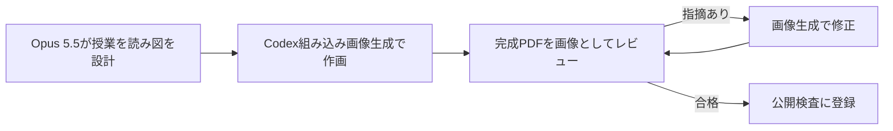

# 第02〜15回 説明図の第二次改訂

2026-10-06の第二次改訂で、第02〜15回の授業スライドに説明図を追加しました。図は、状態の変化や2つの方法の違いを追うためのものです。元の例・数値・コード・表・native図と、演習・提出の条件は原稿にそのまま残しています。

| 項目 | 内容 |
| --- | --- |
| 新しい画像 | PNG 26枚 |
| 新しいスライド | 27ページ。第08回は、画像を載せた2ページと、既存の図・表から作った照合用の1ページ |
| 授業スライドPDF | 第02〜15回の14冊、計533ページ |
| 変更していないPDF | 自習演習64ページ、公開教員補足43ページ |
| 全PDF | 16冊、計640ページ（[PDFの一覧](pdf-manifest.json)） |

## 作成の工程

実Claude Codeの `claude-opus-5-5` が各回の完成PDFを読み、不足を評価しました。そのうえで図の構成と、Codexへの画像生成の指示を作りました。作画にはCodexの組み込み画像生成を使い、完成PDFの画像レビューで受けた指摘に従って修正しました。

## 各回の図と、学生が確かめること

位置は完成PDFのページ番号です。

| 回 | 新しい図と位置 | 図が示す概念 | 学生が確かめること |
| --- | --- | --- | --- |
| 02 | [名札で見比べる共有とcopy](../lectures/assets/illustrations/python02-shared-list-name-tags.png) p23 [結果の行き先](../lectures/assets/illustrations/python02-return-vs-print.png) p42 | `b = a` による共有と、copyで外側のリストを分けること。returnとprintで結果の行き先が違うこと | 各段は独立した例で、どれも `a = [200, 120]` から始まる。80がどの名前から見えるか。showの戻り値は `None` で、画面に表示した400はxへ返らない |
| 03 | [2つの机](../lectures/assets/illustrations/ai03-what-remains-two-desks.png) p5 [期待値の出どころ](../lectures/assets/illustrations/ai03-expected-value-source.png) p15 | 答えを貼るだけの使い方と、学習相手にする使い方で、手元に残るものの違い。実装の出力を期待値に写す誤り | 右のノートに残る疑問・予想・実行結果・説明と、自分の記録に加える1行。意図的な誤り例 `highest_draft` の出力0と、仕様と手計算から求めた期待値 -1 の不一致 |
| 04 | [入力が2倍のときの回数](../lectures/assets/illustrations/algo04-doubling-square.png) p11 [pop(0)とpop()](../lectures/assets/illustrations/algo04-list-pop-shift.png) p18 [二分探索の前提](../lectures/assets/illustrations/algo04-binary-search-premise.png) p25 | 一重ループと二重ループの回数の増え方。先頭と末尾から取り出すときの添字の変化。二分探索が整列を前提とすること | 一重は100回から200回、二重は10,000回から40,000回になる。これは回数のモデルで、実行時間の測定ではない。上段はA、下段はCを取り出す独立した例。昇順の例は添字5で見つかり、未整列の `[8, 2, 6, 4]` では8を見落としてNoneになる。公開の閉区間版は最初に2を比べる |
| 05 | [校内図からグラフへ](../lectures/assets/illustrations/05-campus-map-to-graph.png) p6 [Dを2度登録しない](../lectures/assets/illustrations/05-discovered-once-ledger.png) p20 | 場所と通路を頂点と辺に写すこと。parentで発見済みかを判定すること | 1本の通路を1辺と数え、孤立したXには辺がない。今回の要求に不要な情報を1つ挙げる。CからDを見たときにqueueとparentを変えない理由を、図とコードで説明する |
| 06 | [経路リストと移動数](../lectures/assets/illustrations/06-path-list-vs-moves.png) p6 | 経路の頂点数と、移動数 `len(path) - 1` の違い | `A → B → D` は3駅で移動2回、`A → A` は `[A]` で移動0回。列車は移動回数の比喩で、所要時間は表さない |
| 07 | [区別できるテスト](../lectures/assets/illustrations/07-distinguishing-test.png) p17 | DFSとBFSの違いを検出できるテスト入力 | 架空の講評例では、A→Bはどちらも1辺、A→DはDFSが4辺、BFSが2辺になる。2つの実装を区別できる入力を自分で選ぶ |
| 08 | [カードと木](../lectures/assets/illustrations/08-cards-to-tree.png) p7 [3つの停止段階](../lectures/assets/illustrations/08-three-stops.png) p31 実際のCLIエラーとの照合 p33 | 文字列がトークン、木、値14へと変わる流れ。字句・構文・評価のどの段階で止まるか | termが返すのは木で、`eof` は終端の印。3つの入力がどこまで作れて止まるか（この比較では `eof` を省略）。p33で実際のエラー文・column・終了コード1と照合する。詳細は[第08回の記録](visual-explanation-08.md) |
| 09 | [同じ計算の2つの書き方](../lectures/assets/illustrations/09-infix-prefix-same-tree.png) p4 [4段階で形を変える入力](../lectures/assets/illustrations/09-read-eval-print-pipeline.png) p10 | 中置記法と前置記法が同じ計算構造を表すこと。字句・読取・評価・表示の4段階 | 電卓は優先順位で、Lispは括弧でまとまりを示し、どちらも値は7。木が同じとは計算構造が同じという意味で、ASTと入れ子リストは別の表現。読取を終えた時点で7がもう計算されているかを、図を指して説明する |
| 10 | [defineの前後](../lectures/assets/illustrations/10-define-adds-binding.png) p8 [E5への参照が残る](../lectures/assets/illustrations/10-closure-keeps-e5.png) p19 | 同じGでの検索の失敗、登録、再検索。呼出しが終わってもC5がE5を参照し続けること | defineは値5を登録して名前widthを返し、再検索で5を得る。図は状態2〜4を示し、紐は参照、矢印は外側の環境を表す。G・E5・E3・C0・C5は説明用のラベルで、メモリ番地ではない |
| 11 | [5式とGの共有](../lectures/assets/illustrations/11-script-shared-global.png) p9 | スクリプトの複数の式が、1つの大域環境Gを共有すること | 1番目の式で登録したsquareを、2番目と4番目の式が使う。x=5とx=7はそれぞれ別の局所環境にあり、どちらの外側もG。出力は25と49で、最後の値 `()` も表示される。右下は架空の誤り案 |
| 12 | [ホストと対象の環境](../lectures/assets/illustrations/12-host-and-target-environments.png) p5 [2つのquoteが外れる段階](../lectures/assets/illustrations/12-double-quote-layers.png) p14 | m-evalの実装に使うホストの操作と、対象式で使える算術の区別。二重quoteがどの層で外れるか | 対象環境は空。`+ - * /` は、m-evalが先頭を確認してからprimitive経由で呼ぶ。結果の `(+ 1 2)` は再評価されないので3にはならない。CLIの `--meta --eval "(quote (+ 1 2))"` は図の2から始まる |
| 13 | [1つの式で回す議論](../lectures/assets/illustrations/l13-discussion-cycle-if.png) p5 [読取は名前を探さない](../lectures/assets/illustrations/l13-quote-read-vs-eval.png) p9 | 予測・観察・説明・反例の循環。読取と評価の区別 | ifは選んだ枝だけを評価して8を返す。通常の関数として定義したmy-ifは、引数の `(/ 1 0)` を先に評価して失敗する。`(quote missing)` はデータをそのまま返し、quoteのないmissingだけが評価時にGを探してunknown symbolになる |
| 14 | [式を3つの層で追う](../lectures/assets/illustrations/l14-meta-eval-layers-7.png) p9 [コピーではなく参照](../lectures/assets/illustrations/l14-closure-shared-env-vs-copy.png) p17 | 値がホストとLisp製評価器の層を往復する流れ。closureがGのコピーではなくGへの参照を保存すること | read_all・primitive・printはPythonホストが担い、式の意味はm-evalが決める。途中で6を経て、7を表示する。後からm-defineで登録したfactが `(fact 4)` の中で見つかり、結果は24になる |
| 15 | [作者と聞き手の1往復](../lectures/assets/illustrations/l15-review-pair-example-b.png) p6 [4つの証拠](../lectures/assets/illustrations/l15-four-evidence-add10.png) p18 | 講評の1往復。1つの動作を4種類の証拠で裏付けること | 結果の5だけでは、外側のxが壊れたかどうか分からない。その後にxを読み、例Bの4と参照処理系の100を区別する。`(add10 3)` → 13を、実行ログ・受入例・環境図・コードで確かめる。受入例は、hostとmetaの両方がexpected 13と一致したときにPASSになる |

第03回は、AIから答えを得る活動と5つの学習行為を結びつける設計を保っています。AnswerVsLearning、LearningLoop、5つの学習行為の画像、主例 `highest` の流れは変えていません。

## 架空の例と、意図的な誤り

図に含まれる誤りは、どれも教材用に作った架空の例です。それぞれ参照の正解と照合しました。学生データは使っていません。

| 回 | 架空の例・意図的な誤り | 照合した参照の正解 |
| --- | --- | --- |
| 03 | `highest_draft` は `[-3, -1, -5]` に対して0を返す | 仕様の期待値は -1。空リストは `ValueError` |
| 07 | 架空の提出例 `flawed_route.py` が、A B E F D（4辺）を「最短」と表示する | `improved_route.py` は A C D（2辺）を返す |
| 11 | 式ごとに大域環境Gを作り直す案 | 参照版はGを共有し、25・49・`()` を出力する |
| 14 | 古いGのコピーを保存する案 | 参照版は同じGを参照し、`(fact 4)` は24 |
| 15 | 例Bは、1つの表に x=4 を書き込む | 参照処理系では `(f 4)` は5で、その後の x は100のまま |

## 検証

各項目は下表の範囲で確認しました。PDFと画像のSHA、検証の範囲は[検証記録](visual-explanation-v2-verification.json)、Gistの一覧は[検証済み公開学習サンプル](gist-samples.md)にあります。

| 検証 | 範囲 | 結果 |
| --- | --- | --- |
| 同じ例の照合 | 図・コード・出力で共通の例を、独立したoracleと、Python 3.12.13・3.14.7で実行 | 一致 |
| 既存の回帰テスト | 213件 | 両方の版でそれぞれPASS |
| 互換fixture | 15件 | 両方の版でそれぞれPASS |
| 共通runner | 21件 | 両方の版でそれぞれPASS |
| 公開Gist | 6件・24ファイルについて、所有者と全ファイルのSHAをreadbackで確認 | 一致。第03回はREADMEのページ参照だけを更新 |
| 完成PDFのレビュー | 実Opusが独立した文脈で、16冊すべての全ページを画像として読む。Codexも画像を1枚ずつ確認 | 合格 |
| 画像の公開検査 | 旧4画像は変更なし。新しい26画像を、個別のパスとSHA-256で登録 | 登録にない画像や、同じパスで内容が変わった画像は検査で失敗する |

提出、採点、受入例、解答、授業時間、必須と発展の区分は変更していません。

## 限界

| 項目 | 内容 |
| --- | --- |
| 画像の作成 | 画像の文字・線・形は、すべてCodexの組み込み画像生成が描いた。ローカルでの加工は、機械的なresizeとcontainだけ。返却結果に正確な画像モデルIDが含まれていなかったため、特定のモデル名は記載しない |
| 説明模型 | カード・名札・封筒・掲示板・列車・机は説明模型で、実際のメモリ配置や番地を表すものではない。本文・数値・コードを画像だけに移してはいない |
| 検査の範囲 | 有限個の例と検査による確認で、すべての入力での正しさを証明するものではない |
| 依存監査 | Slidev依存の監査は、既知のbraces advisoryにより失敗する状態。本人の了承を得て改訂を続けた。依存と監査条件は変えず、Python CIとは別の項目として残している |
| 反映の記録 | commit・push・遠隔CIの結果は、この記録では断定しない。[検証記録](visual-explanation-v2-verification.json)を参照する |
| 任意の改善 | 監査で挙げた本文の補足やnative図の変種のうち、今回反映していないものは任意の改善候補 |
