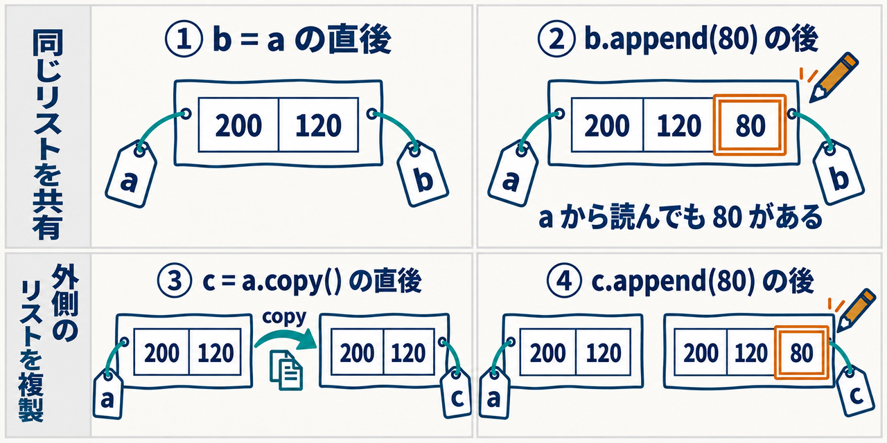
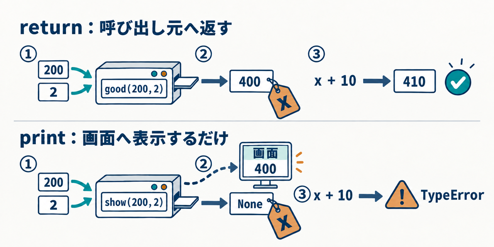

<div class="eyebrow">SOFTWARE DESIGN 2026 / 02</div>

# Pythonの基礎
## 値の変化を追い、処理の理由を理解する

図解と実行トレースで学ぶ自習教材

---

# この資料の読み方

コードの出力を先に予測し、図と実行表で理由を確認する。分からない箇所は短い例を別ファイルへ保存して試す。

|学ぶ内容|確かめること|
|---|---|
|値・名前・型・演算|何を計算し、どの名前が変わるか|
|条件分岐・反復|どの行を、何回、どの順に実行するか|
|リスト・辞書|位置やキーで、どの値を読むか|
|関数・エラー|どこから値を受け取り、どこへ返すか|

第1回で準備したPython **3.12以上**とエディタを使う。理由つき解答も載せているので、予測を残してから読む。

---

# ファイルとターミナルの役割

<div class="study-grid">
<div>

エディタで `hello.py` を保存する。

```python
price = 200
quantity = 2
print(price * quantity)
```

ファイルには「実行する手順」を書く。保存しただけでは計算結果は表示されない。

</div>
<div>

ターミナルで、保存した場所から実行する。

```bash
python3 --version
python3 hello.py
```

表示例は `Python 3.12.x` 以上と `400`。Pythonが上の行から順に処理する。

対話画面の `>>>` は入力の目印。ファイルへ記号を写さない。資料の各短例は、別ファイルで独立して実行する。

</div>
</div>

---

# 値と、値を表示する処理

<div class="study-grid">
<div>

```python
200 + 120
print(200 + 120)
print("ノート")
```

1行目は320を計算するが、ファイル実行では画面へ表示しない。2行目は計算結果をprintへ渡して表示する。

</div>
<div>

|実行する行|計算した値|表示|
|---|---|---|
|`200 + 120`|整数320|なし|
|`print(200 + 120)`|printへ渡す整数320|320|
|`print("ノート")`|printへ渡す文字列|ノート|

引用符は文字列の範囲を表す。printの通常の表示では、その引用符を付けずに中身を表示する。

</div>
</div>

---

# 型は、値ができる操作を決める

<div class="study-grid">
<div>

```python
price = 200
ratio = 0.1
name = "ノート"
available = True
print(type(price))
# <class 'int'>
```

名前priceに「型を宣言して箱を作る」のではなく、値200がintという型を持つ。

</div>
<div>

|型|値の例|
|---|---|
|int|200、-1|
|float|0.1、3.5|
|str|"ノート"、"200"|
|bool|True、False|
|NoneType|None|

`"200"` は数字の形をした文字列。整数200とは型も操作も異なる。

</div>
</div>

---

# 名前と値を結び付ける代入

<div class="study-grid">
<div>

```python
quantity = 2
print(quantity)  # 2
quantity = 3
print(quantity)  # 3
```

右辺の値を求め、その値を左辺の名前へ結び付ける。2回目の代入以降、quantityを読むと3を得る。

</div>
<div>

|実行直後|quantityが指す値|
|---|---:|
|`quantity = 2`|2|
|最初のprint|2のまま|
|`quantity = 3`|3|
|次のprint|3のまま|

printは名前を読むだけで、quantityを変更しない。名前は大文字・小文字を区別する。`Quantity` は別の名前。

</div>
</div>

---

# 代入で変わるのは、名前の参照先

<div class="study-grid">
<div>

```python
a = 2
b = a
a = a + 1
print(a, b)  # 3 2
```

① `b = a` で、bも整数2を指す。

② 右辺 `a + 1` を先に計算する。その結果3へaを結び直す。

</div>
<div><PythonDiagram kind="rebind" /></div>
</div>

<div class="study-note">

aを結び直す時、bへ再代入はしていない。だからbは2のまま。

</div>

---

# 右辺の計算と、等しいかの比較

<div class="study-grid">
<div>

```python
quantity = 2
quantity = quantity + 1
same = quantity == 3
print(quantity, same)
# 3 True
```

右辺のquantityは、代入前の2を読む。2+1を計算してから名前を3へ結び直す。

</div>
<div>

|記法|役割|
|---|---|
|`quantity = 3`|名前を3へ結び付ける|
|`quantity == 3`|等しいかを比較する|
|`quantity += 1`|整数に1を加えて再代入|

**確認**：比較を100回実行したらquantityは増える？

**答え**：増えない。比較は値を読む操作で、代入ではない。

</div>
</div>

---

# 演算子と、計算結果の型

|式|結果|読み方|
|---|---:|---|
|`7 + 2` / `7 - 2`|9 / 5|加算 / 減算|
|`7 * 2` / `2 ** 3`|14 / 8|乗算 / べき乗|
|`7 / 2`|3.5|通常の除算。整数同士でもfloat|
|`7 // 2`|3|切り下げた商|
|`7 % 2`|1|余り。偶数・奇数の判定にも使う|

`//` は0へ切り捨てる操作ではなく、小さい方の整数へ切り下げる。`-7 // 2` は-4になる。0での除算は `ZeroDivisionError`。

---

# 優先順位と、括弧で示す計算の順

<div class="study-grid">
<div>

```python
print(2 + 3 * 4)    # 14
print((2 + 3) * 4)  # 20
```

1つ目は乗算を先に実行する。2つ目は括弧の中を先に実行する。見た目の左から一律に計算するわけではない。

</div>
<div>

|式|先に求める値|次の計算|
|---|---|---|
|`2 + 3 * 4`|`3 * 4` が12|`2 + 12` が14|
|`(2 + 3) * 4`|`2 + 3` が5|`5 * 4` が20|

**確認**：`10 - 2 * 3` と `(10 - 2) * 3` は？

**答え**：4と24。括弧が計算の対象を変えるため、式全体の結果も変わる。

</div>
</div>

---

# 文字列の連結と、数値への変換

<div class="study-grid">
<div>

```python
print(200 + 120)      # 320
print("200" + "120")  # 200120
print(int("200") + 120)
# 320
```

文字列の+は文字をつなぐ。intは整数として解釈できる文字列を整数へ変換する。

</div>
<div>

```python
text = "2"
quantity = int(text)
print(type(text))
# <class 'str'>
print(type(quantity))
# <class 'int'>
```

textは"2"のまま。変換で得た整数2をquantityへ代入している。

`200 + "120"` はTypeError。Pythonは、この加算で文字列を自動的に整数へ変換しない。

</div>
</div>

---

# inputの結果と、変換できない入力

<div class="study-grid">
<div>

```python
text = input("個数: ")
quantity = int(text)
print(quantity * 200)
```

2を入力してEnterを押す。inputからは文字列"2"が返る。intで整数2へ変換し、400を計算する。

</div>
<div>

|入力文字列|変換結果|
|---|---|
|"2"|整数2|
|"0"|整数0|
|"two"|ValueError|
|"2.5"|ValueError|

入力の形式と、変換後の値が仕様に合うかは別の確認。"-1"は整数へ変換できるが、個数として許すかは条件で判断する。

</div>
</div>

---

# 小数の計算と、表せる値の限界

<div class="study-grid">
<div>

```python
print(0.1 + 0.2)
# 0.30000000000000004
```

floatは有限の桁数で数を表す。0.1などを二進数で正確に表せないため、計算に近似誤差が含まれる。

</div>
<div>

```python
import math
print(math.isclose(0.1 + 0.2, 0.3))
# True
```

importは標準ライブラリmathを読み込む。iscloseは、許容差の範囲で近いかを判定する関数。必要な許容差は用途に応じて決める。

この授業の円単位の金額はintで扱う。小数を丸めるルールを勝手に追加しない。

</div>
</div>

---

# 比較の結果は、条件に使う真偽値

<div class="study-grid">
<div>

```python
quantity = 0
print(quantity < 0)   # False
print(quantity == 0)  # True
print(quantity > 0)   # False
```

`<`、`<=`、`>`、`>=`、`==`、`!=` は値を比較する。条件が成立すればTrueになる。

</div>
<div>

|quantity|`< 0`|`== 0`|`> 0`|
|---:|---|---|---|
|-1|True|False|False|
|0|False|True|False|
|1|False|False|True|

境界0を含むかで、`<` と `<=` は結果が違う。条件を書く時は、境界の直前・境界・直後を確かめる。

</div>
</div>

---

# if・elif・elseで実行する枝を選ぶ

<div class="study-grid">
<div>

```python
quantity = 0
if quantity < 0:
    print("負数")
elif quantity == 0:
    print("注文なし")
else:
    print("注文あり")
```

最初に成立した条件の枝だけを実行する。0では最初はFalse、次がTrueなので「注文なし」を表示する。

</div>
<div>

<PythonDiagram kind="if-flow" />

</div>
</div>

---

# 字下げで決まる、処理の範囲

<div class="study-grid">
<div>

```python
quantity = 0
if quantity > 0:
    print("注文あり")
print("確認が終わりました")
```

最後のprintはifと同じ位置にある。条件がFalseでも実行する。出力は「確認が終わりました」だけ。

</div>
<div>

```python
quantity = 0
if quantity > 0:
    print("注文あり")
    print("確認が終わりました")
```

こちらは2つのprintが同じ枝にある。0ではどちらも実行しない。

ifの末尾に `:`、その内側に字下げが必要。タブと空白を混在させず、空白4つでそろえる。

</div>
</div>

---

# and・orと、条件を確かめる順

<div class="study-grid">
<div>

```python
quantity = 3
valid = (quantity >= 0
         and quantity <= 10)
print(valid)  # True
```

andは両方が成立する時に真。orはどちらかが成立すれば真。ここでは比較の結果を組み合わせている。

</div>
<div>

```python
text = ""
if text != "" and int(text) > 0:
    print("正の整数")
```

左側がFalseなので右側のintを実行しない。これを短絡評価という。

ただしtextが"two"なら左はTrueとなり、intでValueError。空文字を除外するだけでは、すべての不正入力を防げない。

</div>
</div>

---

# 確認：型・代入・分岐の理由

<div class="study-grid">
<div>

```python
x = "2"
y = int(x)
y = y + 1
if y == 3:
    print(x, y)
```

**問い**：何を表示する？　xの型は変わった？　どの行でyが変わった？

答えを見る前に、行ごとのxとyを記録する。

</div>
<div>

**答え**：`2 3` を表示する。

xはstrの"2"のまま。intで整数2を得て、yがその値を指す。次の代入でyは整数3を指す。

比較 `y == 3` はTrueを返すだけで、yを変更しない。Trueなので字下げしたprintを実行する。

表示だけでは"2"と2の型を区別できない。必要ならtypeでも確かめる。

</div>
</div>

---

# リストの添字と、要素の位置

<div class="study-grid">
<div>

```python
prices = [200, 120, 80]
print(prices[0])   # 200
print(prices[2])   # 80
print(prices[-1])  # 80
print(len(prices)) # 3
```

0始まりなので、3個なら最後の添字は2。負の添字-1は末尾の要素を表す。

</div>
<div>

<PythonDiagram kind="indices" />

</div>
</div>

---

# 要素を置き換える操作と、追加する操作

<div class="study-grid">
<div>

```python
prices = [200, 120]
prices[1] = 150
prices.append(80)
print(prices)
# [200, 150, 80]
```

添字1への代入は既存の要素を置き換える。appendは末尾へ新しい要素を1つ追加する。

</div>
<div>

|実行直後|リストの値|長さ|
|---|---|---:|
|作成|[200, 120]|2|
|`prices[1] = 150`|[200, 150]|2|
|`prices.append(80)`|[200, 150, 80]|3|

`prices[3]` は存在しないのでIndexError。`prices[3] = 90` も、存在しない位置への代入では要素を追加できない。

</div>
</div>

---

# 同じリストを指す、2つの名前

<div class="study-grid">
<div>

```python
a = [200, 120]
b = a
b.append(80)
print(a)
# [200, 120, 80]
```

`b = a` で同じリストを共有する。右図はappend前。

appendで共有リストに80を加える。aからも変更後の値が読める。

</div>
<div>
<PythonDiagram kind="binding" />

<div class="study-note">

再代入は名前を結び直す。appendは既存リストを変更する。

</div>
</div>
</div>


---

# copyで、外側のリストを分ける

<div class="study-grid">
<div>

```python
a = [200, 120]
c = a.copy()
c.append(80)
print(a) # [200, 120]
print(c) # [200, 120, 80]
```

copyで新しい外側のリストを作る。appendはその新しいリストを変更するため、aの長さは変わらない。

</div>
<div>

<PythonDiagram kind="copy" />

</div>
</div>

---
class: study02
---

# 名札で見比べる、共有とcopy



上段と下段は独立した例で、各段は `a = [200, 120]` から始めます。<br>
名札と紙は説明模型です。copyは外側を分け、辞書などの内側の要素は共有されます。

---

# 辞書は、意味のあるキーで値を読む

<div class="study-grid">
<div>

```python
order = {"name": "ノート",
         "price": 200,
         "quantity": 2}
subtotal = (order["price"]
            * order["quantity"])
print(subtotal)  # 400
```

priceとquantityというキーで項目を選び、200×2を計算する。キーは正確な文字列で指定する。

</div>
<div>

<PythonDiagram kind="dictionary" />

</div>
</div>

---

# 辞書の変更と、存在しないキー

<div class="study-grid">
<div>

```python
order = {"price": 200,
         "quantity": 2}
order["quantity"] = 3
amount = (order["price"]
          * order["quantity"])
print(amount)
# 600
```

既存キーへの代入は対応する値を変える。新しいキーへ代入すると項目を追加する。

</div>
<div>

```python
order = {"price": 200,
         "quantity": 2}
print(order.get("discount", 0)) # 0
print("discount" in order) # False
```

`order["discount"]` はKeyError。getはキーがなければ既定値を返す。既定値を使ってよい仕様かを先に決める。

必須の単価がない時に0を補うと、欠けた入力を正しい注文のように扱ってしまう。

</div>
</div>

---

# 浅いコピーと、入れ子の共有

<div class="study-grid">
<div>

```python
a = [{"quantity": 2}]
c = a.copy()
c[0]["quantity"] = 3
print(a[0]["quantity"]) # 3
```

外側のリストは別だが、要素が指す辞書は共有する。辞書の値を変えると、aからも3を読める。

</div>
<div>

<PythonDiagram kind="shallow" />

</div>
</div>

<div class="study-note">

入力を変えない関数を作る時、copyしたから安全とは限らない。どの対象を変更するかまで確認する。

</div>

---

# リストと辞書を組み合わせる

<div class="study-grid">
<div>

```python
orders = [
    {"name": "ノート",
     "price": 200, "quantity": 2},
    {"name": "ペン",
     "price": 120, "quantity": 3},
]
print(orders[1]["name"]) # ペン
```

まずリストの添字1で2件目の辞書を選び、次にnameキーで商品名を読む。

</div>
<div>

<PythonDiagram kind="nested-access" />

</div>
</div>

---

# 確認：参照とコピーの違い

<div class="study-grid">
<div>

```python
a = [1, 2]
b = a
c = a.copy()
b[0] = 9
c.append(3)
```

**問い**：a、b、cは、それぞれ何を指す？　どの操作がどこへ影響した？

</div>
<div>

**答え**：aとbは `[9, 2]`、cは `[1, 2, 3]` を指す。

bはaと同じリストを指す。bの添字0を変えると、aからも9を読む。

cは複製した別の外側リスト。cへの追加はaやbの長さを変えない。この例の要素は整数なので、入れ子の共有による変更もない。

</div>
</div>

---

# forの1回ごとに、合計が引き継がれる

<div class="study-grid">
<div>

```python
prices = [200, 120, 80]
total = 0
for price in prices:
    total = total + price
print(total)  # 400
```

forは次の要素をpriceへ結び付け、字下げした行を実行する。要素が尽きるまで繰り返す。

</div>
<div><PythonDiagram kind="loop" /></div>
</div>

<div class="study-note">

totalはループ前に0へ初期化する。毎回0へ戻すと、前の結果を失う。

</div>

---

# forの実行表と、空リストの場合

|回|price|実行前のtotal|計算|実行後のtotal|
|---:|---:|---:|---|---:|
|初期化|未定義|未定義|totalへ0を代入|0|
|1|200|0|0 + 200|200|
|2|120|200|200 + 120|320|
|3|80|320|320 + 80|400|

要素を受け取るたびに、同じループ本体を実行する。priceはその回の要素、totalは前回までの結果。

空リストでは本体を0回実行し、初期化したtotalの0が残る。足す値がなくても、合計の意味を保てる。

---

# 初期化の位置と、計算結果

<div class="study-grid">
<div>

## 合計を保持する

```python
total = 0
for price in [200, 120, 80]:
    total += price
print(total)  # 400
```

totalは200、320、400と増える。前の回の合計を次の回でも使う。

</div>
<div>

## 毎回0へ戻してしまう

```python
for price in [200, 120, 80]:
    total = 0
    total += price
print(total)  # 80
```

各回で `0 + price` だけを計算する。最後の80が残る。

別ファイルで単独実行する。空リストなら左は0、右はtotal未定義のNameError。同じ対話環境では以前の値が残ることがある。

</div>
</div>

---

# rangeが作る反復の範囲

<div class="study-grid">
<div>

```python
for index in range(3):
    print(index)
# 0、1、2を別々の行に表示
```

rangeの終端は含まない。`range(3)` は3回の反復を表し、3という値を出すわけではない。

</div>
<div>

|記法|順に受け取る値|
|---|---|
|`range(0)`|値なし。0回|
|`range(1, 4)`|1、2、3|
|`range(0, 6, 2)`|0、2、4|
|`range(3, 0, -1)`|3、2、1|

要素そのものを使うなら `for price in prices` が直接的。添字も必要ならenumerateを使える。

</div>
</div>

---

# enumerateで、位置と要素を一緒に読む

<div class="study-grid">
<div>

```python
prices = [200, 120, 80]
for i, price in enumerate(prices):
    print(i, price)
```

1回の反復で、添字iと値priceを同時に受け取る。添字で取り直さなくても要素の値を使える。

</div>
<div>

|回|i|price|表示|
|---:|---:|---:|---|
|1|0|200|0 200|
|2|1|120|1 120|
|3|2|80|2 80|

**確認**：商品を「1件目」と表示したい時は？

**答え**：表示で `i + 1` を使う。リストの添字は0始まりのまま。表示用の番号と添字を区別する。

</div>
</div>

---

# whileは、条件を満たす間だけ実行する

<div class="study-grid">
<div>

```python
count = 0
while count < 3:
    print(count)
    count += 1
print("終了", count)
```

条件を最初に確認し、Trueなら本体を実行する。本体の後に、条件へ戻って再確認する。

</div>
<div>

<PythonDiagram kind="while-flow" />

</div>
</div>

---

# whileの判定と、値の更新のトレース

|判定前のcount|`count < 3`|表示|本体実行後|
|---:|---|---|---:|
|0|True|0|1|
|1|True|1|2|
|2|True|2|3|
|3|False|本体を実行しない|3のまま|

最後にループの外の `print("終了", count)` が「終了 3」を表示する。条件がFalseになった時の値を残している。

`count += 1` を忘れると、countは0のまま。条件は毎回Trueとなり終了しない。実験して止まらない場合はターミナルでControl+Cを押す。

---

# forとwhileを選ぶ基準

<div class="study-grid">
<div>

```python
for price in [200, 120, 80]:
    print(price)
```

用意した要素を順に処理する時はfor。反復の進行をforが管理するため、自分で添字を増やす必要がない。

</div>
<div>

```python
count = 0
while count < 3:
    print(count)
    count += 1
```

条件の変化を見ながら続ける時はwhile。条件をFalseへ近づける更新を自分で書く。

この回の合計ではforで直接要素を読む。同じ計算をwhileで書く場合は、添字と終端の管理が追加で必要になる。

</div>
</div>

---

# 確認：反復回数と、初期化の理由

<div class="study-grid">
<div>

```python
total = 0
for price in [80, 80]:
    total += price
```

**問い1**：同じ値80は1回だけ加える？

**問い2**：空リストでも、totalの初期化が必要なのはなぜ？

**問い3**：whileの条件は、終了後もTrue？

</div>
<div>

**答え1**：2回加えて160。forは各要素を処理する。値が同じでも、別の位置の要素を省略しない。

**答え2**：本体を0回実行しても、結果0を読むため。ループ本体だけで定義すると空の場合に値がない。

**答え3**：通常の条件判定による終了時はFalse。countが3になってからもう一度判定し、そこで終了する。

</div>
</div>

---

# 関数は入力を受け取り、結果を返す

<div class="study-grid">
<div>

```python
def subtotal(price, quantity):
    return price * quantity
amount = subtotal(200, 2)
print(amount)  # 400
```

defは関数を定義する。中身を実行するのは呼び出した時。

200と2をpriceとquantityへ渡す。returnの400が呼び出し式の結果になる。

</div>
<div>
<PythonDiagram kind="call" />

<div class="study-note">

関数が返った後にamountへ代入する。return前にはまだ400を受け取っていない。

</div>
</div>
</div>


---

# defと、関数呼び出しの実行順

<div class="study-grid">
<div>

```python
def twice(value):
    print("関数内", value)
    return value * 2
print("定義済み")
result = twice(3)
print("結果", result)
```

defで関数を作って名前twiceへ結び付ける。まだ関数内のprintは実行しない。

結果が返るまで呼び出し元は待つ。戻ると次の行へ進む。

</div>
<div>

|順|処理|表示・結果|
|---:|---|---|
|1|def|表示なし|
|2|外側のprint|定義済み|
|3|twice(3)|関数内 3|
|4|return|6を返す|
|5|resultへ代入|値は6|
|6|最後のprint|結果 6|


</div>
</div>

---

# 引数と仮引数の対応

<div class="study-grid">
<div>

```python
def subtotal(price, quantity):
    return price * quantity
print(subtotal(200, 2))
print(subtotal(
    quantity=2, price=200))
# どちらも400
```

渡す値を引数、関数が受け取る名前を仮引数という。位置で渡す時は定義した順に対応する。

</div>
<div>

|price|quantity|戻り値|
|---:|---:|---:|
|200|2|400|
|120|3|360|
|200|0|0|

キーワード引数なら名前で対応を示せる。必要な引数を渡さない呼び出しはTypeErrorになる。

個数0でも関数は実行する。小計0を返す。

</div>
</div>

---

# printとreturnは、結果の行き先が違う

<div class="study-grid">
<div>

## 呼び出し元へ返す

```python
def good(price, quantity):
    return price * quantity

x = good(200, 2)
print(x + 10)  # 410
```

400がxへ渡るため、次の加算に使える。

</div>
<div>

## 画面へ表示するだけ

```python
def show(price, quantity):
    print(price * quantity)

x = show(200, 2)  # 400を表示
print(x)         # None
```

returnがない関数はNoneを返す。画面の400はxへ代入されない。

</div>
</div>

<div class="study-note">

**確認**：右で `x + 10` を計算すると？　**答え**：TypeError。Noneと整数の加算はできない。

</div>

---
class: study02
---

# 結果の行き先を、絵で追う



実線は戻り値、破線は表示。機械は関数の説明模型です。<br>
showの戻り値は `None`。表示した400はxへ返りません。

---

# returnで、関数内の処理を終える

<div class="study-grid">
<div>

```python
def absolute(value):
    if value < 0:
        return -value
    return value
print(absolute(-3)) # 3
print(absolute(3))  # 3
```

-3ではifの中のreturnで結果3を返す。後ろのreturnは実行しない。

</div>
<div>

```python
def no_result():
    message = "計算なし"
print(no_result()) # None
```

returnせず末尾まで進むとNoneを返す。`return` だけを書いた場合もNoneを返す。

Noneは0とは異なる値。合計の計算で戻り値が必要なら、すべての経路で何を返すかを確認する。

</div>
</div>

---

# スコープと、同じ名前の別の束縛

<div class="study-grid">
<div>

```python
price = 100
def adjusted(price, quantity):
    price += 50
    return price * quantity
amount = adjusted(200, 2)
print(amount, price) # 500 100
```

スコープは名前を参照する範囲、束縛は名前と値の結び付き。この例は関数内でpriceを250へ変えるが、外側は100を保つ。

</div>
<div>

<PythonDiagram kind="scope" />

</div>
</div>

---

# 引数のリストと、共有される変更

<div class="study-grid">
<div>

```python
def add_price(prices):
    prices.append(80)
a = [200, 120]
add_price(a)
print(a) # [200, 120, 80]
```

仮引数pricesも、aと同じリストを指す。名前が関数内でも、共有対象への変更は外側から見える。

</div>
<div>

```python
def added_copy(prices):
    result = prices.copy()
    result.append(80)
    return result
a = [200, 120]
b = added_copy(a)
print(a) # [200, 120]
print(b) # [200, 120, 80]
```

copy側だけに追加するので、aの長さを保つ。入れ子の変更を防ぐかは別の確認。


</div>
</div>

---

# 型注釈と、実行時の入力検証

<div class="study-grid">
<div>

```python
def subtotal(
    price: int, quantity: int
) -> int:
    return price * quantity
print(subtotal(200, 2)) # 400
print(subtotal("x", 2)) # xx
```

注釈は想定する入力・戻り値を読者や検査ツールへ伝える。注釈だけで、実行時の型検査は行わない。

</div>
<div>

文字列×整数は、文字列の繰り返しとして有効な演算。そのため"xx"になる。

**確認**：単価は整数という契約を守るには？

**答え**：明示的に型と値を検証する。契約外なら理由の分かる例外を送出する。金額計算の手前で確かめる。

テストで型注釈に反する入力も試すと、「注釈があるから大丈夫」という思い込みを見つけられる。

</div>
</div>

---

# 確認：呼び出し元に残る値

<div class="study-grid">
<div>

```python
value = 10
def increment(value):
    return value + 1
result = increment(value)
print(value, result)
```

**問い**：表示は `11 11`？　外側のvalueへ、どの行が代入している？

</div>
<div>

**答え**：`10 11`。関数は計算した整数11を返し、それをresultへ代入する。

外側のvalueへは再代入していない。valueを増やすなら呼び出し元で `value = increment(value)` と書く。

引数が整数であるこの例と、引数のリストをappendする前の例は異なる。名前を結び直すか、対象を変えるかを読む。

</div>
</div>

---

# Tracebackは、最後の行から原因を読む

<div class="study-grid">
<div>

```python
def read_quantity(text):
    return int(text)
read_quantity("two")
```

"two"は整数へ変換できない。この例を `error_demo.py` として実行すると、右の診断が出る。

</div>
<div>

```text
Traceback (most recent call last):
  File "error_demo.py", line 3
    read_quantity("two")
  File "error_demo.py", line 2
    return int(text)
ValueError: invalid literal ...
```

① 最後の行のValueErrorと入力を読む。

② 直上の行で発生場所intを確認する。

③ さらに上で、どこから"two"を渡したかを追う。表示は説明用に一部省略している。

</div>
</div>

---

# エラーの種類と、最初に確認する場所

|種類|例|確認すること|
|---|---|---|
|SyntaxError / IndentationError|コロン・字下げの誤り|書き方と処理の範囲|
|NameError|定義前のtotalを読む|どの経路で名前を作るか|
|TypeError|`200 + "120"`|操作する値の型|
|IndexError|`[200, 120][2]`|長さと添字の範囲|
|KeyError|`{"price": 200}["cost"]`|キーの表記と入力項目|
|ValueError|`int("two")`|値が操作・契約に合うか|

期待値を保つ修正かも確認する。エラーを隠すだけの修正は避ける。

---

# try・exceptで、回復できる失敗を扱う

<div class="study-grid">
<div>

```python
text = "two"
try:
    quantity = int(text)
except ValueError:
    print("整数を入力してください")
else:
    print(quantity * 200)
```

intが成功した場合だけelseへ進む。"two"ではexceptのメッセージを表示する。

</div>
<div>

|入力|通る場所|表示|
|---|---|---|
|"2"|try、else|400|
|"two"|try、except|整数を入力してください|

例外を扱う範囲は、回復したい操作に絞る。ここではValueErrorを扱っており、すべての不具合を無条件に無視していない。

変換失敗後にquantityを使うと、値が定義されていない。elseの位置にも理由がある。

</div>
</div>

---

# 不具合の再現と、修正を確かめる例

<div class="study-grid">
<div>

```python
price = 200
quantity = "2"
# amount = price + quantity
amount = price * int(quantity)
print(amount) # 400
```

「200+文字列」でTypeErrorを再現し、値の型と、求める計算の両方を調べる。小計の仕様は単価×個数。

</div>
<div>

`price + int(quantity)` に直すと202になり、エラーだけは消える。しかし小計400という期待値を満たさない。

**確認**：入力を"0"に変えると？

**答え**：小計は0。足し算への修正だと200になるので、境界例でも誤りを見つけられる。

最小の例、期待値、実際の結果を比べる。AIへ修正を頼む時も、この根拠を渡して判断する。

</div>
</div>

---

# 注文の集計を、学んだ処理へ分ける

|段階|扱う値|使う仕組み|
|---|---|---|
|1件を選ぶ|注文の辞書|リストのfor|
|項目を読む|単価・個数|辞書のキー|
|小計を求める|単価×個数|演算・関数|
|結果を蓄積する|これまでの合計|初期化と更新|
|合計を返す|円単位の整数|return|

ノートは200×2=400、ペンは120×3=360。合計は760。まず手で求めた期待値を用意してから、コードを追う。

---

# 集計関数の本体と、値の流れ

<div class="study-grid">
<div>

この短例は検証済みの注文を使う。同じファイルに前のorders例を置く。

```python
def total_orders(orders):
    total = 0
    for order in orders:
        price = order["price"]
        quantity = (
            order["quantity"])
        total += price * quantity
    return total
print(total_orders(orders)) # 760
```

</div>
<div>

<PythonDiagram kind="orders" />

</div>
</div>

---

# 注文集計の実行表

|段階|order|小計|更新前total|更新後total|
|---|---|---:|---:|---:|
|初期化|まだ受け取らない|なし|未定義|0|
|1回目|ノートの辞書|200×2=400|0|400|
|2回目|ペンの辞書|120×3=360|400|760|
|ループ終了|次の要素なし|なし|760|760|
|return|呼び出し元へ返す|なし|760|戻り値760|

注文が空なら、for本体は0回でreturn 0。個数が0の注文は小計0として処理する。順序を入れ替えても、この整数の加算では合計760を保つ。

---

# 0以上の整数という、入力の契約

```python
def checked_subtotal(price, quantity):
    if (type(price) is not int
            or type(quantity) is not int):
        raise ValueError("単価と個数は整数")
    if price < 0 or quantity < 0:
        raise ValueError("単価と個数は0以上")
    return price * quantity
```

raiseは正常な処理を止め、指定した例外を呼び出し元へ知らせる。型を先に確認し、文字列と0の比較で別のTypeErrorを出さない。

ここでは整数かを確かめてから、0以上かを確かめる。両方を満たす場合だけ小計を返す。

---

# 補足：boolとintを、契約で区別する

<div class="study-grid">
<div>

```python
print(isinstance(True, int))
# True
print(type(True) is int)
# False
```

boolはintの派生型。isinstanceは派生型も含めるのでTrueになる。typeで厳密にintを要求するとboolを含めない。

この教材はTrueを個数として拒否する。型検査の厳密さは、入力の意味に合わせて選ぶ。

</div>
<div>

|入力例|型の確認|契約上の結果|
|---|---|---|
|200|int|0以上なので許可|
|-1|int|負数なので拒否|
|"200"|str|型の時点で拒否|
|True|bool|型の時点で拒否|

**確認**：整数へ変換できる文字列なら、自動的に受け付ける？

**答え**：この契約では拒否する。入力変換を追加するなら、別途仕様として決める。

</div>
</div>

---

# 公開summaryの契約と、入力の保持

examples/02-basicsへdemo_summary.pyとして保存する。同じ場所で `python3 demo_summary.py` を実行する。

```python
from order_summary import summary
orders = [{"name": "ノート",
           "price": 200, "quantity": 2}]
print(summary(orders)) # 400
print(orders[0]["quantity"]) # 2
```

公開例はname（文字列）と単価・個数を検証する。キー不足・型・負数にはValueError。入力のリストや辞書を書き換えず、同じ入力で繰り返し計算できる。

---

# 確認用デモの実行と、出力の読み方

リポジトリのルートで、Python3.12以上を使って実行する。

```bash
python3 examples/02-basics/concepts.py --help
python3 examples/02-basics/concepts.py rebinding
python3 examples/02-basics/concepts.py for-trace
python3 examples/02-basics/concepts.py functions
python3 examples/02-basics/order_summary.py
```

for-traceは各回のprice、加算前、加算後を表示する。functionsは戻り値400、表示後のNone、外側の100を示す。予測と照合する。

期待出力と読み方はexamples/02-basics/README.md。exceptionsは意図的な例外を捕捉して原因を表示し、コマンド自体は正常終了する。

---

# 例で確かめる、関数の結果と境界

<div class="study-grid">
<div>

```python
def subtotal(price, quantity):
    return price * quantity
assert subtotal(200, 2) == 400
assert subtotal(200, 0) == 0
assert subtotal(0, 3) == 0
```

assertが成立すれば何も表示しない。FalseならAssertionErrorになり、その例が期待値を満たしていない。

</div>
<div>

通常の例だけでなく、0や空、不正入力も選ぶ。期待値を実装と独立に手で求める。

**確認**：assertだけで本番の入力検証を行ってよい？

**答え**：入力検証はifとraiseで明示する。assertは最適化オプションで無効になる場合があるため、利用者入力の契約に依存させない。

</div>
</div>

---

# 自習の実験：結果と理由を変えて確かめる

<div class="study-grid">
<div>

**反復**：入力 `[200, 120, 80]` を空、重複、逆順へ変える。各回の値を記録して、合計の予測と照合する。

**参照**：代入、append、copyを1つずつ変える。どの名前から変更が見えるかを図で説明する。

**関数**：returnをprintへ変える。画面の表示と戻り値を、別々のprintで確かめる。

</div>
<div>

変えるのは一度に1点。実行前に予測し、出力の違いを行と値で説明する。

実験と理由つき解答は `exercises/02.md`。注文集計へ進む前に、短い例で理解を確かめられる。

AIを使う場合も、出力を先に予測する。提案されたコードが動いた後に「どの値が、どの順に変わったか」を自分で追う。

</div>
</div>

---

# まとめと、第3回への接続

|仕組み|説明できること|
|---|---|
|名前と型|再代入と対象の変更の違い|
|比較と分岐|成立する枝と、通らない枝|
|forとwhile|反復回数、初期値、更新、終了|
|リストと辞書|添字・キー・共有する参照先|
|関数とreturn|引数の対応、結果の行き先、スコープ|
|例外と検証|発生位置、原因、期待値を保つ修正|

次回のAI提案も、今日のトレースと境界例で検証する。

---

# 巻末：演習の成果と提出案内

学生演習の注文集計は `exercises/02.md` に仕様・受入例・実行方法をまとめている。まず短い実験を理解してから取り組む。

成果物の例はsummary.py、テスト、実行README、学習の振り返り。提出先と期限は授業内の案内に従う。

教師向けの進行・観察・提出運用は `instructor/02.md` に分けてある。時間分数や点数配分は、この教材では追加していない。

図の編集可能なソースは `lectures/components/PythonDiagram.vue`。図は名前・値・処理順を説明する教材用のモデルで、実装のメモリ番地を描いたものではない。
