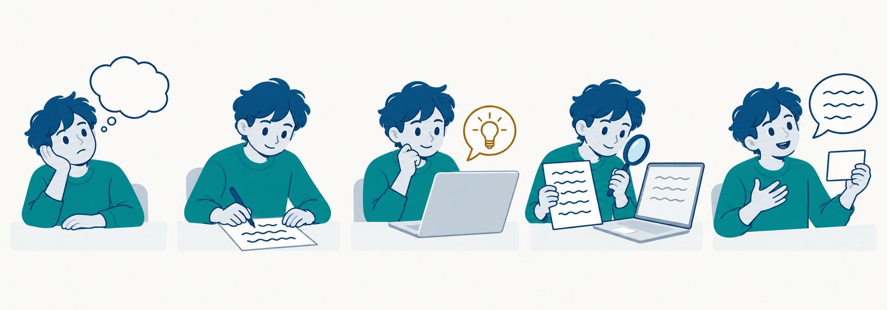

<div class='eyebrow'>SOFTWARE DESIGN 2026 / 03</div>

# AI時代の学び方
## 自分で考え、AIと確かめ、説明し直す

情報システム学科 3年生　選択 2単位

---
class: learning03
---

<LearningStyles />

# 今日の到達目標

- 分からない点と自分の予想を、目的・制約・入出力の例と一緒にAIへ伝える。
- AIの説明やコードを、期待値・反例・公式文書で確かめる。
- 確かめた内容を、自分の言葉と新しい入力で説明し直す。
- 採用した判断と、学習の変化を記録する。

授業では生成AIの利用を推奨します。検証と説明も自分の仕事になります。

---
class: learning03
---

<LearningStyles />

# 前回の注文集計を説明してみる

第2回の `summary(orders)` を開いてください。

1. 入力の条件と戻り値を説明する。
2. 空入力・不正入力のテストを選ぶ。
3. 1行を直すなら、変更と理由を話す。

詰まった箇所を1文で書き留めます。<br>
その1文が、今日の5ステップの出発点(1 言葉にする)です。

---
class: learning03
---

<LearningStyles />

# 使い方で、手元に残るものが変わる

<AnswerVsLearning />

学習相手として使うときは、自分で説明し、実行で確かめます。<br>
理解が進んだかを、自分の説明と証拠で確認します。

---
class: learning03
---

<LearningStyles />

# 学習相手にする5ステップ

<LearningLoop :current='0' />

AIの出番は主に3です。5では自分の説明への指摘を求めます。<br>
説明できない点が残れば、1へ戻ります。

---
class: learning03
---

<LearningStyles />

# 今日の例: 最高気温を求める

for文と初期値を、5ステップで学び直します。

**仕様**：整数の気温リスト `temps` から、最大値を返す。入力は変更しません。

空リストは `ValueError` とする仕様を選んでいます。<br>
この扱いは、後で公式文書と照合します。

**手計算の期待値**：`[3, 7, 5]` は7、`[-3, -1, -5]` は-1。

[今日の例と実行手順（公開Gist）](https://gist.github.com/biwakonbu/7aa6c2d4eba43e49f852381734a38265)<br>
主例の `highest.py` と `test_highest.py` を同じ場所へ保存します。

---
class: learning03
---

<LearningStyles />

# 1 言葉にする: 分からない点を1文に

<LearningLoop :current='1' strip />

説明用に自作した、意図的な誤りの例（`highest_draft`）:

```python
def highest_draft(temps):
    best = 0
    for t in temps:
        if t > best:
            best = t
    return best
```

広すぎる: for文がよく分からない。<br>
具体的: `best` を 0 から始めてよい理由を説明できない。

---
class: learning03
---

<LearningStyles />

# 2 予想する: 期待値と予想を分けて書く

<LearningLoop :current='2' strip />

<TraceTable />

期待値は仕様から決まる正しい答え、予想はこのコードが返すと思う値です。<br>
右の空欄と、空リスト `[]` の戻り値の予想を紙に書いてから、先へ進みます。

---
class: learning03
---

<LearningStyles />

# 3 AIに聞く: 答えではなく、ヒントを求める

<LearningLoop :current='3' strip />

答えを受け取る依頼:

```text
最大値を求めるPythonコードを書いて。
```

学習相手にする依頼:

```text
Python 3.12、標準ライブラリのみ。気温の最大値をfor文で
求めたい。best = 0 で書いた。highest_draft を添えます。
[-3, -1, -5] の戻り値を、私は ___ と予想した。
0 から始めてよいか、答えではなく確かめ方のヒントを1つください。
```

---
class: learning03
---

<LearningStyles />

# 3 AIのヒントで、自分で1行をたどる

ヒントの例（教材用に自作。特定サービスの回答ではありません）:

```text
最初に t = -3 を受け取るとき、best はいくつですか。
t > best は True ですか、False ですか。
そのあと、best にどの値が残るか追ってみてください。
```

答えのコードを受け取る前に、自分で比較と更新を追います。<br>
まだ説明できなければ、分からない1行を示して聞き直します。

---
class: learning03
---

<LearningStyles />

# 3 AIの返答を使う前の確認

<PasteGate />

AIの説明やコード全般を使う前の確認です。<br>
Q3では、`[-3, -1, -5]` のような入力を自分で挙げてみます。<br>
1つでも答えられなければ、貼らずに3へ戻ります。

---
class: learning03
---

<LearningStyles />

# 4 確かめる: 実行して、期待値と比べる

<LearningLoop :current='4' strip />

<PredictVsActual />

実行結果が期待値と違う入力が、反例です。<br>
予想が外れた箇所は、理解を直す手がかりになります。

---
class: learning03
---

<LearningStyles />

# 4 もっともらしい説明とテストも、確かめる

自作の誤答例:「0から始めて大きい値に更新すれば、最大値が求まります。」

```python
# 意図的に誤った期待値を置いた教材例
self.assertEqual(highest_draft([-3, -1, -5]), 0)
```

このテストは合格します。しかし仕様の期待値は -1 です。

実装の出力から期待値を作ると、同じ誤りを写します。<br>
AIにテスト案を頼むこともできます。<br>
採用する期待値の根拠は、仕様と手計算で自分でも確かめます。

---
class: learning03
---

<LearningStyles />

# 4 空リストを、公式文書で確かめる

```python
max([3, 7, 5])         # 7
max([], default=None)  # None
max([])                # ValueError
```

`max` は、空の iterable で `default` がなければ `ValueError` を送出します。<br>
今日の例では、この扱いを仕様として選んでいます。

今日は for文を学ぶので、`max` では書かずに答え合わせの相手に使います。<br>
関数名・引数・空入力の扱いを、公式文書で照合します。<br>
https://docs.python.org/3.12/library/functions.html#max

---
class: learning03
---

<LearningStyles />

# 3へ戻る: 実行結果を伝え、ヒントを求める

```text
[-3, -1, -5] の期待値は -1、実行結果は 0 でした。
Python 3.12 で実行しました。highest_draft を添えます。
修正コードではなく、原因を考えるヒントを1つください。
```

ヒントの例(教材用に自作): 1回目の比較の前、best にはリストの中の値が入っていますか。

実際に出た値を伝え、想像の実行結果を混ぜないでください。<br>
ヒントから修正を考えるのは、自分の仕事です。

---
class: learning03
---

<LearningStyles />

# 4 ヒントから、自分の修正を考える

次のページへ進む前に、手元に書きます。

- 空リストなら、どうするか。
- 空でなければ、`best` を何から始めるか。
- 修正する行と、その理由。

自分の修正を実行し、負の値だけの入力と空入力で確かめます。

---
class: learning03
---

<LearningStyles />

# 4 自分の修正を、配布例と比べる

```python
def highest(temps):
    if not temps:
        raise ValueError('temps must not be empty')
    best = temps[0]
    for t in temps[1:]:
        if t > best:
            best = t
    return best
```

[公開Gistの主例: highest.py / test_highest.py](https://gist.github.com/biwakonbu/7aa6c2d4eba43e49f852381734a38265)

`python3 test_highest.py` を実行します。

期待出力: `10 tests passed; highest: 3906 integer lists`

---
class: learning03
---

<LearningStyles />

# 5 自分の説明への指摘を求める

<LearningLoop :current='5' strip />

次のページへ進む前に、修正した理由を自分の言葉で1文書きます。

**自分の説明**：________________________________________________

**AIへの依頼**：仕様（空は `ValueError`）と `highest` と自分の説明を添えます。説明の誤りや抜けを、指摘だけしてください。

返された指摘を、仕様とコードに当てて確かめます。<br>
採用する指摘は、自分で決めます。

---
class: learning03
---

<LearningStyles />

# 5 指摘を確かめ、説明し直す

自分で書いた説明と、次の教材用の例を比べます。

**説明例**：先頭から始めれば、全部が負でもリストにない0が残らない。

**指摘例（自作）**：空リストのとき、先頭の値はありますか。

**書き直し例**：空なら `ValueError`。空でなければ、先頭から始めて各値と比べる。

指摘をコードと仕様で確かめ、最後は自分の言葉で説明します。

---
class: learning03
---

<LearningStyles />

# 5 新しい入力を、実行前に予想する

<NewInputCheck />

先へ進む前に、結果の予想と、初期値・更新の理由を1文ずつ書きます。

---
class: learning03
---

<LearningStyles />

# 5 予想と理由を、実行結果と照合する

<NewInputCheck reveal />

この3例は、修正版と誤り版で同じ結果になります。<br>
予想が当たるだけでなく、初期値と更新の理由も説明して確かめます。<br>
`[2, 9, 9]` は `>` でも `>=` でも戻り値は 9 です。

---
class: learning03
---

<LearningStyles />

# 5 別の例で、理解を確かめる

理解確認の例です。最低気温を返す `lowest(temps)` を、<br>
AIを閉じてまず自分で考えます。空入力は同じく `ValueError` とします。

- 初期値を何にしたか、理由を1文で言える。
- `[3, 7, 5]` と `[8, 9]` の戻り値を、実行前に予想できる。
- best = 0 で書いた場合に誤る入力を、自分で作れる。

答え合わせは `min(temps)` と比べます。<br>
言えない項目があれば、1 言葉にする、に戻ります。

---
class: learning03
---

<LearningStyles />

# AIに頼むこと、自分で決めること

| 場面 | AIに頼んでよいこと | 自分で決めること |
|---|---|---|
| 分からない点 | 用語の説明、言い換え | 何が分からないかの1文 |
| 期待値 | 入力案の候補 | 期待値(仕様と手計算) |
| 修正 | ヒント、原因の候補 | どの修正を採用するか |
| 説明 | 自分の説明への指摘 | 最終的な説明の文 |

自分の理解を示す部分は、自分で書きます。

---
class: learning03
---

<LearningStyles />

# 学習の記録: 判断と検証の根拠を残す

教材用の記録例です（p13の自作誤答例を検討した場合）。

```text
目的: best の初期値を 0 にしてよいか理解したい。
予想: -1 と書いた。実行結果は 0 で、予想が外れた。
提案: p13の自作誤答例「0 で最大値が求まる」。
判断: 実行結果 0 が期待値 -1 と違うので不採用。
検証: 先頭で初期化し、10件のテストと max で照合。
学習: 初期値はリストの中の値にする。
```

チャット全文より、判断と検証の根拠を残します。<br>
提出する記録の形式は、別冊 `exercises/03.md` に従います。

---
class: learning03
---

<LearningStyles />

# AIに渡す情報の選択

教材の架空データと、必要な最小コードを使ってください。

- 氏名・学籍番号・連絡先を含めない。
- パスワードやAPIキーを貼らない。
- 他人の提出物を、本人の許可なく送らない。

データを小さくすると、原因も読み取りやすくなります。

---
class: learning03
---

<LearningStyles />

# AIが使えない場合も、同じ5ステップで学ぶ

利用できない場合は、配布の提案例と相互質問で同じ検証を行います。

- 3の代わり: p10・p15のヒント例と、p13の自作誤答例を読む。
- 説明やヒント: 隣の人と質問し合い、公式文書を読む。
- 5の代わり: p19の指摘例と、隣の人からの指摘を使う。
- 1, 2, 4 は、AIを使う場合と同じです。

AIサービスの利用環境は、各自の条件に合わせてください。

---
class: learning03 activity03
---

<LearningStyles />

# 別冊の演習へつなぐ

課題の条件と提出物は、別冊 `exercises/03.md` の指示に従います。<br>
第2回で説明しづらかった箇所を1つ選ぶ例です(冒頭で書き留めた1文)。

1. 自分の理解と疑問を先に書く。
2. AIへ質問し、説明を得る。
3. 別の小さな例で実行する。
4. 説明が変わった箇所を記録する。

別冊の演習Bを使う場合は、指定の入力分類をすべて試し、完成コードと、失敗から修正までの記録をまとめます。

以下はリポジトリのルートで実行。自分のテストは、作成後に実行します。

```sh
python3 examples/03-ai-workflow/verify.py
python3 -m unittest discover -s submission/03 -v
```

---
class: learning03
---

<LearningStyles />

# 確認問題

1. 期待値と予想の違いを、`[-3, -1, -5]` を例に説明する。
2. 「正しく動きます」という流暢な返答だけで判断できない理由は何か。
3. AIにテストも作らせた場合、期待値はどう確認するか。
4. 提案を採用しなかった判断は、何を記録すればよいか。

授業内では、結果を実行例と結び付けて説明してください。

---
class: learning03
---

<LearningStyles />

# まとめと次回

1 言葉にする、2 予想する、3 AIに聞く、4 確かめる、5 言い直す。<br>
AIには答えでなく説明やヒントを求め、確かめた根拠を自分の言葉で残します。

**復習**: 第2回のコードに、新しい境界テストを1つ追加すると、<br>
何を確かめられるでしょうか。<br>
**次回**: 処理の回数とデータ構造を比較します。



---
class: learning03
---

<LearningStyles />

# 参考: 演習Bの二分探索でも同じ手順

[公開Gist: 実行手順と教材ファイル](https://gist.github.com/biwakonbu/7aa6c2d4eba43e49f852381734a38265)<br>
https://gist.github.com/biwakonbu/7aa6c2d4eba43e49f852381734a38265

Gistには主例2ファイルと、二分探索の実行用4ファイル・READMEがあります。<br>
二分探索の4ファイルを同じディレクトリに置く。Python 3.12以上、標準ライブラリのみ。

```sh
python3 verify.py
python3 test_contract.py
```

`test_contract.py` の期待出力:

```text
8 tests passed; exhaustive contract: 1764 cases
```

`[1]` から 1 を探すと、`while low < high` の誤り版は比較せずに None を返します(1要素の反例)。

---
class: learning03
---

<LearningStyles />

# 参考と教材ファイル

- Python 3.12 unittest<br>https://docs.python.org/3.12/library/unittest.html
- Python 3.12 max<br>https://docs.python.org/3.12/library/functions.html#max
- Python 3.12 collections.deque<br>https://docs.python.org/3.12/library/collections.html#collections.deque
- 学生向け課題: `exercises/03.md`
- 自作の例: `examples/03-ai-workflow/` (二分探索の診断例、`highest.py`)

サービス固有の利用条件は、各サービスの最新の案内を確認してください。
