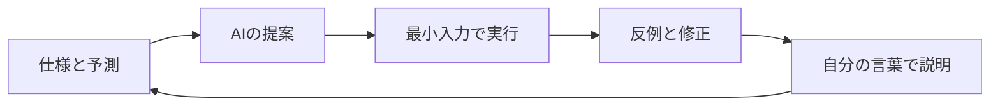

<div class="eyebrow">SOFTWARE DESIGN 2026 / 03</div>

# AI時代の学習と開発
## 提案を、検証できる理解へ

情報システム学科 3年生　選択 2単位

---

# 今日の到達目標

- AIへ目的・制約・入出力の例を伝える。
- 提案されたコードを、小さい反例で検証する。
- 学習の説明と、実装の生成を使い分ける。
- 採用した判断と学習の変化を記録する。

授業では生成AIの利用を推奨します。検証と説明も自分の仕事になります。

---

# 前回の注文集計を説明する

第2回の `summary(orders)` を開いてください。

1. 入力の条件と戻り値を説明する。
2. 空入力・不正入力のテストを選ぶ。
3. 自分が直した1行と、その理由を話す。

説明できない箇所が、今日の学習の出発点になります。

---

# 開発環境の役割

| 道具 | 役割 | 残すもの |
|---|---|---|
| エディタ | コードを読む・直す | 保存したファイル |
| Python 3.12以上 | 実行する | 出力・エラー |
| テスト | 仕様の例を確認する | 期待値と結果 |
| 生成AI | 説明や候補を得る | 採用理由・検証 |

AIサービスの利用環境は各自の条件に合わせてください。

---

# AIの出力と正しさ

AIは、文脈からもっともらしい回答を生成します。<br>
説明が流暢でも、仕様・境界・実行環境を取り違えることがあります。

**確かめる対象**：コード、前提、期待値、使ったAPI。

回答を読んだ段階と、手元で実行して確かめた段階を区別します。

---

# 依頼に必要な情報

```text
Python 3.12、標準ライブラリのみ。
整列済み整数リストからtargetの添字を返す。
見つからない場合はNone、重複は任意の一致。
空、1要素、末尾一致を含むテスト案を示す。
完成コードの前に、探索範囲の更新を説明する。
```

目的・環境・仕様・例を揃えると、提案を評価しやすくなります。

---

# 学習に使う依頼

```text
for文で注文の合計を計算する処理を学びたい。
私の予測は、空リストではエラーになる、です。
答えをすぐ示さず、初期値と反復回数を
考える質問を1つずつ出してください。
```

自分の予測を先に書いてください。分かった箇所を、自分の例で説明してください。

---

# デバッグに使う依頼

```text
期待値: [1]から1を探すと0。
実際: None。Python 3.12で再現する。
下記が最小のコードと入力です。
原因候補と、その候補を区別できるテストを示す。
修正は一度に1点ずつ提案してください。
```

実際に出たエラーや結果を伝えてください。想像の実行結果を混ぜないでください。

---

# AI利用の検証ループ



1回の回答で終わらず、検証した情報を次の判断に使います。

---

# 一見正しそうな二分探索

```python
left, right = 0, len(values) - 1
while left < right:
    middle = (left + right) // 2
    if values[middle] == target:
        return middle
    if values[middle] < target:
        left = middle + 1
    else:
        right = middle - 1
return None
```

境界に1候補だけ残った場合を考えます。

---

# 最小の反例

```python
values = [1]
target = 1
# left = 0, right = 0
# while left < right はFalse
# 0番目を比較せずにNoneを返す
```

大きなデータより、1要素の例が原因を見せます。

**修正候補**：閉区間なら、候補1個のときも調べます。

---

# テストの期待値

| 入力とtarget | 期待値 | 確認する条件 |
|---|---|---|
| `[]`, 1 | `None` | 候補なし |
| `[1]`, 1 | 0 | 候補1個 |
| `[1, 3, 5]`, 5 | 2 | 末尾一致 |
| `[1, 3, 5]`, 4 | `None` | 範囲内で不在 |

期待値は仕様と手計算から作ります。コードと同じ誤りを写さないでください。

---

# 検証デモの実行

```bash
python3 examples/03-ai-workflow/verify.py
python3 -m unittest discover -s tests -p test_foundations.py -v
```

教材のbuggy例は、検証のために自作した誤りの例です。<br>
特定サービスの回答を転載したものではありません。

誤りの再現と修正版の検証を、それぞれ確認してください。

---

# 合格したテストと仕様の範囲

テストが通ったことは、その例で動作が一致した証拠になります。

- 未整列入力を許可する仕様か。
- 重複した値なら、どの添字を返すか。
- 想定する入力サイズで実行できるか。

テストの外にある条件を、仕様として確認します。

---

# 公式ドキュメントとの照合

存在しない関数名や、版の異なるAPIが提案される場合があります。

```python
from collections import deque
queue = deque(["A"])
print(queue.popleft())  # A
```

標準ライブラリの名称・引数・戻り値を、Python 3.12の文書で確かめてください。

---

# コードの説明を確認する

同じコードを別の入力で動かす前に、結果を予測してください。

- 探索範囲が毎回小さくなる理由を説明する。
- 関数の入力と戻り値を図か表で示す。
- 1行を変えた場合、どのテストが失敗するか考える。

AIの説明を、自分の実行例で確かめます。

---

# 記録の短い例

```text
目的: 末尾の値を見つけたい。
提案: while条件を<=にする。
判断: left/rightは閉区間なので採用。
検証: 1要素、末尾、不在、空の4例を実行。
学習: 範囲の定義と終了条件を揃える必要がある。
```

チャット全文より、判断と検証の根拠を残します。

---

# AIに渡す情報の選択

教材の架空データと、必要な最小コードを使ってください。

- 氏名・学籍番号・連絡先を含めない。
- パスワードやAPIキーを貼らない。
- 他人の提出物を、本人の許可なく送らない。

データを小さくすると、原因も読み取りやすくなります。

---

# 演習A　学習の依頼

第2回で説明しづらかった箇所を1つ選んでください。

1. 自分の理解と疑問を先に書く。
2. AIへ質問し、説明を得る。
3. 別の小さな例で実行する。
4. 説明が変わった箇所を記録する。

利用できない場合は、配布の提案例と相互質問で同じ検証を行います。

---

# 演習B　誤りの診断

`examples/03-ai-workflow/` のbuggy例を読んでください。

- 最小の反例を自分で用意する。
- AIへ原因候補を依頼する。
- 採用した修正を、4種類以上の入力で試す。
- 残っている仕様上の前提を1つ書く。

必須の入力分類は、学生向け課題の演習Bで確認し、すべて試してください。
完成コードと、失敗から修正までの記録を提出してください。

---

# 演習C　相互説明

コードを見せ、相手に未知の入力を1つ選んでもらいます。

自分は実行前の予測を説明し、その後に実行します。<br>
予測と違った場合は、原因を調べて記録を更新します。

AIが書いた部分も含めて、自分が選んだ実装として説明します。

---

# 確認問題

1. 流暢な説明だけで正しいと判断できない理由は何か。
2. 1要素の反例は、どの条件の誤りを示したか。
3. AIにテストも作らせた場合、期待値はどう確認するか。
4. 提案を採用しなかった判断は、何を記録すればよいか。

授業内では、結果を実行例と結び付けて説明してください。

---

# まとめと次回

仕様と予測を先に置き、提案を小さな入力で確かめます。<br>
検証の根拠を残すと、他の人にも判断を説明できます。

**復習**：第2回のコードに、新しい境界テストを1つ追加してください。<br>
**次回**：処理の回数とデータ構造を比較します。

---

# 参考と教材ファイル

- Python 3.12 unittest<br>https://docs.python.org/3.12/library/unittest.html
- Python 3.12 collections.deque<br>https://docs.python.org/3.12/library/collections.html#collections.deque
- 学生向け課題：`exercises/03.md`
- 自作の診断例：`examples/03-ai-workflow/`

サービス固有の利用条件は、各サービスの最新の案内を確認してください。
