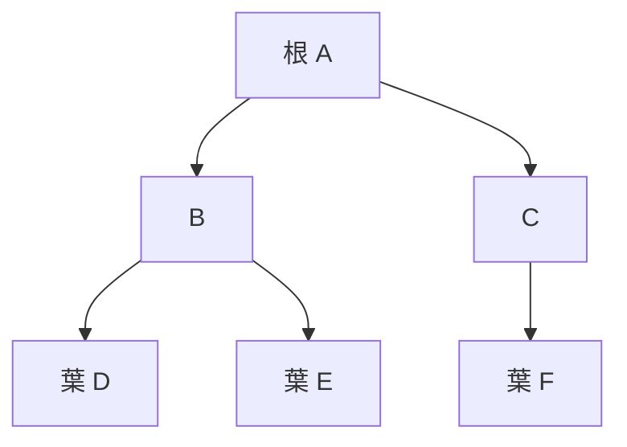

<div class="eyebrow">SOFTWARE DESIGN 2026 / 04</div>

# データ構造と<br>アルゴリズム

## 記憶の使い方と、処理の増え方

情報システム学科 3年 / 選択2単位

---

# 今日の到達目標

- 入力サイズと、時間・メモリの増え方を区別できる
- キューとスタックを処理順に合わせて選べる
- 探索法の前提を説明し、木の探索を追跡できる

演習では、速さを推測した理由を実行結果と照合する。

---

# 前回との接続

AI が提案したコードにも、処理回数と記憶量がある。

```python
for x in items:
    for y in items:
        compare(x, y)
```

「動いた」から一歩進み、入力が増えたときの振る舞いを説明する。

---

# データ構造の役割

値の入れ方と取り出し方を決めると、処理の選択肢が変わる。

| したいこと | 構造の例 |
| --- | --- |
| 位置を指定して読む | リスト |
| 名前から値を引く | 辞書 |
| 重複を避ける | 集合 |
| 待ち順を管理する | キュー |

同じデータでも、主な操作に合う表現は異なる。

---

# リストの実装モデル

CPythonのlistは、要素への参照を並べる **可変長配列**。

- インデックスで要素を読む
- 要素を増やすと、内部の容量を広げる場合がある
- 先頭を削ると、後ろの要素の位置を詰める

各要素が次の要素を指す連結リストとは、操作の費用が異なる。

---

# メモリサイズのモデル

仮に1件を8 byteで固定長保存するなら、n件の本体は **8n byte**。

- 1,000件なら8,000 byte
- 1,000,000件なら8,000,000 byte
- 管理情報、参照、空き容量などは別に必要

Python の整数やリストは、この固定長モデルと同じサイズにはならない。

---

# 実測値が表す範囲

```python
import sys
items = [10, 20, 30]
print(sys.getsizeof(items))
print(sys.getsizeof(items[0]))
```

`getsizeof(items)` は、参照先の全オブジェクトを合計しない。

実測値はPythonの処理系・版・環境で変わる。固定値の暗記より、**何を測ったか**を記録する。

---

# 時間計算量

入力サイズ n に対して、基本操作の回数がどう増えるかを表す。

| 記法 | 代表的な増え方 |
| --- | --- |
| O(1) | 入力サイズによらない上界 |
| O(log n) | 範囲を繰り返し半分にする |
| O(n) | 要素を一通り調べる |
| O(n²) | すべての組合せを二重ループで調べる |

O記法は秒数の予測値ではなく、漸近的な上界を表す。

---

# 入力を2倍にしたとき

基本操作数を `n` と `n²` の式で比較する。

| n | n回 | n²回 |
| --- | ---: | ---: |
| 100 | 100 | 10,000 |
| 200 | 200 | 40,000 |
| 400 | 400 | 160,000 |

定数倍の差と、増え方の差を分けて考える。

---

# ケースによる違い

線形探索で、探す値が先頭にある場合は1回の比較で終了する。

- 最良：先頭で発見
- 最悪：末尾で発見、または存在しない
- 平均：入力の分布を仮定して考える

「線形探索はO(n)」という説明では、ここでは最悪ケースを扱う。

---

# 空間計算量

アルゴリズムが追加で必要とする記憶量を考える。

```python
copied = items.copy()
```

n件の参照をコピーすると、追加領域はO(n)。

入力データ自体を含むのか、補助領域だけなのか、比較時の条件を明記する。

---

# スタック

最後に入れた値を先に取り出す **LIFO**。

```python
stack = []
stack.append("A")
stack.append("B")
print(stack.pop())  # B
print(stack.pop())  # A
```

例：取り消し履歴、探索中に後で処理する場所。

---

# キュー

先に入れた値を先に取り出す **FIFO**。

```python
from collections import deque
queue = deque(["A", "B"])
queue.append("C")
print(queue.popleft())  # A
print(list(queue))     # ['B', 'C']
```

例：受付待ち、距離が近い順の探索。

---

# 操作と実装の選択

Pythonのリストで `pop(0)` を使うと、後続要素の位置を詰める。

| 目的 | 操作 | 想定するコスト |
| --- | --- | --- |
| 末尾のスタック | listのappend / pop | ならしO(1) / O(1) |
| 先頭からのキュー | dequeのpopleft | おおむねO(1) |
| リスト先頭の削除 | listのpop(0) | O(n) |

「キュー」という考え方と、その実装に使う型を区別する。

---

# ソート

一定の順序で要素を並べ替える。

```python
prices = [500, 200, 500, 100]
ordered = sorted(prices)
print(ordered)  # [100, 200, 500, 500]
```

並べる基準が先に必要。価格順、名前順、日時順では結果が異なる。

---

# 挿入ソートの考え方

左側を整列済みに保ち、次の値を適切な位置へ入れる。

| 段階 | 並び |
| --- | --- |
| 開始 | 5, 2, 4 |
| 2を挿入 | 2, 5, 4 |
| 4を挿入 | 2, 4, 5 |

逆順入力では、挿入のたびに多くの要素をずらす。最悪時間はO(n²)。

---

# ソートと検索の総コスト

二分探索には整列が必要。1回だけ探す場合は整列の費用も数える。

- 線形探索を1回：最悪O(n)
- `sorted` 後に二分探索を1回：最悪O(n log n) + O(log n)
- 同じ整列済みデータに何度も検索：整列の費用を共有できる

Pythonの実用コードでは `sorted` を使い、教材では処理の仕組みを追う。

---

# 線形探索

先頭から順に、目的の値と比較する。

```python
def linear_search(values, target):
    for i, value in enumerate(values):
        if value == target:
            return i
    return None
```

未整列でも利用できる。返すのは位置か値か、見つからないときは何かを決める。

---

# 全探索

候補をすべて調べ、条件を満たすものを探す。

```python
values = [2, 4, 7]
pairs = []
for i in range(len(values)):
    for j in range(i + 1, len(values)):
        if values[i] + values[j] == 9:
            pairs.append((i, j))
```

この例の候補数は n(n−1)/2。全探索の計算量は、候補の作り方で変わる。

---

# 二分探索の前提

昇順の列で中央を比べ、答えがあり得ない半分を捨てる。

`[2, 4, 6, 8, 10, 12, 14]` から `12` を探す。

1. 中央の8より大きいので、右側へ
2. 右側の中央12で発見

未整列入力では、半分を捨てる根拠が成り立たない。

---

# 二分探索の初期化と比較

探索区間を半開区間 **[lo, hi)** として管理する。関数の前半：

```python
def binary_search(a, target):
    lo, hi = 0, len(a)
    while lo < hi:
        mid = (lo + hi) // 2
        if a[mid] == target:
            return mid
```

一致を見つけたら終了。重複の先頭を返す保証はない。

---

# 二分探索の範囲更新

前の関数の続き。区間を縮め、不在なら終了後に `None` を返す。

```python
        if a[mid] < target:
            lo = mid + 1
        else:
            hi = mid
    return None
```

区間幅 `hi - lo` は毎回小さくなる。空列は最初から幅0。

---

# 木構造

ここでは根を持つ木を扱う。根以外の各節点は親を1つ持つ。



木には循環がない。親子関係を使って階層を表せる。

---

# 木の表現

各節点の子を、辞書とリストで表す。

```python
children = {
    "A": ["B", "C"],
    "B": ["D", "E"],
    "C": ["F"],
    "D": [], "E": [], "F": [],
}
```

葉もキーを持つようにすると、子がない場合の扱いが揃う。

---

# 深さ優先探索 DFS

分岐を1つ選び、奥まで進んでから次の分岐へ戻る。

```python
def dfs(node, children):
    yield node
    for child in children[node]:
        yield from dfs(child, children)
```

前の木では **A, B, D, E, C, F**。子の順序が訪問順を決める。

再帰の呼出しもスタックを使う。深い木では再帰上限に注意する。

---

# 幅優先探索 BFS

近い深さから順に節点を処理する。

```python
from collections import deque
queue = deque(["A"])
order = []
while queue:
    node = queue.popleft()
    order.append(node)
    queue.extend(children[node])
```

前の木では **A, B, C, D, E, F**。同じ深さの節点が先に待つ。

---

# DFSとBFSの記憶量

同じ木でも、待機する節点の数が違う。

| 探索 | 主な補助記憶 | 増えやすい木 |
| --- | --- | --- |
| 再帰DFS | 呼出しの深さ | 深く細い木 |
| BFS | 待機キュー | 浅く広い木 |

すべての節点と辺を1回ずつ扱うなら時間はO(V + E)。木では E = V − 1。

---

# 実演の実行

Python 3.12以上の環境で、リポジトリのルートから実行する。

```bash
python3 examples/04-algorithms/containers.py
python3 examples/04-algorithms/sorting_search.py
python3 examples/04-algorithms/trees.py
python3 examples/04-algorithms/memory_complexity.py
```

出力を保存し、探索順と比較回数を先に書いた予測と照合する。
メモリのbyte数は環境差を含めて記録する。

---

# 演習1：処理順の予測

`exercises/04.md` の手順に沿って実行する。

1. A、B、Cを入れたスタックとキューの取り出し順を書く
2. 木のDFSとBFSの順番を紙で追う
3. `containers.py` と `trees.py` で照合する

期待する性質：LIFO / FIFO、DFSの分岐優先 / BFSの深さ優先。

---

# 演習2：探索法の選択

入力 `[8, 2, 6, 4]` に対し、値6の存在を判定する。

- 線形探索を実装し、未整列のまま確認する
- 整列したコピーで二分探索を実行する
- 空列、先頭、末尾、存在しない値も確認する

提出用記録：`04-search.py` と `04-observations.md`。

---

# 演習3：増え方の説明

`memory_complexity.py` の操作数モデルとメモリ実測値を読む。

- 入力サイズと操作数の関係
- 実測したbyte数が含む範囲
- コピーを1つ増やしたときの追加領域の見積り

AIを使った箇所、採用した説明、自分で検証した入力を振り返る。

---

# 確認問題

1. 未整列の列に二分探索を適用すると、何が崩れるか
2. n件の全組合せを調べる二重ループは何回程度になるか
3. BFSで `pop()` を使うと、処理順はどう変わるか
4. `getsizeof(list)` だけで全データの使用量を説明できるか

理由を1文で答える。解説は教員用資料に分けてある。

---

# まとめと次回

構造の選択は、操作の費用と探索の順番を変える。

- 計算量を語るときは入力サイズとケースを示す
- 二分探索には整列、木の探索には親子関係が必要
- 実測値は、測定対象と環境と一緒に読む

次回は、循環や複数の経路を持つ **グラフ** を扱う。

---

# 参考資料

- [Python公式：collections.deque](https://docs.python.org/3/library/collections.html#collections.deque)
- [Python公式：sys.getsizeof](https://docs.python.org/3/library/sys.html#sys.getsizeof)
- [Python公式：bisect](https://docs.python.org/3/library/bisect.html)
- [Python公式：Sorting HOW TO](https://docs.python.org/3/howto/sorting.html)
- [MIT 6.006：講義資料一覧](https://ocw.mit.edu/courses/6-006-introduction-to-algorithms-fall-2011/pages/lecture-notes/)

図・コード・演習例は本教材用の自作。
