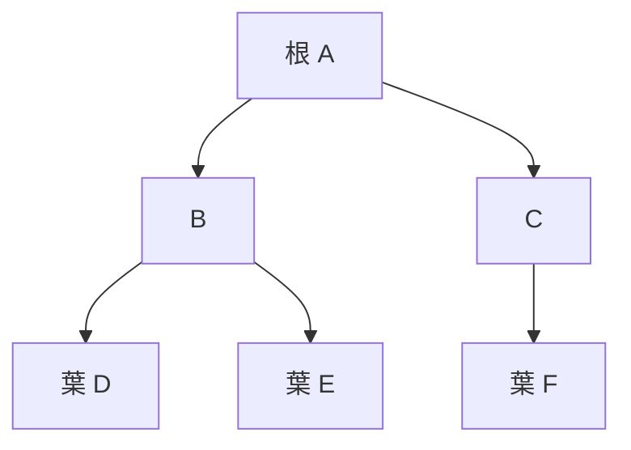

<div class="eyebrow">SOFTWARE DESIGN 2026 / 04</div>

# データ構造と<br>アルゴリズム

## 記憶の使い方と、処理の増え方

情報システム学科 3年 / 選択2単位

---

# 今日の到達目標

- 入力サイズと、時間・メモリの増え方を区別できる
- キューとスタックを処理順に合わせて選べる
- 探索法の前提を説明し、木の探索を追跡できる

演習では、速さを推測した理由を実行結果と照合します。

---

# 今日、深く追うところ

| 学び方 | この回で確かめること |
| --- | --- |
| 状態を追う | スタック・キューと、木の訪問順 |
| 実装して確かめる | 線形探索・二分探索の前提と境界 |
| 小さい例で説明する | 操作数の増え方、メモリ実測の範囲 |
| 概観として読む | ソートの実装方式、計算量の各ケース |

ソート全方式や `yield` の自力実装は追加課題にしません。<br>
演習は、処理順 → 探索 → 増え方の順で進めます。

---

# 前回との接続

AI が提案したコードにも、処理回数と記憶量があります。

```python
for x in items:
    for y in items:
        compare(x, y)
```

「動いた」から一歩進み、入力が増えたときの振る舞いを説明します。

---

# データ構造の役割

値の入れ方と取り出し方を決めると、処理の選択肢が変わります。

| したいこと | 構造の例 |
| --- | --- |
| 位置を指定して読む | リスト |
| 名前から値を引く | 辞書 |
| 重複を避ける | 集合 |
| 待ち順を管理する | キュー |

同じデータでも、主な操作に合う表現は異なります。

---

# リストの実装モデル

CPythonのlistは、要素への参照を並べる **可変長配列** です。

- インデックスで要素を読む
- 要素を増やすと、内部の容量を広げる場合がある
- 先頭を削ると、後ろの要素の位置を詰める

各要素が次の要素を指す連結リストとは、操作の費用が異なります。

---

# メモリサイズのモデル

仮に1件を8 byteで固定長保存するなら、n件の本体は **8n byte** です。

- 1,000件なら8,000 byte
- 1,000,000件なら8,000,000 byte
- 管理情報、参照、空き容量などは別に必要

Python の整数やリストは、この固定長モデルと同じサイズにはなりません。

---

# 実測値が表す範囲

```python
import sys
items = [10, 20, 30]
print(sys.getsizeof(items))
print(sys.getsizeof(items[0]))
```

`getsizeof(items)` は、参照先の全オブジェクトを合計しません。

実測値はPythonの処理系・版・環境で変わります。固定値の暗記より、**何を測ったか**を記録してください。

---

# 時間計算量

入力サイズ n に対して、基本操作の回数がどう増えるかを表します。

| 記法 | 代表的な増え方 |
| --- | --- |
| O(1) | 入力サイズによらない上界 |
| O(log n) | 範囲を繰り返し半分にする |
| O(n) | 要素を一通り調べる |
| O(n²) | すべての組合せを二重ループで調べる |

O記法は秒数の予測値ではなく、漸近的な上界を表します。

---

# 入力を2倍にしたとき

基本操作数を `n` と `n²` の式で比較します。

| n | n回 | n²回 |
| --- | ---: | ---: |
| 100 | 100 | 10,000 |
| 200 | 200 | 40,000 |
| 400 | 400 | 160,000 |

定数倍の差と、増え方の差を分けて考えます。

---

# ケースによる違い

線形探索で、探す値が先頭にある場合は1回の比較で終了します。

- 最良：先頭で発見
- 最悪：末尾で発見、または存在しない
- 平均：入力の分布を仮定して考える

「線形探索はO(n)」という説明では、ここでは最悪ケースを扱います。

---

# 空間計算量

アルゴリズムが追加で必要とする記憶量を考えます。

```python
copied = items.copy()
```

n件の参照をコピーすると、追加領域はO(n)です。

入力データ自体を含むのか、補助領域だけなのか、比較時の条件を明記します。

---

# スタック

最後に入れた値を先に取り出す **LIFO**。

```python
stack = []
stack.append("A")
stack.append("B")
print(stack.pop())  # B
print(stack.pop())  # A
```

例：取り消し履歴、探索中に後で処理する場所。

---

# キュー

先に入れた値を先に取り出す **FIFO**。

```python
from collections import deque
queue = deque(["A", "B"])
queue.append("C")
print(queue.popleft())  # A
print(list(queue))     # ['B', 'C']
```

例：受付待ち、距離が近い順の探索。

---

# 操作と実装の選択

Pythonのリストで `pop(0)` を使うと、後続要素の位置を詰めます。

| 目的 | 操作 | 想定するコスト |
| --- | --- | --- |
| 末尾のスタック | listのappend / pop | ならしO(1) / O(1) |
| 先頭からのキュー | dequeのpopleft | おおむねO(1) |
| リスト先頭の削除 | listのpop(0) | O(n) |

「キュー」という考え方と、その実装に使う型を区別します。

---

# ソート

一定の順序で要素を並べ替えます。

```python
prices = [500, 200, 500, 100]
ordered = sorted(prices)
print(ordered)  # [100, 200, 500, 500]
```

並べる基準が先に必要です。価格順、名前順、日時順では結果が異なります。

---

# 挿入ソートの考え方

左側を整列済みに保ち、次の値を適切な位置へ入れます。

| 段階 | 並び |
| --- | --- |
| 開始 | 5, 2, 4 |
| 2を挿入 | 2, 5, 4 |
| 4を挿入 | 2, 4, 5 |

逆順入力では、挿入のたびに多くの要素をずらします。最悪時間はO(n²)です。

---

# ソートと検索の総コスト

二分探索には整列が必要です。1回だけ探す場合は整列の費用も数えます。

- 線形探索を1回：最悪O(n)
- `sorted` 後に二分探索を1回：最悪O(n log n) + O(log n)
- 同じ整列済みデータに何度も検索：整列の費用を共有できる

Pythonの実用コードでは `sorted` を使い、教材では処理の仕組みを追います。

---

# 線形探索

先頭から順に、目的の値と比較します。

```python
def linear_search(values, target):
    for i, value in enumerate(values):
        if value == target:
            return i
    return None
```

未整列でも利用できます。返すのは位置か値か、見つからないときは何かを決めます。

---

# 全探索

候補をすべて調べ、条件を満たすものを探します。

```python
values = [2, 4, 7]
pairs = []
for i in range(len(values)):
    for j in range(i + 1, len(values)):
        if values[i] + values[j] == 9:
            pairs.append((i, j))
```

この例の候補数は n(n−1)/2 です。全探索の計算量は、候補の作り方で変わります。

---

# 二分探索の前提

昇順の列で中央を比べ、答えがあり得ない半分を捨てます。

`[2, 4, 6, 8, 10, 12, 14]` から `12` を探します。

1. 中央の8より大きいので、右側へ
2. 右側の中央12で発見

未整列入力では、半分を捨てる根拠が成り立ちません。

---

# 二分探索の初期化と比較

探索区間を半開区間 **[lo, hi)** として管理します。<br>
`lo` は候補に含み、`hi` は含みません。関数の前半：

```python
def binary_search(a, target):
    lo, hi = 0, len(a)
    while lo < hi:
        mid = (lo + hi) // 2
        if a[mid] == target:
            return mid
```

一致を見つけたら終了します。重複の先頭を返す保証はありません。

---

# 二分探索の範囲更新

前の関数の続きです。区間を縮め、不在なら終了後に `None` を返します。

```python
        if a[mid] < target:
            lo = mid + 1
        else:
            hi = mid
    return None
```

区間幅 `hi - lo` は毎回小さくなります。空列は最初から幅0です。

---

# 半開区間で、不在まで追う

昇順の `[2, 4, 6, 8]` から、存在しない `5` を探します。

| 比較前の lo, hi | 候補の添字 | mid と値 | 比較後の更新 |
| --- | --- | --- | --- |
| 0, 4 | 0, 1, 2, 3 | 2 → 6 | 5 < 6 なので hi = 2 |
| 0, 2 | 0, 1 | 1 → 4 | 5 > 4 なので lo = 2 |
| 2, 2 | なし | 比較しない | lo < hi が偽、None |

中央の値は不一致と確認済みです。`hi = mid` なら中央も除外されます。<br>
`lo = mid + 1` なら中央の次からを候補にします。

---

# 公開コードは閉区間

第3回と `sorting_search.py` は **[low, high]** です。両端を含みます。

| 管理するもの | 半開区間の講義版 | 閉区間の公開版 |
| --- | --- | --- |
| 初期値 | lo = 0, hi = len(a) | low = 0, high = len(a) − 1 |
| 候補が残る条件 | lo < hi | low ≤ high |
| 中央より小さい場合 | hi = mid | high = middle − 1 |
| 中央より大きい場合 | lo = mid + 1 | low = middle + 1 |

右端を候補に含むかで、初期値・継続条件・更新が一組で変わります。

---

# 閉区間で、同じ入力を追う

`[2, 4, 6, 8]` から `5`。公開版の変数名で追います。

| 比較前の low, high | 候補の添字 | middle と値 | 比較後の更新 |
| --- | --- | --- | --- |
| 0, 3 | 0, 1, 2, 3 | 1 → 4 | 5 > 4 なので low = 2 |
| 2, 3 | 2, 3 | 2 → 6 | 5 < 6 なので high = 1 |
| 2, 1 | なし | 比較しない | low ≤ high が偽、None |

閉区間では `high = middle − 1` で中央を除外します。<br>
比較する順は異なっても、答えがあり得る候補だけを残します。

---

# 候補1個と、候補0個

| 入力と候補 | 半開区間 | 閉区間 |
| --- | --- | --- |
| `[6]`：最初の候補1個 | lo = 0, hi = 1 | low = 0, high = 0 |
| `6` を探す | 比較して0を返す | 比較して0を返す |
| `5` を探した後 | lo = 0, hi = 0 | low = 0, high = −1 |
| `[]`：最初から候補0個 | lo = 0, hi = 0 | low = 0, high = −1 |

閉区間の `low == high` は、まだ候補1個です。そこで比較を省略しません。<br>
半開区間の `lo == hi` は候補0個です。範囲の意味から条件を読みます。

---

# 木構造

ここでは根を持つ木を扱います。根以外の各節点は親を1つ持ちます。



木には循環がありません。親子関係を使って階層を表せます。

---

# 木の表現

各節点の子を、辞書とリストで表します。

```python
children = {
    "A": ["B", "C"],
    "B": ["D", "E"],
    "C": ["F"],
    "D": [], "E": [], "F": [],
}
```

葉もキーを持つようにすると、子がない場合の扱いが揃います。

---

# 深さ優先探索 DFS

| 動き | 訪問済みの並び |
| --- | --- |
| Aを記録し、最初の子Bへ | A |
| Bを記録し、子D、Eを順に訪問 | A, B, D, E |
| B側を終えてAへ戻り、子Cへ | A, B, D, E, C |
| Cの子Fを訪問して終了 | A, B, D, E, C, F |

**再帰**は、関数が自分自身を呼ぶことです。子にも同じ訪問手順を使います。<br>
子の処理が終わると、呼出し元の「次の子」へ戻ります。

---

# 訪問した名前をリストに残す

既習の `append` と `return` で、辞書版のDFSを書きます。

```python
def dfs_names(root, children):
    order = []
    def visit(name):
        order.append(name)
        for child in children[name]:
            visit(child)
    visit(root)
    return order
```

`dfs_names("A", children)` は `['A', 'B', 'D', 'E', 'C', 'F']` を返します。

---

# 完成サンプルのNodeを読む

`Node` は名前と子の列を持つ節点です。`.` で節点の情報を読みます。

```python
root = Node("A", [Node("B"), Node("C")])
```

| 読み方 | この短い例の値 |
| --- | --- |
| root.value：根の名前 | "A" |
| root.children：根の子のリスト | BのNode、CのNode |
| root.children[0].value：最初の子の名前 | "B" |

---

# 辞書版とNode版の対応

どちらも「記録 → 子を順に訪問 → 呼出し元へ戻る」です。

| 役割 | 講義の辞書版 | trees.pyの公開版 |
| --- | --- | --- |
| 名前を記録 | orderにnameを追加 | resultにnode.valueを追加 |
| 子を得る | children[name] | node.children |
| 全訪問後の戻り値 | return order | return result |

公開版の `demo_tree()` は先ほどの6節点の木です。<br>
`dfs(demo_tree())` も **A, B, D, E, C, F** をリストで返します。<br>
`Node` の定義を自力で作ることは、この回の演習に追加しません。

---

# 読む補足：yield（必須範囲外）

同じ訪問順を、値を1つずつ取り出せる **ジェネレーター** でも表せます。

```python
def dfs_stream(node, children):
    yield node
    for child in children[node]:
        yield from dfs_stream(child, children)

order = list(dfs_stream("A", children))
```

`yield` は1つの値を渡して中断し、次の要求で続きを進めます。<br>
`yield from` は子の訪問から出る値を順に渡します。`list` が最後まで取り出します。

---

# 幅優先探索 BFS

近い深さから順に節点を処理します。

```python
from collections import deque
queue = deque(["A"])
order = []
while queue:
    node = queue.popleft()
    order.append(node)
    queue.extend(children[node])
```

前の木では **A, B, C, D, E, F** です。同じ深さの節点が先に待ちます。

---

# DFSとBFSの記憶量

同じ木でも、待機する節点の数が違います。

ここでは公開版で、訪問結果を保存するリストを除いた補助記憶を比べます。

| 探索 | 主な補助記憶 | 増えやすい木 |
| --- | --- | --- |
| 再帰DFS | 呼出しの深さ | 深く細い木 |
| BFS | 待機キュー | 浅く広い木 |

すべての節点と辺を1回ずつ扱うなら時間はO(V + E)です。木では E = V − 1 です。

再帰の呼出しもスタックを使います。深い木では再帰上限に注意してください。

---

# 実演の実行

Python 3.12以上の環境で、リポジトリのルートから実行してください。

```bash
python3 examples/04-algorithms/containers.py
python3 examples/04-algorithms/sorting_search.py
python3 examples/04-algorithms/trees.py
python3 examples/04-algorithms/memory_complexity.py
```

出力を保存し、探索順と操作数モデルを先に書いた予測と照合してください。
メモリのbyte数は環境差を含めて記録してください。

---

# 演習1：処理順の予測

`exercises/04.md` の手順に沿って実行してください。

1. A、B、Cを入れたスタックとキューの取り出し順を書く
2. 木のDFSとBFSの順番を紙で追う
3. `containers.py` と `trees.py` で照合する

期待する性質：LIFO / FIFO、DFSの分岐優先 / BFSの浅い層からの処理。

---

# 演習2：探索法の選択

入力 `[8, 2, 6, 4]` に対し、値6の存在を判定します。

- 線形探索を実装し、未整列のまま確認する
- 整列したコピーで二分探索を実行する
- 空列、先頭、末尾、存在しない値も確認する

提出用記録：`04-search.py` と `04-observations.md`。

---

# 演習3：増え方の説明

`memory_complexity.py` の操作数モデルとメモリ実測値を読みます。

- 入力サイズと操作数の関係
- 実測したbyte数が含む範囲
- コピーを1つ増やしたときの追加領域の見積り

AIを使った箇所、採用した説明、自分で検証した入力を振り返ってください。

---

# 確認問題

1. 未整列の列に二分探索を適用すると、何が崩れるか
2. n件の全組合せを調べる二重ループは何回程度になるか
3. BFSで `pop()` を使うと、処理順はどう変わるか
4. リストの本体だけを測って、参照先を含む全データの使用量を説明できるか

理由を1文で答えてから、次の解答と比べてください。

---

# 確認問題の解答：前提と回数

**1　未整列では、半分を捨てる根拠が崩れる。**<br>
中央との大小から候補を除くには、昇順の前提が必要。<br>
`[8, 2, 6, 4]` で8を探すと、8がある側を捨てて見落とす。

**2　両方のループでn件を全て調べるなら、n×n回。**<br>
異なる位置を `i < j` で選ぶなら、候補はn(n−1)/2件。<br>
候補1件の確認がO(1)なら、どちらも増え方はO(n²)。<br>
二重ループという構文だけでは決めず、範囲と途中終了を確認する。

---

# 確認問題の解答：順番と記憶

**3　末尾のpopはLIFO。BFSに必要なFIFOが崩れる。**<br>
子B、Cをこの順で待たせても、末尾からならCが先に出る。<br>
その子を先に処理するDFS型の順になり、浅い層を先に処理する保証を失う。

**4　リスト本体と、参照先の値は別のオブジェクト。**<br>
`sys.getsizeof(items)` が測るのは管理領域と要素への参照。<br>
参照をたどって整数などを合計しないため、全量にはならない。<br>
byte数と一緒に、測定対象・Pythonの版・環境を示す。

---

# まとめと次回

構造の選択は、操作の費用と探索の順番を変えます。

- 計算量を語るときは入力サイズとケースを示す
- 二分探索には整列、木の探索には親子関係が必要
- 実測値は、測定対象と環境と一緒に読む

次回は、循環や複数の経路を持つ **グラフ** を扱います。

---

# 参考資料

- [Python公式：collections.deque](https://docs.python.org/3/library/collections.html#collections.deque)
- [Python公式：sys.getsizeof](https://docs.python.org/3/library/sys.html#sys.getsizeof)
- [Python公式：bisect](https://docs.python.org/3/library/bisect.html)
- [Python公式：Sorting HOW TO](https://docs.python.org/3/howto/sorting.html)
- [MIT 6.006：講義資料一覧](https://ocw.mit.edu/courses/6-006-introduction-to-algorithms-fall-2011/pages/lecture-notes/)

図・コード・演習例は本教材用の自作です。
