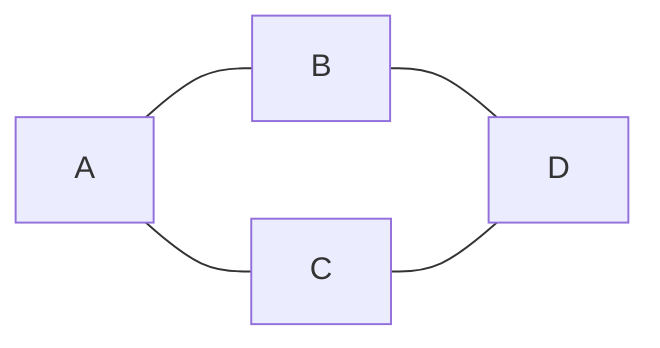
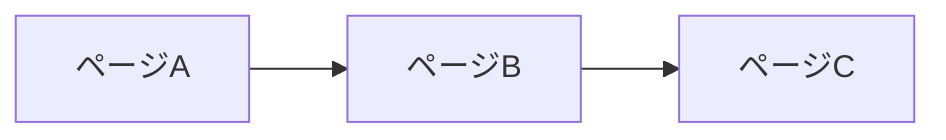
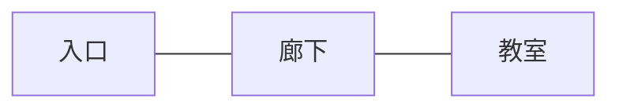
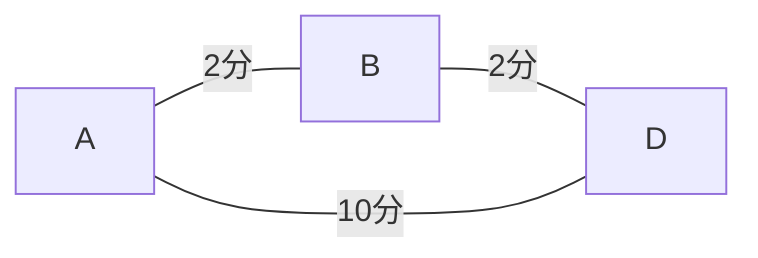
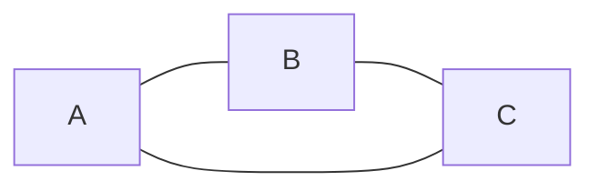
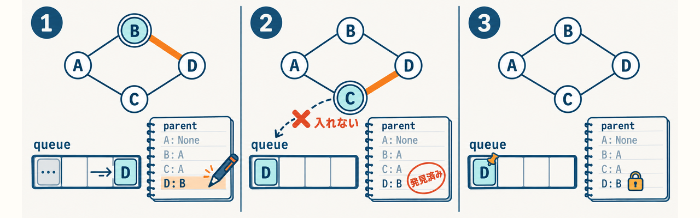

<div class="eyebrow">SOFTWARE DESIGN 2026 / 05</div>

# グラフによる<br>問題の表現

## 関係をデータにし、経路を探す

情報システム学科 3年 / 選択2単位

---
class: learning05
---

<LearningStyles05 />

# 今日の到達目標

- 実際の関係を頂点と辺として表現できる
- 向きと重みの意味を、問題の条件から決められる
- BFSの訪問済み管理と経路復元を説明できる

次回の経路探索演習に使う設計を、自分の言葉で書きます。

---
class: learning05
---

<LearningStyles05 />

# 前回との接続

木の探索では、親子関係を一方向にたどりました。

グラフでは、同じ頂点へ複数の経路で到達することがあります。

<div v-if="false" class="sd-figure-reference">



</div>

<Graph05 variant="diamond" />

訪問済みを管理すると、同じ頂点の重複処理と、循環による繰り返しの探索を防げます。

---
class: learning05
---

<LearningStyles05 />

# 頂点と辺

グラフ G = (V, E) は、頂点の集合Vと辺の集合Eで関係を表します。

| 題材 | 頂点 | 辺 |
| --- | --- | --- |
| 校内の移動 | 場所 | 通れる区間 |
| Webサイト | ページ | リンク |
| 作業の依存 | 作業 | 前提となる関係 |
| 友人関係 | 人 | 相互の関係 |

何を1頂点とするかが、モデルの粒度を決めます。

---
class: learning05
---

<LearningStyles05 />

# モデルの境界

校内の「最短経路」でも、目的によって辺の意味が変わります。

- 通路の数を減らす：各辺を1区間として数える
- 移動時間を減らす：各辺に時間を持たせる
- 階段を避ける：通行可能な辺を限定する

要求を確認してから、必要なデータを決めます。

---
class: learning-course diagram-page
---

<LearningStylesCourse />

# 場所と通路から、頂点と辺を残す


第5回演習の架空マップです。1本の通路を1辺と数え、距離や時間は表しません。<br>
場所の絵とグラフを対応させ、今回の要求に不要な情報を1つ挙げます。

---
class: learning05
---

<LearningStyles05 />

# 有向グラフ

辺に向きがあります。AからBへ行けても、BからAへ行けるとは限りません。

<div v-if="false" class="sd-figure-reference">



</div>

<Graph05 variant="directed" />

例：一方通行、ページのリンク、作業の依存。

---
class: learning05
---

<LearningStyles05 />

# 無向グラフ

辺の両方向に移動できます。

<div v-if="false" class="sd-figure-reference">



</div>

<Graph05 variant="undirected" />

隣接リストでは、Aの隣にBを書くと同時に、Bの隣にもAを書きます。

---
class: learning05
---

<LearningStyles05 />

# 重み付きグラフ

辺に距離・時間・料金などの値を持たせます。

<div v-if="false" class="sd-figure-reference">



</div>

<Weighted05 />

AからDへは、1辺の経路が10分、2辺の経路が4分です。

BFSは辺数が最少の経路を選びます。<br>
各辺の費用が等しければ、最短時間の経路にもなります。

---
class: learning05
---

<LearningStyles05 />

# 隣接リスト

各頂点について、直接つながる頂点を持ちます。

<div class="two-col" style="--left:440px">
<div>

```python
graph = {
    "A": ["B", "C"],
    "B": ["A", "D"],
    "C": ["A", "D"],
    "D": ["B", "C"],
    "X": [],
}
```

</div>
<div>

<Graph05 variant="adjacency" />

</div>
</div>

孤立した頂点Xも明示します。頂点集合を、辺だけから推測しません。

---
class: learning05
---

<LearningStyles05 />

# 次数

単純無向グラフでは、頂点につながる辺の数を次数と呼びます。

有向グラフでは、出ていく辺を **出次数**、入ってくる辺を **入次数** として数えます。

```python
directed = {"A": ["B"], "B": ["D"], "D": []}
print(len(directed["A"]))  # Aの出次数は1
```

次数の値に正負の符号がある、という意味ではありません。

---
class: learning05
---

<LearningStyles05 />

# 隣接行列との比較

行と列を頂点に対応させ、接続の有無を格納します。

| 表現 | 記憶量の目安 | 得意な操作 |
| --- | --- | --- |
| 隣接リスト | O(V + E) | 隣の頂点の列挙 |
| 隣接行列 | O(V²) | 特定の2頂点の接続確認 |

Vは頂点数、Eは辺数です。無向リストでは各辺を両方向に持ちます。

辺が少ないグラフでは、隣接リストが使いやすくなります。

---
class: learning05
---

<LearningStyles05 />

# 経路と距離

経路は、辺で結ばれた頂点の列です。

`A, B, D` の辺数は **2** です。頂点数は3です。

- この回の距離は、移動した辺の数
- 最短経路が複数あることもある
- 同じ長さなら、隣接リストの順が返す経路に影響する

期待値は「長さ」と「経路の妥当性」の両方で確認します。

---
class: learning05
---

<LearningStyles05 />

# 循環

ある頂点から辺をたどり、同じ頂点へ戻れる構造です。

<div v-if="false" class="sd-figure-reference">



</div>

<Graph05 variant="cycle" />

訪問済みを管理しない探索は、同じ頂点を繰り返し処理することがあります。

無向グラフの循環判定では、直前の親へ戻る辺と、それ以外の再訪を区別します。

---
class: learning05
---

<LearningStyles05 />

# 連結性と到達可能性

無向グラフが連結なら、どの頂点の組にも経路があります。

- Xが孤立していれば、全体は非連結
- BFSで到達した集合を求められる
- 有向グラフでは、出発点ごとに到達できる集合が変わる

有向グラフの「全頂点から互いに到達できる」は、強連結という別の条件です。

---
class: learning05
---

<LearningStyles05 />

# 探索する問題の仕様

**入力**：隣接リスト、出発点start、到着点goal。

**出力**：最少辺数の経路1本。到達できなければ `None`。

- 出発点と到着点が同じなら `[start]`
- 未知の頂点名は入力エラーとして扱う
- この演習は重みなし・無向グラフ

到達不能と入力エラーを区別します。

---
class: learning05
---

<LearningStyles05 />

# BFSの層

キューを使うと、出発点から近い距離の順に処理します。

<div v-if="false" class="sd-figure-reference">

| 距離 | 頂点 |
| --- | --- |
| 0 | A |
| 1 | B, C |
| 2 | D |
| 到達不能 | X |

</div>

<BfsLayers05 />

未発見の頂点へ伸ばす辺は、現在の距離に1を足します。

---
class: learning05
---

<LearningStyles05 />

# 発見時の記録

キューへ入れた時点で訪問済みにします。

```python
queue = deque([start])
parent = {start: None}
while queue:
    node = queue.popleft()
    for neighbor in graph[node]:
        if neighbor not in parent:
            parent[neighbor] = node
            queue.append(neighbor)
```

`parent` は発見済み集合と、直前の頂点の記録を兼ねます。

---
class: learning05
---

<LearningStyles05 />

# 訪問済みを記録する理由

BとCの両方からDへ行ける場合を考えます。

1. Bを処理してDを発見し、キューへ入れる
2. Cを処理したとき、Dはすでに発見済み
3. Dを再びキューへ入れず、最初の親を保つ

各頂点を1回だけキューへ入れれば、循環があっても探索を終了できます。

---
class: learning-course diagram-page
---

<LearningStylesCourse />

# 同じDを、2度登録しない



parentのノートは辞書の説明模型です。queueの「…」は省略した部分です。<br>
CからDを見たとき、queueとparentを変更しない理由を、図とコードで説明します。

---
class: learning05
---

<LearningStyles05 />

# 経路の復元

到着点から親をたどり、最後に逆順にします。

<div class="two-col" style="--left:500px">
<div>

```python
path = []
node = goal
while node is not None:
    path.append(node)
    node = parent[node]
path.reverse()
```

</div>
<div>

<ParentChain05 />

</div>
</div>

`D` の親が `B`、`B` の親が `A` なら、結果は `A, B, D` です。

未到達のgoalを先に判定してから復元します。

---
class: learning05
---

<LearningStyles05 />

# BFSの計算量

隣接リストで、各頂点と各隣接要素を一通り調べます。

- 時間：O(V + E)
- 追加領域：キューと親記録にO(V)
- 入力グラフ自体：O(V + E)

辞書・集合の操作を平均的にO(1)とみなすモデルです。

探索ごとに経路全体をコピーする実装では、追加コストを別に数えます。

---
class: learning05
---

<LearningStyles05 />

# DFSを選ぶ場面

DFSは、奥の分岐を調べて戻る操作に合います。

- 到達する頂点の列挙
- 循環の検出や依存関係の検討
- 分岐を選び直す探索

DFSで最初に見つけた経路の辺数が最少とは限りません。

求めたい答えの条件から、探索法を選びます。

---
class: learning05
---

<LearningStyles05 />

# 実演の実行

Python 3.12以上の環境で実行してください。

```bash
python3 examples/05-graphs/graphs.py
```

出力でBFSとDFSの訪問順、経路、連結成分を確認してください。

経路が出たら、各隣接頂点の組が元の辺に含まれるかを図と照合してください。

辺を1本削った場合の結果を、変更前に予測してください。

自習用：[検証済み公開Gist](https://gist.github.com/biwakonbu/b3ff11e2b12c062e11854f5df658269b)。図と同じ例・境界ケースを実行できます。

---
class: learning05
---

<LearningStyles05 />

# モデルを説明する例

`exercises/05.md` の架空校内マップを、モデル化の題材として使います。<br>
別冊の演習を使う場合は、次の条件でモデルを作ります。

- 5頂点以上、孤立頂点を1つ含む隣接リストを作る
- 無向辺を両方向に登録する
- このモデルで「1辺」の意味を書く

別冊の演習を使う場合の記録：<br>
`05-map.py` と、頂点・辺・前提を記した `05-design.md`。

---
class: learning05
---

<LearningStyles05 />

# BFSの探索を追う例

AからDを探すBFSを、1回の取り出しごとに追います。Aの隣接順はB、Cです。<br>
`graphs.py` と同じく、取り出した頂点がgoalかを判定します。

<BfsTrace05 />

期待する性質：最初の発見で親が決まり、同じ頂点が重複して入らない。

---
class: learning05
---

<LearningStyles05 />

# BFSの追跡を、出力と照合する

<BfsTrace05 reveal />

`graphs.py` の `shortest_path` は、D を取り出した時点で復元へ進みます。<br>
parent から A, B, D が復元でき、出力 `['A', 'B', 'D']` と一致します。

AIの説明も、実際のキューの変化と図を照合して確かめます。

変えて試す：B–Dの辺を両方向から削る前に、経路と辺数を予想します。

---
class: learning05
---

<LearningStyles05 />

# 確認問題

1. 一方通行を無向辺として登録すると、どんな誤答が起こるか
2. BFSで訪問済みを記録するタイミングはどこか
3. 最少辺数と最短時間が一致する条件は何か
4. 孤立頂点を持つ入力で、到達不能をどう返すか

解答では、前提条件と理由を添えてください。

---
class: learning05
---

<LearningStyles05 />

# まとめと次回

グラフの設計では、頂点・辺・向き・重みの意味を先に決めます。

BFSは最少辺数の経路を探せます。各辺の費用が等しければ、最短費用とも一致します。<br>
親の記録を使うと、その経路を復元できます。

次回は、仕様を満たす経路探索プログラムを実装し、授業内で提出します。

---
class: learning05
---

<LearningStyles05 />

# 参考資料

- [Python公式：collections.deque](https://docs.python.org/3/library/collections.html#collections.deque)
- [MIT 6.006：BFS・DFSの講義資料](https://ocw.mit.edu/courses/6-006-introduction-to-algorithms-fall-2011/pages/lecture-notes/)

図・校内マップ・コードは本教材用の自作です。

次回の課題手順：`exercises/06.md`。
