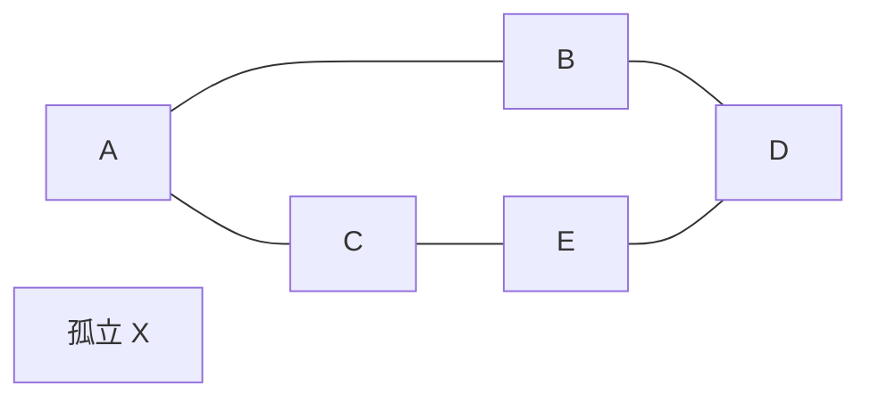
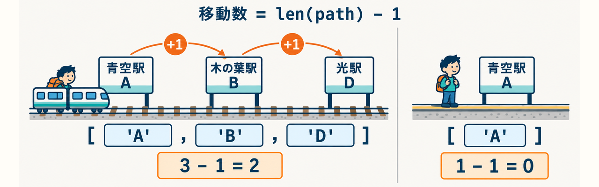

<div class="eyebrow">SOFTWARE DESIGN 2026 / 06</div>

# 経路探索の<br>実装と提出

## 仕様を、動くコードと検証にする

情報システム学科 3年 / 選択2単位

---
class: learning06
---

<LearningStyles06 />

# 今日の到達目標

- 重みなしグラフで最少辺数の経路を実装できる
- 正常系と境界ケースを、仕様に対応させて検証できる
- 自分のコードとAIの支援範囲を説明して提出できる

授業内で実装・確認・提出を行います。<br>
正式な提出先・期限は授業時の案内に従ってください。

---
class: learning06
---

<LearningStyles06 />

# 前回との接続

前回は、頂点を発見したときに親を記録しました。

今回は、その記録を使い、出発点から到着点までの経路を返します。

- キュー：次に処理する頂点
- 親の辞書：発見済みの判定と復元の材料
- 関数の戻り値：経路、または到達不能

<StageStrip06 full />

開始状態を確認したら実装へ。段階2〜5は作業中に戻って読みます。<br>
検証と提出確認の時間も、最初に確保してください。

---
class: learning06
---

<LearningStyles06 />

# 題材と前提

架空の駅を結ぶ **無向・重みなしグラフ** を使います。

<div v-if="false" class="sd-figure-reference">



</div>

<RouteGraph06 />

各辺は移動1回です。同じ路線・駅でも、運行時間を表すモデルではありません。

---
class: learning06
---

<LearningStyles06 />

# 入力と出力

出発駅と到着駅を、コマンドライン引数で指定します。

```bash
python3 examples/06-route-project/route_starter.py A D
```

最終的に期待する経路は **A, B, D**、移動数は **2** です。

引数を省略するとAからDを使います。入力データは `route_data.py` にあります。

---
class: learning-course diagram-page
---

<LearningStylesCourse />

# 3駅の経路は、移動2回



駅名はroute_data.pyの架空駅です。列車は移動回数の比喩で、所要時間は表しません。<br>
`A → B → D` は3駅で移動2回。`A → A` は経路 `[A]` で移動0回です。

---
class: learning06
---

<LearningStyles06 />

# 条件ごとの期待値

<div v-if="false" class="sd-figure-reference">

| 入力 | 経路関数の期待値 |
| --- | --- |
| AからD | `['A', 'B', 'D']` |
| AからA | `['A']` |
| AからB | `['A', 'B']` |
| AからX | `None` |

</div>

<CliOutcome06 />

成功は標準出力、失敗はエラー出力。`route_reference.py` で照合しました。<br>
未知の駅名は入力エラーです。CLIは到達不能・入力エラーとも終了コード2で伝えます。

---
class: learning06
---

<LearningStyles06 />

# 学生版の開始状態

`route_starter.py` は、同じ駅と隣の駅だけを処理します。

```bash
python3 examples/06-route-project/route_starter.py A A
python3 examples/06-route-project/route_starter.py A B
python3 examples/06-route-project/route_starter.py A D
```

AからDの多段経路は未実装です。最初の失敗は、実装する範囲を示します。

`find_route` のTODOを中心に、自分の作業コピーで実装してください。

---
class: learning06
---

<LearningStyles06 />

# 作業コピーの準備

Python 3.12以上の環境で、リポジトリのルートから実行します。<br>
学生版とデータを、同じ作業先へコピーしてください。

```bash
mkdir -p work/06
cp examples/06-route-project/route_starter.py work/06/route.py
cp examples/06-route-project/route_data.py work/06/route_data.py
python3 work/06/route.py A D
```

以後は `work/06/route.py` を編集してください。

---
class: learning06
---

<LearningStyles06 />

# 段階1：仕様の記録

<StageStrip06 :current="1" />

実装前に `work/06/README.md` へ書いてください。

- 最短とは何を最少にすることか
- 未知の駅と、存在する孤立駅の違い
- 同じ駅を入力したときの経路と移動数
- 経路が複数あるとき、何を保証するか

期待値を先に書くと、出力に合わせて仕様を変える誤りを避けやすくなります。

---
class: learning06
---

<LearningStyles06 />

# 段階2：探索の初期状態

<StageStrip06 :current="2" />

開始点だけをキューへ入れ、親を持たない開始点を記録します。

```python
queue = deque([start])
parent = {start: None}
```

未発見の頂点だけを追加します。開始点も最初から発見済みです。

未知の頂点の検証は、探索の前に行います。

---
class: learning06
---

<LearningStyles06 />

# 段階3：次の頂点の発見

<StageStrip06 :current="3" />

```python
node = queue.popleft()
for neighbor in graph[node]:
    if neighbor not in parent:
        parent[neighbor] = node
        queue.append(neighbor)
```

`while queue:` の中に置く処理の中心部分です。

取り出しには `popleft()` を使い、先に発見した頂点から処理します。

---
class: learning06
---

<LearningStyles06 />

# 段階4：到着と終了

<StageStrip06 :current="4" />

到着点を発見または取り出したら、経路復元へ進めます。

- 探索を最後まで行っても、到着点がなければ `None`
- 到着点が発見済みなら、親をたどって復元
- キューが空になることが、到達不能時の終了条件

どの時点で停止するかは、自分の実装に合わせて説明してください。

---
class: learning06
---

<LearningStyles06 />

# 段階4の確認：A D の状態を書く

自分の実装で、取り出しごとのキューと新しい parent を書きます。<br>
止めた行で終えます。

<RouteStateSheet06 />

確かめる：parent から復元した経路が A, B, D になるか。<br>
各駅が parent に1回だけ入り、上書きされていないか。

---
class: learning06
---

<LearningStyles06 />

# 段階5：経路の復元

<StageStrip06 :current="5" />

親をたどる向きは、到着点から出発点への逆向きです。

```python
path = []
node = goal
while node is not None:
    path.append(node)
    node = parent[node]
return list(reversed(path))
```

辺数は `len(path) - 1` です。同じ駅の経路も、この式で0になります。

---
class: learning06
---

<LearningStyles06 />

# 正常系の実行

```bash
python3 work/06/route.py A D
python3 work/06/route.py D A
python3 work/06/route.py A A
```

期待する経路：A B D、D B A、A。

それぞれの移動数：2、2、0。<br>
出力だけでなく、各隣接駅が辺で結ばれていることも確認してください。

---
class: learning06
---

<LearningStyles06 />

# 境界ケースの実行

```bash
python3 work/06/route.py A X
python3 work/06/route.py UNKNOWN D
```

到達不能と未知の入力を、それぞれ説明できる表示にします。

このCLI契約では、どちらも終了コード2です。<br>
期待する失敗をテストし、成功時と混同しないでください。

---
class: learning06
---

<LearningStyles06 />

# 経路の検証条件

文字列の一致だけでは、経路の正しさを十分に調べられません。

1. 先頭が出発点、末尾が到着点
2. 隣り合う2頂点が元のグラフの辺
3. 最少辺数が既知の小さい例で一致
4. 到達不能・未知の入力を仕様どおり扱う

自作入力も1件追加し、その期待値を手で求めてください。

---
class: learning06
---

<LearningStyles06 />

# 循環を含む入力

今回の駅グラフには、A B D E C A の循環があります。

訪問済みの判定が働けば、各頂点の発見は1回で済みます。

- `parent` を上書きし続けていないか
- 同じ頂点を繰り返しキューへ入れていないか
- 親の連鎖が開始点へ戻るか

途中のキューと親の記録で確認してください。

---
class: learning06
---

<LearningStyles06 />

# 失敗の切り分け

| 症状 | 先に見る場所 |
| --- | --- |
| 終わらない | 訪問済み判定、更新 |
| 経路が逆向き | 復元後の反転 |
| 長い経路になる | FIFO、発見時の親記録 |
| 同駅で移動数1 | 頂点数と辺数の混同 |

1つの入力に絞って、状態の変化を追ってください。

---
class: learning06
---

<LearningStyles06 />

# AIによる支援の使い方

質問例：「このキューの遷移がBFSになる理由を、入力A Dで説明して」

- 提案を読んで、採用する変更を自分で選ぶ
- 自分の入力で再実行し、期待値と照合する
- 最後は、資料を閉じても処理順を説明できるか確認する

AI利用の有無を記録してください。未使用の場合も「未使用」と書いてください。

---
class: learning06
---

<LearningStyles06 />

# 公開参考版の使い方

`route_reference.py` は、本教材の解説・照合用の参考実装です。

自分の実装と検証結果を先に記録し、比較した場合はその範囲も書いてください。

```bash
python3 examples/06-route-project/route_reference.py A D
```

参考版のコードを読むことと、自分が理由を説明できることを区別します。<br>
正式な課題での参照条件は、授業時の案内に従ってください。

---
class: learning06
---

<LearningStyles06 />

# 提出物の準備

本教材の推奨構成です。正式な提出方法は担当教員の案内に従ってください。

- `route.py` と必要な `route_data.py`
- `README.md`：実行方法、前提、設計の説明
- `test-results.md`：入力、期待値、実際の結果
- `reflection.md`：AI支援、検証、残る疑問

提出前に、作業ディレクトリからの実行をもう一度確認してください。

---
class: learning06
---

<LearningStyles06 />

# 理解の確認

1. `parent[start]` を `None` にする理由は何か
2. `pop()` を使うと、最少辺数の保証に何が起こるか
3. `len(path) - 1` が0になる入力を説明できるか
4. 到達不能のときに、経路復元を始めてはいけない理由は何か

次回の質疑に向け、説明に詰まる箇所を振り返りへ記してください。

---
class: learning06
---

<LearningStyles06 />

# 授業内の提出確認

実装、検証、成果物整理が揃ったら、案内された方法で提出してください。

提出できたことを確認し、使った版のコードと結果を手元に残してください。

未完成の部分がある場合は、動く範囲・再現入力・残る問題を書いてください。

次回は、提出内容を題材に設計と理解を説明します。

---
class: learning06
---

<LearningStyles06 />

# まとめと次回

最少辺数を求める仕様を、キュー・親記録・境界処理として実装しました。

検証には、正常な経路と、意図した失敗の両方が必要です。

次回は講評と質疑です。コードの各行だけでなく、**その選択の理由**を話します。

課題全文：`exercises/06.md`。

---
class: learning06
---

<LearningStyles06 />

# 参考資料

- [Python公式：collections.deque](https://docs.python.org/3/library/collections.html#collections.deque)
- [MIT 6.006：BFSの講義資料](https://ocw.mit.edu/courses/6-006-introduction-to-algorithms-fall-2011/pages/lecture-notes/)

架空の駅データ、学生版、参考版は本教材用の自作です。

本教材の到達基準は学習の目安です。正式な点数配分は設定していません。
