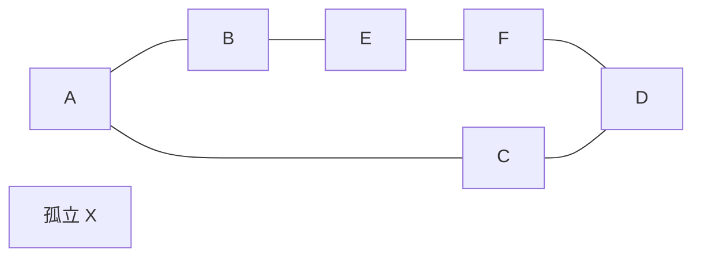
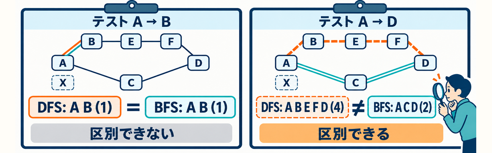

<LearningStylesCourse />

<div class="eyebrow">SOFTWARE DESIGN 2026 / 07</div>

# 講評と<br>設計の説明

## コードの振る舞いを、根拠とともに話す

情報システム学科 3年 / 選択2単位
---
class: learning-course
---


# 今日の到達目標

- 実装の結果を仕様と照合し、改善点を説明できる
- 小さい反例で、探索法の保証の違いを示せる
- 自分の提出物について、設計と検証の質疑に答えられる

共通講評には教材用の架空提出例を使います。実際の学生の情報は含めません。
---
class: learning-course
---


# 前回との接続

前回の成果物は、コードと検証記録と振り返りです。

今日は「なぜその結果になるか」をコードに戻って確認します。

- 仕様の言葉と戻り値が一致するか
- テストは、その仕様を確認できる入力か
- AIの提案を採用した理由を説明できるか
---
class: learning-course
---


# 講評の対象

この回のサンプルは **講評専用の架空グラフ** です。
第06回の駅データとは異なります。

<div v-if="false" class="sd-figure-reference">



</div>

<Figure07 :index="3" />

AからDには、4辺と2辺の経路があります。
---
class: learning-course
---


# 架空提出例の主張

Python 3.12以上の環境で実行してください。

`flawed_route.py` は、DFSで最初に発見した経路を「最短」と表示します。

```bash
python3 examples/07-review/flawed_route.py A D
```

出力経路は **A B E F D**、移動数は **4** です。

経路は存在します。しかし、仕様の「最少辺数」を満たすか確認が必要です。
---
class: learning-course
---


# 反例の役割

同じ入力に、もっと短い経路 **A C D** があります。移動数は2です。

「すべての入力で最少」という主張は、この1例で崩れます。

- 経路の妥当性：隣接頂点が辺で結ばれる
- 最少性：これより短い経路がない

成立している部分と、改善が必要な部分を分けて講評します。
---
class: learning-course
---


# DFSの処理順

Aの隣接順がB、Cなら、B側の奥を先にたどります。

| 進行 | 現在の経路 |
| --- | --- |
| Aを訪問 | A |
| B側へ進む | A B |
| E、Fへ進む | A B E F |
| Dを発見 | A B E F D |

訪問済みの管理は、探索の終了に役立ちます。最少性の保証とは別の条件です。

このDFSで、頂点Cの隣接リストが一度でも調べられるか予想してください。

---
class: learning-course diagram-page
---

# DFSの呼出し: Cは呼ばれない

visit は B 側へ深く潜り、D に入った時点でその経路を返します。

<Figure07 :index="0" />

<div class="course-check">別入力: 作業コピーで隣接順を A:[C,B] にしたとき、返る経路を予想して実行します。</div>
---
class: learning-course
---


# BFSの処理順

BFSは、出発点からの辺数が小さい順に探索します。

| 層 | 頂点 |
| --- | --- |
| 0 | A |
| 1 | B, C |
| 2 | E, D |

Dの発見に必要な辺数は2です。先にBを処理しても、B側の奥まで進みません。

Dを取り出す直前に、キューに残っている頂点を予想してください。

---
class: learning-course diagram-page
---

# BFSの層と previous

辺数の層ごとに発見し、最初に見つけた直前の頂点を previous に記録します。

<Figure07 :index="1" />

<div class="course-check">別入力: <code>improved_route.py A F</code> の経路と移動数を、層から予想して実行します。</div>
---
class: learning-course
---


# 改善版の照合

```bash
python3 examples/07-review/improved_route.py A D
```

期待する経路は **A C D**、移動数は **2** です。

改善点：FIFOのキューと、最初に発見した親の記録を使います。

コードを比較し、何が変わって最少性を保証するかを説明してください。

previous から経路を戻すとき、最初に path へ入る頂点を予想してください。

---
class: learning-course diagram-page
---

# previous を逆にたどって復元

goal から previous をたどり、None で止めて逆順にします。

<Figure07 :index="2" />

<div class="course-check">別入力: A X では previous に X が入らず None になる理由を、実行前に説明します。</div>
---
class: learning-course
---


# 仕様に戻る説明

説明の出発点は、関数名よりも要求する答えです。

「無向・重みなしのグラフで、最少辺数の経路1本を返す」

この条件に対して、BFSは近い層を先に探索します。
最初の親を保持すると、その層の経路を復元できます。

重みが異なる場合には、この根拠をそのまま使えません。
---
class: learning-course
---


# 入力変更による確認

講評用グラフで、A Cの辺を削るとどうなるか。

残る経路は **A B E F D**、移動数は4です。

- 変更前：4辺を返す実装は最少性を満たさない
- 変更後：4辺の経路も最少になる

1つの成功例だけで、実装一般の正しさを判断しません。
---
class: learning-course
---


# 境界ケースの講評

| 条件 | 確認する振る舞い |
| --- | --- |
| 同じ出発点と到着点 | 経路1頂点、移動数0 |
| 孤立したXへの探索 | 到達不能として終了 |
| 未知の頂点名 | 入力エラーとして終了 |
| 循環を含むグラフ | 重複処理で終わらなくならない |

未対応の条件には、再現入力と期待値を添えてください。
---
class: learning-course
---


# テストの不足

架空提出例が「Aから隣のB」だけを確認していたとします。

その入力では、DFSでもBFSでも1辺の経路を返します。

テストを増やすときは、数よりも **区別できる条件** を選びます。

この例では、奥の4辺と近い2辺を持つ入力が、最少性の違いを明らかにします。
---
class: learning-course diagram-page
---

<LearningStylesCourse />

# 2つの実装を区別する入力を選ぶ



架空の講評例です。A→Bは両方1辺、A→DはDFSが4辺、BFSが2辺です。<br>
DFSで最初に見つけた経路は、最短とは限りません。区別できる入力を自分で選びます。

---
class: learning-course
---


# 計算量の説明

隣接リストのBFSでは、各頂点と隣接要素を一通り調べます。

- 時間O(V + E)、追加領域O(V)
- 途中で全経路をコピーするなら、その費用も検討する
- 出力する経路の長さも、復元の処理に影響する

「速い」という感想を、入力サイズと操作数の説明へ直します。
---
class: learning-course
---


# 読みやすさの講評

名前は、記録する意味と対応させます。

```python
parent[neighbor] = node
```

この1行は「neighborを最初に発見した直前の頂点をnodeと記録する」という意味です。

変数名・関数の責務・境界処理が追えると、誤りを説明しやすくなります。
---
class: learning-course
---


# 講評文の書き方

対象を特定し、根拠を示し、改善後の確認方法を書きます。

例：

> A Dで4辺の経路を返しますが、A C Dは2辺です。FIFOのキューで探索し、同じ入力と到達不能の入力で結果を確認してください。

人格や能力の評価を避け、修正できる振る舞いを扱います。
---
class: learning-course
---


# 演習1：架空提出例のレビュー

`exercises/07.md` に沿って、両方の実装を実行してください。

- 主張、反例、実際の出力を記録する
- 仕様を満たす点と、改善が必要な点を書く
- 改善後の確認入力を1つ追加する

成果物：`07-review.md`。
---
class: learning-course
---


# 演習2：自分の提出物の説明

第06回のコードを開き、次の箇所を指して説明してください。

1. 仕様と、入力エラーの検証
2. キューの初期化と取り出し
3. 発見済みの判定と親の記録
4. 到達不能の判定と経路復元

コードを読むだけでなく、具体的な入力で状態を追ってください。
---
class: learning-course
---


# 授業内の質疑

提出者と担当教員で、提出内容の理解を確認します。

問いの例：「AからDの探索で、Cを処理した時点の親記録を説明してください」

答えに詰まったら、入力を小さくし、キューと辞書を書いて確かめてください。

説明の修正や残る疑問を、その場でメモへ残してください。

待機中はペアで本人コードを説明し、反例を検証してください。教員との確認順は授業で案内します。
---
class: learning-course
---


# AI利用の振り返り

AIが生成した箇所も、採用した実装について説明します。

- どの問いにAIを使ったか
- 提案のどこを変更したか
- 何を実行して正しさを確認したか
- 今なら、自分でどこまで説明できるか

AI利用の有無だけで、理解の有無を決めません。
---
class: learning-course
---


# 改善記録

`07-improvements.md` に、修正前後の差を残してください。

- 直した仕様・振る舞い
- 再現入力、期待値、実際の結果
- 修正の理由
- 次に確認したい条件

正式な再提出の有無や方法は、授業時の案内に従ってください。
---
class: learning-course
---


# 確認問題

1. 訪問済み集合があれば、DFSは最短経路を保証するか
2. 経路が実在することと、最短であることはどう違うか
3. どんなテスト入力なら、DFSとBFSの違いを検出しやすいか
4. 修正後のコードを、どの証拠で確認するか

理由と具体例を添えて答えてください。
---
class: learning-course
---


# まとめと次回

講評では、仕様・反例・状態の追跡を結び付けます。
説明できない部分は、小さい入力で再検証します。

次回は、電卓を題材に **字句解析・構文解析・意味解析** を学びます。

入力文字列を木構造へ変換する場面でも、今日のデータ構造の考え方を使います。
---
class: learning-course
---


# 参考資料

- [Python公式：collections.deque](https://docs.python.org/3/library/collections.html#collections.deque)
- [MIT 6.006：BFS・DFSの講義資料](https://ocw.mit.edu/courses/6-006-introduction-to-algorithms-fall-2011/pages/lecture-notes/)

架空提出例・グラフ・講評文は本教材用の自作です。
実学生の提出物や採点情報は使っていません。
