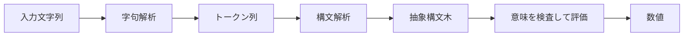
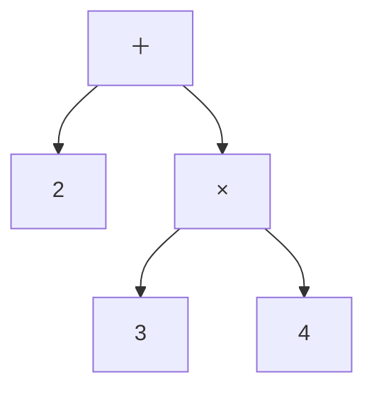
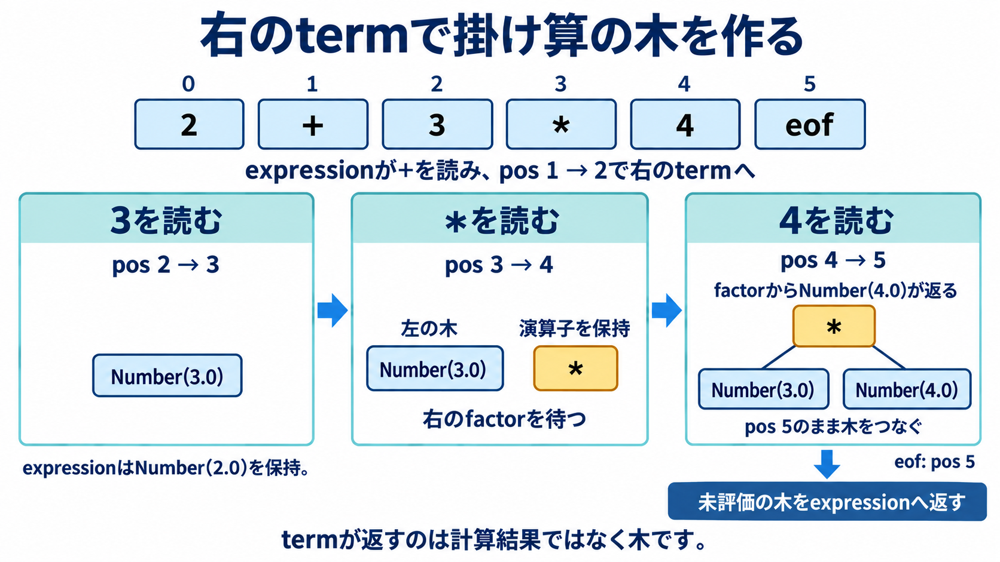
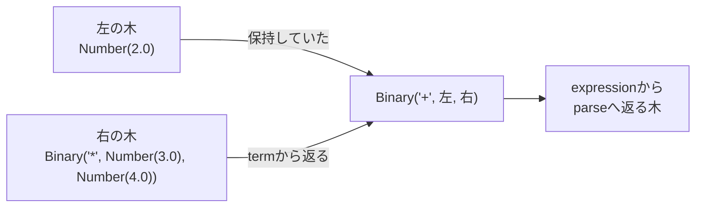

<div class="eyebrow">SOFTWARE DESIGN 2026 / 08</div>

# 電卓の解析と実行
## 文字列から、計算の意味へ

情報システム学科 3年生　選択 2単位

---

# 今日の到達目標

- 字句解析・構文解析・意味の検査を区別する。
- 優先順位を表した抽象構文木を読む。
- 木を再帰的に評価する流れを説明する。
- 不正な入力を、適切な段階で拒否する。

題材は、四則演算と括弧を扱う小さな電卓です。

---

# 今日、中心に追う一例

`2+3*4` を、**トークン位置 → 規則の呼出し → 部分的な木 → 評価**まで追います。<br>
その後、字句・構文・評価の失敗を、理由とテストで区別します。

| 別冊演習Cの実装経路 | 変更する部分 |
| --- | --- |
| 完成基礎電卓を使って拡張 | 独立の検査・表示・テストを増やす |
| 自分で全実装する | 字句・構文・評価を別関数として作る |

別冊の演習Cを使う場合は、両経路に共通の受入例と提出物を確認します。<br>
完成基礎電卓は、途中状態と各段階の役割を観察する題材です。

---

# グラフと木からの接続

前回までは、頂点と辺で問題の構造を表しました。<br>
式 `2 + 3 * 4` も、計算のまとまりを木で表せます。

**今日の問い**：文字の並びから、どのように木を作るか。

授業で作る処理系では、Pythonの `eval()` を使わずに式を解釈します。

---

# 電卓の仕様

| 項目 | この教材で扱うもの |
|---|---|
| 数値 | 整数の表記、小数の表記 |
| 演算 | `+ - * /`、単項 `+ -` |
| グループ | 括弧、入れ子 |
| 空白 | トークンの外では無視 |

変数・関数・代入は扱いません。数値は内部でfloatに変換します。

---

# 解析から実行まで



字句は文字の単位を、構文は並び方を、意味は演算の成立条件を扱います。

---

# 字句解析の入力と出力

入力は `12 + 3.5` です。

| 種類 | 文字列 | 開始位置（0始まり） |
|---|---|---:|
| number | `12` | 0 |
| + | `+` | 3 |
| number | `3.5` | 5 |
| eof | 空文字列 | 8 |

位置を保持すると、エラーの発生箇所を伝えられます。

---

# 数字をまとめる

`123` は3つの数ではなく、1つの数値トークンです。

```text
現在位置0: 1を読む
現在位置1: 2も数字なので続ける
現在位置2: 3も数字なので続ける
終端に到達: "123"をnumberとして確定
```

空白なしの `12+3` も、演算子を境界にして分けます。

---

# 空白と不正な文字

```text
2 + 3      number, +, number, eof
2+3        number, +, number, eof
2 @ 3      @ の位置で字句エラー
```

空白は読み飛ばします。知らない文字を勝手に取り除くことはしません。<br>
`2 @ 3` を23や5として解釈すると、入力の意味が変わってしまいます。

---

# EBNFによる数値の表記

```text
digit  = "0" | "1" | ... | "9" ;
digits = digit, { digit } ;
number = digits, [ ".", { digit } ]
       | ".", digits ;
```

`{ }` は0回以上の繰り返し、`[ ]` は省略可能な部分を表します。<br>
この教材の文法は `3`、`3.5`、`3.`、`.5` を許し、`.` だけは拒否します。

---

# 構文はトークンの並び方

| 入力 | 字句 | 構文 |
|---|---|---|
| `2 + 3` | 全て識別できる | 有効 |
| `2 + * 3` | 全て識別できる | オペランド不足 |
| `(2 + 3` | 全て識別できる | 閉じ括弧不足 |
| `2 3` | 全て識別できる | 余分な数値 |

字句が読めても、式として成立するとは限りません。

---

# 抽象構文木（AST）



`2 + 3 * 4` は、3と4の積を右の子に持ちます。<br>
空白や括弧そのものは、木のノードとして残す必要がありません。

---

# 優先順位を文法にする

```text
expression = term, { ("+" | "-"), term } ;
term       = factor, { ("*" | "/"), factor } ;
factor     = number
           | ("+" | "-"), factor
           | "(", expression, ")" ;
```

expressionがtermを、termがfactorを読みます。<br>
内側で読んだまとまりが、木の子になります。

---

# 2+3*4のトークン位置

| トークンの添字 | kind | text | 元の文字列のoffset |
| --- | --- | --- | --- |
| 0 | number | "2" | 0 |
| 1 | + | "+" | 1 |
| 2 | number | "3" | 2 |
| 3 | * | "*" | 3 |
| 4 | number | "4" | 4 |

添字5は `eof` です。`pos` はトークン添字、`offset` は入力の文字位置で、空白や多桁でずれる場合があります。

---

# Parserは入力位置を持つ

`Parser(tokens)` が作る情報・操作のまとまりを、各規則の **self** が指します。

| 公開コードの読み方 | 役割 |
| --- | --- |
| parser.tokens | 入力のトークン列 |
| parser.pos | 次に読むトークンの添字。初期値0 |
| parser.current | tokens[pos]。見るだけで位置は進まない |
| parser.take() | 現在のトークンを返し、posを1増やす |

規則が別の規則を呼んでも、同じselfの位置を引き継ぎます。

---

# 2+3*4：currentを見る／takeで進める

| 操作前のpos | 操作 | 得られるトークン | 操作後のpos |
| --- | --- | --- | --- |
| 0 | self.current | number "2" | 0 |
| 0 | self.take() | number "2" | 1 |
| 1 | self.current | + "+" | 1 |
| 1 | self.take() | + "+" | 2 |

`take()` は現在のトークンを返して位置を進めます。`current` を見るだけでは位置は進みません。

---

# NumberとBinaryは、木の部品

木のオブジェクトには、評価に必要な情報を保存します。

| 作る部品 | 保存する情報 |
| --- | --- |
| Number(2.0) | 数値2.0を持つ葉 |
| Binary("+", left, right) | 演算子と、左右の子の木 |

`Binary("*", Number(3.0), Number(4.0))` は、3×4を表す木です。<br>
作った時点では計算しません。`evaluate` が木を読んで値を求めます。

`node` は「ここまでに作った木」を指す変数として使います。

---

# 再帰下降パーサー

文法の規則ごとに関数を用意します。

```python
def expression(self):
    node = self.term()
    while self.current.kind in ("+", "-"):
        op = self.take().kind
        node = Binary(op, node, self.term())
    return node
```

左の式を先に木にすることで、減算の左結合を表します。

---

# 途中1：最初のtermが返る

`parse("2+3*4")` はposを0にして `expression()` を呼びます。

| 規則と動き | posの変化 | できた木・戻り値 |
| --- | --- | --- |
| expression → term → factorと呼ぶ | 0のまま | まだ木はない |
| factorがtakeで "2" を読む | 0 → 1 | Number(2.0)を返す |
| termがcurrent.kindの "+" を見る | 1のまま | * / ではないので、その木を返す |
| expressionがtermの木を受け取る | 1のまま | nodeはNumber(2.0) |

termは `+` を読まずにexpressionへ残します。進んだposは同じParserが保持します。

---

# 途中2：右のtermで掛け算を作る

<div v-if="false" class="sd-figure-reference">

| 規則と動き | posの変化 | 右側で作っている木 |
| --- | --- | --- |
| expressionがtakeで "+" を読む | 1 → 2 | 右のtermを待つ |
| term → factorが "3" を読む | 2 → 3 | Number(3.0) |
| termがtakeで "*" を読む | 3 → 4 | 左に3の木を保持 |
| factorが "4" を読む | 4 → 5 | Number(4.0)が返る |
| termが左右をつなぎ、eofで終了 | 5のまま | 3×4の木を返す |

</div>

<div class="sd-diagram-full">

</div>

termが返すのは数値12ではなく、`Binary("*", 左, 右)` の未評価の木です。

---

# 途中3：返った木を左の木につなぐ



図の矢印は、部分的な木を渡す流れを表します。expressionもeofを見て返ります。<br>
parseは余分なトークンがないことを確認し、足し算を根に持つASTを返します。

優先順位は、termが掛け算の木を先にまとめたことで表れています。

---

# 左結合と計算結果

```text
10 - 3 - 2
正しい木: (10 - 3) - 2 = 5
別の木:   10 - (3 - 2) = 9
```

演算子の優先順位だけでなく、同じ優先順位での結合方向も仕様の一部です。

**検証**：`8 / 2 / 2` は、この教材では2になります。

---

# 括弧の扱い

```text
factorが "(" を見つける
  expressionで内側の式を読む
  ")" が続くことを確認する
  内側の木を返す
```

閉じ括弧がなければ構文エラーです。<br>
括弧の中の式も同じ文法なので、再帰で入れ子を扱えます。

---

# 単項マイナス

```text
-3 * 2
Binary("*", Unary("-", Number(3)), Number(2))
結果: -6
```

単項マイナスは引数を1つ、減算は引数を2つ取ります。<br>
同じ文字でも、式の中での位置によって役割が決まります。

---

# ASTを評価する

```python
if isinstance(node, Number):
    return node.value
if isinstance(node, Binary):
    left = evaluate(node.left)
    right = evaluate(node.right)
    if node.op == "+":
        return left + right
```

子の値を求めてから、親の演算を適用します。<br>
第4回の木の走査が、式の評価につながります。

---

# 意味の検査と実行時の失敗

`1 / 0` は字句も構文も正しいものの、数値の除算として成立しません。

```python
if node.op == "/":
    if right == 0:
        raise CalculatorError("division by zero")
    return left / right
```

この電卓では、評価時に意味上の条件を検査します。<br>
一般の言語では、型や名前を実行前に検査する処理系もあります。

---

# 3段階のエラーを比較する

| 例 | 段階 | 理由 |
|---|---|---|
| `2 @ 3` | 字句 | 未知の文字 |
| `2 + * 3` | 構文 | 値が必要な位置に `*` |
| `1 / 0` | 意味・評価 | ゼロでの除算 |

同じ「動かない」でも、修正すべき場所が異なります。

---

# サンプルの実行

```bash
python3 examples/08-calculator/calculator.py --eval '2+3*4'
python3 examples/08-calculator/calculator.py --eval '(2+3)*4'
python3 examples/08-calculator/calculator.py --eval '1/0'
```

出力は順に14、20、理由の分かるエラーです。<br>
終了コードは、成功時が0、解析・評価エラーが1です。

---

# 数値表現の限界

内部のfloatには、10進小数を厳密に表せない値があります。

```text
0.1 + 0.2 は、内部で厳密な0.3とは限らない。
```

整数の例は、結果の一致で確認します。小数のテストでは誤差を考慮します。<br>
金額の厳密な計算などでは、数値表現そのものを設計する必要があります。

---

# トークン列を予測する問い

`12+3.5*(2-1)` のトークン列を予測します。

- 種類・文字列・開始位置を記録する。
- 空白を追加した場合の違いを説明する。
- `@` を挿入して、拒否する位置を確かめる。

公開例の `tokenize()` と予測を照合します。

---

# 木と値の対応を読む例

`2+3*4` と `(2+3)*4` のASTを描き、構造を比べます。

葉から順に値を求め、途中結果を木の横に記録します。<br>
その後にサンプルを実行し、結果14と20を確認します。

`10-3-2` の木も比べ、結合方向を説明します。

---

# 段階別にテストを読む

`exercises/08.md` の題材で、正常例と失敗例を段階ごとに整理します。

別冊で実装・拡張する場合は、選んだ経路と自分の変更範囲を記録します。

- 正常：優先順位・括弧・単項演算。
- 字句：未知の文字。
- 構文：閉じ括弧不足・余分なトークン。
- 評価：ゼロ除算。

AIの提案も、どの段階を変更するかを確かめて読みます。

---

# 確認問題

1. `2+*3` は、字句エラーだろうか。
2. ASTに空白を残す必要がない理由は何か。
3. `10-3-2` の木と結果を説明できるか。
4. `1/0` を構文解析だけで拒否する設計にすると何が起こるか。

予測を述べてから、実行例で確かめてください。

---

# 確認問題の解答：字句と木

**1　字句は有効、構文で失敗する。**<br>
`2`・`+`・`*`・`3` は、全て識別できるトークンです。<br>
しかし、`+` の後に必要なfactorを `*` で始める規則はありません。

**2　空白は計算を変えず、括弧の役割は木に残る。**<br>
`(2+3)*4` では、足し算の木を掛け算の子にします。<br>
このASTでは、括弧の文字を残さなくてもグループを表せます。<br>
元の表記も復元したい場合は、別に情報を保存する設計もあります。

---

# 確認問題の解答：結合と評価

**3　左の木に次の減算をつなぐため、左結合になる。**

| 木のまとまり | 計算の順と結果 |
| --- | --- |
| (10 − 3) − 2 | 7 − 2 = 5 |
| 10 − (3 − 2) | 10 − 1 = 9 |

**4　演算対象が0かは、評価で分かる。**<br>
`1/(2-2)` は構文上は合法でも、右の式の値が0になります。<br>
ゼロ除算は式の並び方と分け、評価時の成立条件として検査します。

---

# まとめと次回

文字をトークンに分け、文法に従って木を作り、意味を評価しました。<br>
処理を分けると、失敗の原因と修正箇所を絞れます。

**復習**：電卓の4種類の失敗を、テストで説明してください。<br>
**次回**：括弧と前置記法を使うLispのREPLを作ります。

---

# 参考と教材ファイル

- Python 3.12 re<br>https://docs.python.org/3.12/library/re.html
- Python 3.12 浮動小数点の問題と制限<br>https://docs.python.org/3.12/tutorial/floatingpoint.html
- 学生向け課題：`exercises/08.md`
- 解析・評価の公開例：`examples/08-calculator/`

本教材の文法・AST・図・コードは新規に作成したものです。
