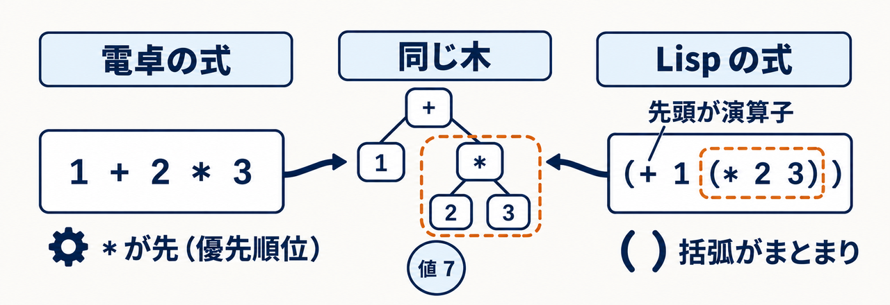
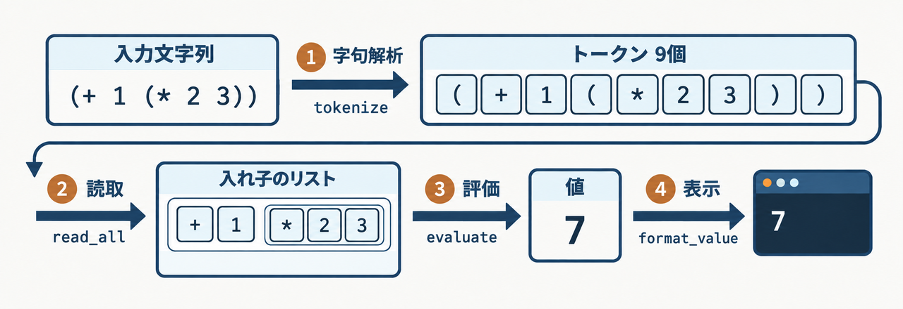
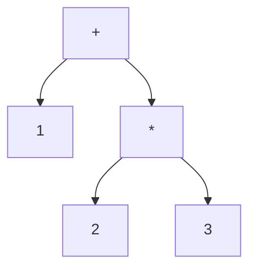

<LearningStylesCourse />


<div class="eyebrow">SOFTWARE DESIGN 2026 / 09</div>

# LispのREPLと四則演算

## 式を読み、計算し、結果を返す

<p>情報システム学科 3年・選択・2単位</p>
---
class: learning-course
---


# 今日の到達目標

- S式をトークンと木で表せる
- 四則演算の評価規則を説明できる
- エラー後も使えるREPLを実装できる
---
class: learning-course
---


# 前回との接続

電卓では、演算子の優先順位を構文で表しました。

Lispでは括弧がまとまりを指定し、先頭に演算子を書きます。

`1 + 2 * 3` と `(+ 1 (* 2 3))` を比較します。
---
class: learning-course diagram-page
---

<LearningStylesCourse />

# 同じ計算を、2つの書き方で見る



電卓は優先順位、Lispは括弧でまとまりを示します。どちらも値は `7` です。<br>
同じ木は計算構造の一致です。実装のASTと入れ子リストは別の表現です。

---
class: learning-course
---


# 教材の言語仕様

本教材では、Pythonをホストにする小さなLisp方言を設計します。

これは教材上の選択であり、Lisp処理系や正式シラバスの共通仕様ではありません。

第9回の範囲は、数値、S式、四則演算、REPLです。
---
class: learning-course
---


# 最初の実演

```sh
python3 examples/09-lisp-arithmetic/lisp.py --eval "(+ 1 (* 2 3))"
```

期待する値は `7` です。

数値の表示規則も、実装の契約としてそろえます。
---
class: learning-course
---


# S式の形

```lisp
42
(+ 1 2)
(* (+ 1 2) 4)
```

数値はそのまま値になります。リストは先頭と残りに分けます。
---
class: learning-course
---


# 読取と評価

<table><thead><tr><th>段階</th><th>仕事</th></tr></thead><tbody><tr><td>字句解析</td><td>括弧・記号・数値を切り出す</td></tr><tr><td>読取</td><td>入れ子のリストを組み立てる</td></tr><tr><td>評価</td><td>式から値を計算する</td></tr><tr><td>表示</td><td>値を文字列にする</td></tr></tbody></table>
---
class: learning-course
---


# トークン列

```text
入力: (+ 1 (* 2 3))
トークン: (  +  1  (  *  2  3  )  )
```

区切りの括弧は捨てず、トークンとして残します。
---
class: learning-course diagram-page
---

<LearningStylesCourse />

# 同じ入力が、4段階で形を変える



カードはデータの説明模型です。参照版では read_all が内部で tokenize を呼びます。<br>
読取が終わった時点で、値 `7` はもう計算されているか、図を指して説明します。

---
class: learning-course
---


# 構文木

<div v-if="false" class="sd-figure-reference">



</div>

<Figure09 :index="3" />

内側の式の値を、外側の引数に使います。
---
class: learning-course
---


# 読取の再帰

`(` を読んだら、対応する `)` まで要素を読みます。

要素が再び `(` なら、同じ処理を呼びます。

入力を消費する位置と、返す木を分けて考えます。

内側の `(* 2 3)` を読み終えた直後に、pos が指すトークンを予想してください。

---
class: learning-course diagram-page
---

# read の再帰と pos

( を読むと read が自分を呼び、内側の ) で戻ってから外側を続けます。

<Figure09 :index="0" />

<div class="course-check">別入力: <code>(+ 1 2))</code> で、余分な <code>)</code> のエラーが示す offset を予想してから実行します。</div>
---
class: learning-course
---


# 数値の評価

```python
def evaluate_number(node):
    return node
```

この断片は評価規則の説明用です。実行可能な完成版は例題ディレクトリにあります。
---
class: learning-course
---


# 演算の評価

1. 先頭の演算子を確認する
2. 各引数を評価する
3. 評価済みの値で計算する

`(+ 1 (* 2 3))` の `*` を先に計算する理由を述べてください。

`+` の検索と `(* 2 3)` の計算は、どちらが先に起こるか予想してください。

---
class: learning-course diagram-page
---

# 先頭→引数→適用の順

先頭を環境で探し、引数を左から評価してから Builtin を呼びます。

<Figure09 :index="1" />

<div class="course-check">別入力: <code>(- 10 2 3)</code> の評価順と値を同じ4コマで書き、実行の 5 と照合します。</div>
---
class: learning-course
---


# 四則演算の契約

演算子ごとに、引数個数と型の扱いを決めます。

今回の受入例では、各演算子に2個の数値を渡します。

単項演算や可変長引数を追加する場合は、参照実装の仕様を先に確認してください。
---
class: learning-course
---


# 可変長の四則

参照版の `+` と `*` は0個以上、`-` と `/` は1個以上の引数を取ります。

```lisp
(+ 1 2 3)
(- 10 2 3)
(/ 12 2 3)
```

結果は `6`、`5`、`2` です。減算と除算は左から順に計算します。
---
class: learning-course
---


# ゼロ除算

`(/ 8 0)` は構文として読めます。

評価時に失敗したことを利用者に伝えます。

入力全体を「構文エラー」と呼ぶと、原因を探しにくくなります。
---
class: learning-course
---


# 括弧の不足

```lisp
(+ 1 2
(+ 1 2))
```

1行目は閉じ括弧の不足、2行目は余分な閉じ括弧です。

どの段階が検出するかを予測してください。
---
class: learning-course
---


# REPLの循環

<table><thead><tr><th>文字</th><th>役割</th></tr></thead><tbody><tr><td>Read</td><td>入力をS式にする</td></tr><tr><td>Eval</td><td>値を求める</td></tr><tr><td>Print</td><td>値を表示する</td></tr><tr><td>Loop</td><td>次の入力を待つ</td></tr></tbody></table>
---
class: learning-course
---


# REPLの実演

```sh
python3 examples/09-lisp-arithmetic/lisp.py
```

`(+ 2 3)`、`(/ 1 0)`、`(* 4 5)` の順に入力してください。

最後の式で `20` が得られます。終了は `:quit` またはEOFです。
---
class: learning-course
---


# エラーからの回復

1回の入力の失敗は、その入力の結果として報告します。

ループの外まで例外を逃がすと、次の入力を受けられません。

想定する例外は扱い、実装バグの情報は残します。

`(/ 1 0)` で例外が起きた後、処理がどこへ戻るか予想してください。

---
class: learning-course diagram-page
---

# try はループの内側

try は while の内側にあり、失敗はその1行で終わって次の行へ進みます。

<Figure09 :index="2" />

<div class="course-check">別入力: <code>(+ 1 2</code> の後に <code>(* 4 5)</code> を入力し、読取の失敗でも続くか確かめます。</div>
---
class: learning-course
---


# 演習1 読取の観察

`(* (+ 2 3) (- 9 4))` を手でトークン列にしてください。

次に入れ子のリストを書き、実装の読取結果と照合してください。

検証用の入力を1個、自分で追加してください。
---
class: learning-course
---


# 演習2 評価器

2引数の四則演算を実装してください。

`(+ 2 3)`、`(- 9 4)`、`(* 3 4)`、`(/ 8 2)` を確かめてください。

入れ子の式も、同じ評価関数で扱います。
---
class: learning-course
---


# 演習3 REPL

正常入力の間にエラー入力を挟んでください。

結果、診断、次の結果を実行ログに残してください。

EOFで自然に終了できることも確認してください。
---
class: learning-course
---


# 確認問い

`(+ 1 2)` の括弧を消すと、どの規則が失われるか。

読取器と評価器を1つの関数にすると、何の検証が難しくなるか。
---
class: learning-course
---


# 提出物の証拠

演習成果物の案は `exercises/09.md` にあります。

コードに加え、入れ子の正常例とエラー後の回復例を残してください。

提出先・締切などの運用は、授業の案内で確認してください。
---
class: learning-course
---


# まとめと次回

括弧で木を作り、再帰で値を求めました。

REPLは、入力ごとに失敗を区切ります。

次回は、名前を値へ結び付け、関数を定義します。
---
class: learning-course
---


# 参考

- 本教材: `examples/09-lisp-arithmetic/`
- Python 3.12 [エラーと例外](https://docs.python.org/3.12/tutorial/errors.html)
- SICP [評価器](https://sicp.sourceacademy.org/chapters/4.1.html)

外部資料の言語仕様と、教材方言との差に注意してください。


自習用の [検証済みサンプルとテスト](https://gist.github.com/biwakonbu/51af4a869e18e65cbe606c19274d5af7) も公開しています。
