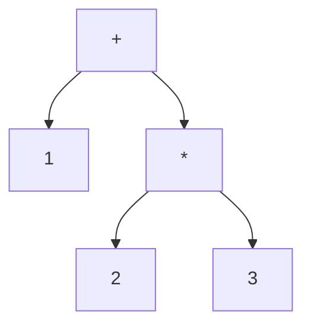

<div class="eyebrow">SOFTWARE DESIGN 2026 / 09</div>

# LispのREPLと四則演算

## 式を読み、計算し、結果を返す

<p>情報システム学科 3年・選択・2単位</p>

---

# 今日の到達目標

- S式をトークンと木で表せる
- 四則演算の評価規則を説明できる
- エラー後も使えるREPLを実装できる

---

# 前回との接続

電卓では演算子の優先順位を構文で表した。

Lispでは括弧がまとまりを指定し、先頭に演算子を書く。

`1 + 2 * 3` と `(+ 1 (* 2 3))` を比較する。

---

# 教材の言語仕様

本教材ではPythonをホストにする小さなLisp方言を設計する。

これは教材上の選択。Lisp処理系や正式シラバスの共通仕様ではない。

第9回の範囲は数値、S式、四則演算、REPL。

---

# 最初の実演

```sh
python3 examples/09-lisp-arithmetic/lisp.py --eval "(+ 1 (* 2 3))"
```

期待する値は `7`。

数値の表示規則も実装の契約としてそろえる。

---

# S式の形

```lisp
42
(+ 1 2)
(* (+ 1 2) 4)
```

数値はそのまま値になる。リストは先頭と残りに分ける。

---

# 読取と評価

<table><thead><tr><th>段階</th><th>仕事</th></tr></thead><tbody><tr><td>字句解析</td><td>括弧・記号・数値を切り出す</td></tr><tr><td>読取</td><td>入れ子のリストを組み立てる</td></tr><tr><td>評価</td><td>式から値を計算する</td></tr><tr><td>表示</td><td>値を文字列にする</td></tr></tbody></table>

---

# トークン列

```text
入力: (+ 1 (* 2 3))
トークン: (  +  1  (  *  2  3  )  )
```

区切りの括弧は捨てず、トークンとして残す。

---

# 構文木



内側の式の値を外側の引数に使う。

---

# 読取の再帰

`(` を読んだら、対応する `)` まで要素を読む。

要素が再び `(` なら同じ処理を呼ぶ。

入力を消費する位置と返す木を分けて考える。

---

# 数値の評価

```python
def evaluate_number(node):
    return node
```

この断片は評価規則の説明用。実行可能な完成版は例題ディレクトリにある。

---

# 演算の評価

1. 先頭の演算子を確認する
2. 各引数を評価する
3. 評価済みの値で計算する

`(+ 1 (* 2 3))` の `*` を先に計算する理由を述べる。

---

# 四則演算の契約

演算子ごとに引数個数と型の扱いを決める。

今回の受入例は、各演算子に2個の数値を渡す。

単項演算・可変長引数は参照実装の仕様を確認してから追加する。

---

# 可変長の四則

参照版の `+` と `*` は0個以上、`-` と `/` は1個以上。

```lisp
(+ 1 2 3)
(- 10 2 3)
(/ 12 2 3)
```

結果は `6`、`5`、`2`。減算と除算は左から順に計算する。

---

# ゼロ除算

`(/ 8 0)` は構文として読める。

評価時に失敗したことを利用者に伝える。

入力全体を「構文エラー」と呼ぶと、原因を探しにくくなる。

---

# 括弧の不足

```lisp
(+ 1 2
(+ 1 2))
```

1行目は閉じ括弧不足。2行目は余分な閉じ括弧。

どの段階が検出するかを予測する。

---

# REPLの循環

<table><thead><tr><th>文字</th><th>役割</th></tr></thead><tbody><tr><td>Read</td><td>入力をS式にする</td></tr><tr><td>Eval</td><td>値を求める</td></tr><tr><td>Print</td><td>値を表示する</td></tr><tr><td>Loop</td><td>次の入力を待つ</td></tr></tbody></table>

---

# REPLの実演

```sh
python3 examples/09-lisp-arithmetic/lisp.py
```

`(+ 2 3)`、`(/ 1 0)`、`(* 4 5)` の順に入力する。

最後の式で `20` を得る。終了は `:quit` またはEOF。

---

# エラーからの回復

1回の入力の失敗は、その入力の結果として報告する。

ループの外まで例外を逃がすと、次の入力を受けられない。

想定する例外を扱い、実装バグの情報は残す。

---

# 演習1 読取の観察

`(* (+ 2 3) (- 9 4))` を手でトークン列にする。

次に入れ子のリストを書き、実装の読取結果と照合する。

検証用の入力を1個、自分で追加する。

---

# 演習2 評価器

2引数の四則演算を実装する。

`(+ 2 3)`、`(- 9 4)`、`(* 3 4)`、`(/ 8 2)` を確かめる。

入れ子の式も同じ評価関数で扱う。

---

# 演習3 REPL

正常入力の間にエラー入力を挟む。

結果、診断、次の結果を実行ログに残す。

EOFで自然に終了できることも確認する。

---

# 確認問い

`(+ 1 2)` の括弧を消すと、どの規則が失われるか。

読取器と評価器を1つの関数にすると、何の検証が難しくなるか。

---

# 提出物の証拠

演習成果物の案は `exercises/09.md` にある。

コードに加え、入れ子の正常例とエラー後の回復例を残す。

提出先・締切などの運用は授業で確認する。

---

# まとめと次回

括弧で木を作り、再帰で値を求めた。

REPLは入力ごとの失敗を区切る。

次回は名前を値へ結び付け、関数を定義する。

---

# 参考

- 本教材: `examples/09-lisp-arithmetic/`
- Python 3.12 [エラーと例外](https://docs.python.org/3.12/tutorial/errors.html)
- SICP [評価器](https://sicp.sourceacademy.org/chapters/4.1.html)

外部資料の言語仕様と教材方言の差に注意する。
