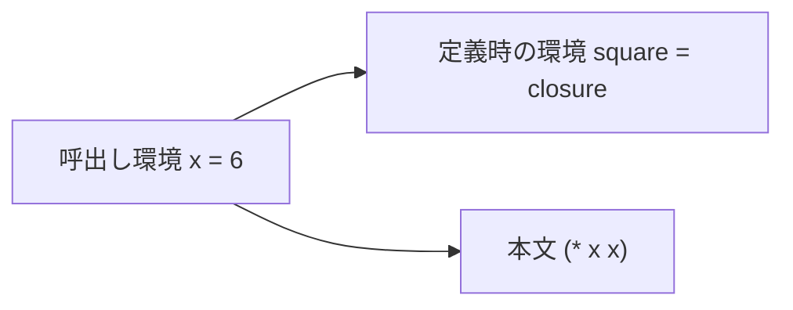
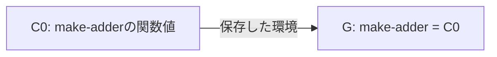
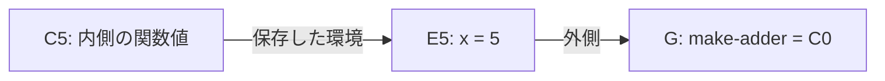
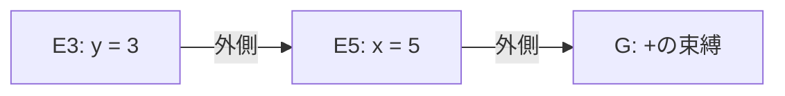
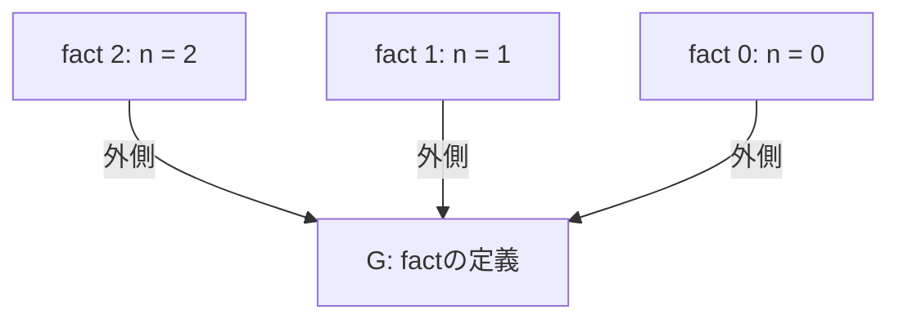

<div class="eyebrow">SOFTWARE DESIGN 2026 / 10</div>

# 変数と関数の定義

## 環境に名前を結び付ける

<p>情報システム学科 3年・選択・2単位</p>

---

# 今日の到達目標

- 環境を使って名前を検索できる
- `define` と `lambda` の役割を区別できる
- クロージャの環境と再帰呼出しを説明できる

---

# 前回との接続

数値と演算子だけでも計算はできました。

名前を付けると、計算の意図と再利用する部分を表せます。

今回は、評価器に「名前を探す場所」を渡します。

---

# 今日の中心

当日は、名前の定義、単純な関数、`if` を順に確認します。

クロージャの環境寿命と再帰の復帰は、図で理由を説明します。

授業内で未完の実装は、確認できた地点から継続してください。これは授業内の進め方であり、クロージャと再帰も到達目標に含みます。受入例と成果物は演習資料で確認してください。

---

# 変数の実演

```lisp
(define width 5)
(define height 3)
(* width height)
```

同じREPLで順に入力すると、最後の値は `15` です。

例は改行して示していますが、教材REPLへは1行1式で入力してください。

---

# 環境の表現

<table><thead><tr><th>名前</th><th>値</th></tr></thead><tbody><tr><td>width</td><td>5</td></tr><tr><td>height</td><td>3</td></tr><tr><td>+</td><td>組込み手続き</td></tr></tbody></table>

Pythonホストでは、辞書と外側の環境への参照で表せます。

---

# 名前の評価

数値を評価すると、数値自身を返します。

記号を評価するときは、環境を検索します。

`width` が見つからない場合は、未定義名のエラーを返します。

---

# defineの評価

`(define width (+ 2 3))`

右辺を現在の環境で評価し、得た値を `width` に登録します。

`width` 自体を先に評価すると、初めての定義が失敗します。

---

# 特殊形式

`define` では、引数をすべて先に評価することはできません。

評価の仕方を個別に決める構文を、特殊形式と呼びます。

評価器では、特殊形式を通常の関数呼出しとは別の分岐で扱います。

---

# lambdaの実演

```lisp
(define square
  (lambda (x) (* x x)))
(square 6)
```

`lambda` は関数の値を作ります。最後の値は `36` です。

---

# 関数の保存内容

```python
@dataclass
class Closure:
    parameters: list
    body: list
    environment: Env
```

完成ホストの定義からの抜粋です。仮引数、本文の列、定義時環境を保持します。
呼び出すまで本文は評価しません。

---

# 呼出しの順序

1. 関数の式を評価する
2. 引数の式を評価する
3. 仮引数を新しい環境へ束縛する
4. 本文を評価する

---

# 呼出しの環境



新しい環境の外側は、関数が保存した環境です。

---

# 引数個数

`(square 6 7)` は仮引数と実引数の個数が合いません。

余分な引数を黙って捨てると、誤った呼出しを見逃します。

束縛する前に個数を確認します。

---

# レキシカルスコープ

名前の意味は、関数を定義した場所の環境に従います。

呼び出した場所の同名変数へ勝手に切り替わることはありません。

次の例で、保存する環境を追います。

---

# クロージャの例

```lisp
(define make-adder
  (lambda (x) (lambda (y) (+ x y))))
(define add5 (make-adder 5))
(add5 3)
```

結果 `8` に至る4状態を追います。REPLでは、各定義を1行にして入力してください。
図のG・E5・E3とC0・C5は説明用のラベルです。

---

# 1 make-adderの定義



仮引数は `(x)`、本文は内側の `lambda` です。
定義時には、まだ `x = 5` も `y = 3` も作りません。

---

# 2 外側の呼出し



`(make-adder 5)` はE5で内側の `lambda` を評価します。
`(+ x y)` は計算せず、E5を保存したC5を返します。

---

# 3 返された関数


外側の呼出しは終了し、Gの `add5` にC5を登録します。
C5からE5への参照が残るので、`x = 5` を後から使えます。

---

# 4 add5の呼出し



`(add5 3)` は保存環境E5を外側にしたE3を作ります。
`y` はE3、`x` はE5、`+` はGで見つかり、結果は `8` です。

---

# 同名の引数

```lisp
(define x 100)
(define f (lambda (x) (+ x 1)))
(f 4)
x
```

結果は順に `5` と `100` です。内側の束縛が、外側の束縛を隠します。

---

# 条件式

```lisp
(if (= 2 2) 10 20)
(if #f (/ 1 0) 7)
```

選んだ枝だけを評価します。結果は `10` と `7` です。

---

# ifの評価

条件を評価し、真偽に応じて枝を1つ選びます。

両方の枝を通常の引数と同じように評価すると、不要なゼロ除算が起こります。

教材方言の偽値は `#f` です。

---

# quoteの評価

```lisp
(+ 1 2)
(quote (+ 1 2))
```

上の式は計算し、下の式は式そのものをデータとして返します。

下の式では、記号 `+` を環境から検索しません。

---

# コードとデータ

リストは、プログラムにもデータにも使えます。

`quote` で評価を止めれば、別の評価器へ式を渡せます。

この考え方が、第12回のLisp製評価器へつながります。

---

# 再帰関数

```lisp
(define fact
  (lambda (n)
    (if (= n 0)
        1
        (* n (fact (- n 1))))))
(fact 4)
```

停止条件に到達する入力を選びます。結果は `24` です。

---

# 再帰の下降



呼出しは `2`、`1`、`0` の順に進みます。各 `n` の環境は別です。
どの呼出しも同じGで `fact` を探し、`n = 0` から戻ります。

---

# 再帰の復帰

<table>
<thead><tr><th>戻る呼出し</th><th>残っていた計算</th><th>戻り値</th></tr></thead>
<tbody><tr><td>fact 0</td><td>停止条件の <code>1</code></td><td>1</td></tr><tr><td>fact 1</td><td><code>(* 1 1)</code></td><td>1</td></tr><tr><td>fact 2</td><td><code>(* 2 1)</code></td><td>2</td></tr></tbody>
</table>

`fact 2` は、`fact 1` が返るまで乗算を待ちます。
呼出しの順と、値が戻る順を区別します。

---

# 演習1 名前

当日は `define` と未定義名の診断から確認してください。

定義前後で同じ名前を評価し、環境の変化を記録してください。

動く地点を確かめてから、単純な関数へ進んでください。

---

# 演習2 関数

`square` の呼出しと引数個数の反例を確かめてください。

`make-adder` の4状態を説明し、保存する環境を示してください。

自作版が未完の場合は、完成参照で理解を確認し、自作版との実装差分を記録してください。

---

# 演習3 分岐と再帰

`if` が選ばない枝を評価しないことを確かめてください。

`fact 2` の下降と復帰を説明し、続けて `fact 4 = 24` も確認してください。

未完の機能は、この記録を使って継続して実装してください。

---

# 確認問い

`lambda` の本文を定義時に評価すると何が起きるか。

クロージャが呼出し元の環境を保存する実装では、どんな反例が作れるか。

---

# 解答 lambdaの評価時点

```lisp
(define square (lambda (x) (* x x)))
(square 6)
```

大域にも `x` がない新しい環境で考えます。
定義時に本文を評価すると、仮引数 `x` は未束縛のため診断になります。

本文は呼出し時に評価します。`x = 6` を束縛した結果は `36` です。

---

# 解答 保存先の反例

```lisp
(define x 100)
(define make-adder
  (lambda (x) (lambda (y) (+ x y))))
(define add5 (make-adder 5))
(add5 3)
```

REPLでは、各 `define` 全体を1行にまとめて入力してください。

正しい保存先はE5の `x = 5` です。`y = 3` と加えて `8` になります。

誤って内側の関数がGを保存すると、大域の `x = 100` を使って `103` になります。
正しい実装では、呼出しから戻っても定義時環境への参照を保持します。

---

# AI利用の確認

AIが提案した環境検索を、自分の図と比べてください。

定義時と呼出し時の環境を混同していないか確かめてください。

採用した案と、自分で実行した反例を残してください。

---

# まとめと次回

名前の意味を環境で決め、関数には定義時環境を保存しました。

特殊形式は、評価の順序を制御します。

次回は、複数の式をファイルから実行します。

---

# 参考

- 本教材: `examples/10-lisp-functions/`
- 補足観察: `learning_trace.py closure` / `fact`
- [公開教員補足](../instructor/10.md)・[演習](../exercises/10.md)
- [The Scheme Programming Language](https://www.scheme.com/tspl4/)

外部資料と教材方言との違いは、教材の仕様で確認してください。
