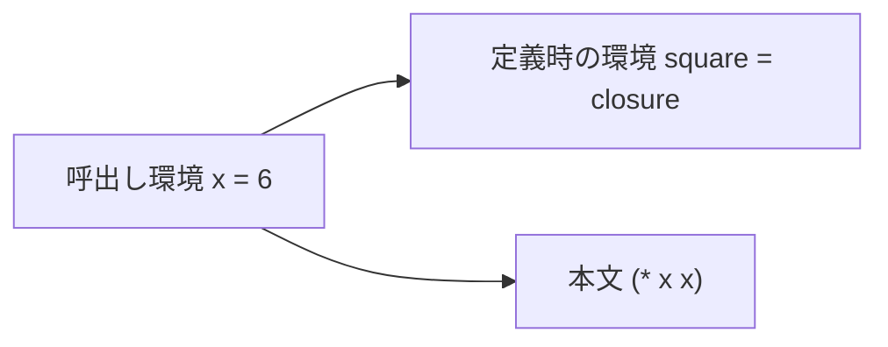

<div class="eyebrow">SOFTWARE DESIGN 2026 / 10</div>

# 変数と関数の定義

## 環境に名前を結び付ける

<p>情報システム学科 3年・選択・2単位</p>

---

# 今日の到達目標

- 環境を使って名前を検索できる
- `define` と `lambda` の役割を区別できる
- クロージャの環境と再帰呼出しを説明できる

---

# 前回との接続

数値と演算子だけでも計算はできた。

名前を付けると、計算の意図と再利用する部分を表せる。

評価器に「名前を探す場所」を渡す。

---

# 変数の実演

```lisp
(define width 5)
(define height 3)
(* width height)
```

同じREPLで順に入力すると最後の値は `15`。

例を改行して示すが、教材REPLへは1行1式で入力する。

---

# 環境の表現

<table><thead><tr><th>名前</th><th>値</th></tr></thead><tbody><tr><td>width</td><td>5</td></tr><tr><td>height</td><td>3</td></tr><tr><td>+</td><td>組込み手続き</td></tr></tbody></table>

Pythonホストでは辞書と外側への参照で表せる。

---

# 名前の評価

数値の評価は数値自身を返す。

記号の評価は環境を検索する。

`width` が見つからない場合は、未定義名のエラーを返す。

---

# defineの評価

`(define width (+ 2 3))`

右辺を現在の環境で評価し、得た値を `width` に登録する。

`width` 自体を先に評価すると、初めての定義が失敗する。

---

# 特殊形式

`define` は引数をすべて先に評価できない。

評価の仕方を個別に決める構文を特殊形式と呼ぶ。

通常の関数呼出しと分岐を分ける。

---

# lambdaの実演

```lisp
(define square
  (lambda (x) (* x x)))
(square 6)
```

`lambda` は関数の値を作る。最後の値は `36`。

---

# 関数の保存内容

関数は仮引数、本文、定義時の環境を保持する。

呼び出すまで本文を評価しない。

引数に応じた計算を後から実行するための値になる。

---

# 呼出しの順序

1. 関数の式を評価する
2. 引数の式を評価する
3. 仮引数を新しい環境へ束縛する
4. 本文を評価する

---

# 呼出しの環境



新しい環境の外側は、関数が保存した環境。

---

# 引数個数

`(square 6 7)` は仮引数と実引数の個数が合わない。

余分な引数を黙って捨てると、誤った呼出しを見逃す。

束縛する前に個数を確認する。

---

# レキシカルスコープ

名前の意味は、関数を定義した場所の環境に従う。

呼び出した場所の同名変数へ勝手に切り替わらない。

次の例で、保存する環境を追う。

---

# クロージャの例

```lisp
(define make-adder
  (lambda (x) (lambda (y) (+ x y))))
(define add5 (make-adder 5))
(add5 3)
```

`add5` は `x = 5` の環境を保持する。結果は `8`。

---

# 同名の引数

```lisp
(define x 100)
(define f (lambda (x) (+ x 1)))
(f 4)
x
```

結果は順に `5` と `100`。内側の束縛が外側を隠す。

---

# 条件式

```lisp
(if (= 2 2) 10 20)
(if #f (/ 1 0) 7)
```

選んだ枝だけ評価する。結果は `10` と `7`。

---

# ifの評価

条件を評価し、真偽に応じて枝を1つ選ぶ。

両方の枝を通常の引数と同じように評価すると、不要なゼロ除算が起こる。

教材方言の偽値は `#f`。

---

# quoteの評価

```lisp
(+ 1 2)
(quote (+ 1 2))
```

上は計算、下は式をデータとして返す。

記号 `+` を環境から検索しない。

---

# コードとデータ

リストをプログラムにもデータにも使う。

`quote` で評価を止めれば、別の評価器へ式を渡せる。

第12回のLisp製評価器へつながる。

---

# 再帰関数

```lisp
(define fact
  (lambda (n)
    (if (= n 0)
        1
        (* n (fact (- n 1))))))
(fact 4)
```

停止条件に到達する入力を選ぶ。結果は `24`。

---

# 再帰の環境

`fact 3`、`fact 2`、`fact 1`、`fact 0` はそれぞれ別の引数束縛を持つ。

外側の環境で `fact` 自身を検索する。

戻るときに乗算が完了する。

---

# 演習1 名前

`define` と未定義名の診断を実装する。

定義前後で同じ名前を評価し、環境の変化を記録する。

右辺に式を使う検証も加える。

---

# 演習2 関数

`square` の呼出しを通す。

次に `make-adder` で定義時環境を保持する。

引数個数が合わない反例を作る。

---

# 演習3 分岐と再帰

`if` が選ばない枝を評価しないことを証明する。

`fact 0` と `fact 4` を比較し、環境を手で追う。

負の入力の扱いは別の仕様として記述する。

---

# 確認問い

`lambda` の本文を定義時に評価すると何が起きるか。

クロージャが呼出し元の環境を保存する実装では、どんな反例が作れるか。

---

# AI利用の確認

AIの提案した環境検索を、自分の図と比べる。

定義時と呼出し時の環境を混同していないか確かめる。

採用した案と、自分で実行した反例を残す。

---

# まとめと次回

名前の意味を環境で決め、関数は定義時環境を保存した。

特殊形式は評価の順序を制御する。

次回は複数の式をファイルから実行する。

---

# 参考

- 本教材: `examples/10-lisp-functions/`
- [The Scheme Programming Language](https://www.scheme.com/tspl4/)
- SICP [評価器](https://sicp.sourceacademy.org/chapters/4.1.html)

Schemeの全機能を本教材で実装するわけではない。
