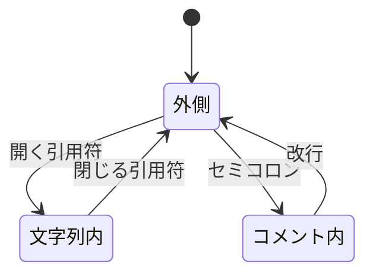
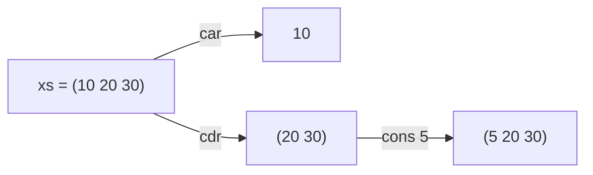
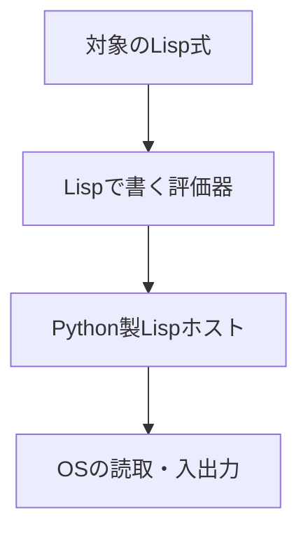

<div class="eyebrow">SOFTWARE DESIGN 2026 / 11</div>

# スクリプト実行

## Lispで評価器を書く準備

<p>情報システム学科 3年・選択・2単位</p>

---

# 今日の到達目標

- ファイル内の複数式を順に評価できる
- 式と文字列・リストを区別できる
- セルフホスティングへの依存関係を説明できる

---

# 前回との接続

REPLで名前と関数を定義できるようになった。

同じ定義を毎回入力する手間を、スクリプト実行で減らす。

定義をファイルに保存して検証を再現する。

---

# 当日の中心と継続する改修

| 進める順序 | 確かめること |
| --- | --- |
| 主経路 | 複数式を読み、同じ環境で順に評価 |
| 操作の観察 | 文字列・記号、リストの分解と再帰 |
| 自作版の不足を改修 | 文字列・コメントのlexerを追加 |

完成ホストで観察した部分と、自分で直した部分を区別する。

必要機能は維持し、未実装の差分は継続作業として記録する。

---

# スクリプトの実演

```sh
python3 examples/11-lisp-scripts/lisp.py examples/11-lisp-scripts/demo.lisp
```

ファイルを読み、式を順に評価する。

作業ディレクトリとファイルの相対パスを確認する。

---

# 複数式の読取

```lisp
(define square (lambda (x) (* x x)))
(display (square 5))
(newline)
(display (square 7))
(newline)
```

ファイル全体には、独立した式が5個ある。

---

# 読取器の反復

式を1つ読んだ後、入力が残っているか確認する。

残っていれば次の式を読む。

1個の巨大なリストに包む必要はない。

---

# 環境の共有

同じスクリプト内の式は1つの実行環境を共有する。

先の `define` が、後の呼出しで見つかる。

式ごとに環境を初期化すると、定義が消える。

---

# 5個の式と、1個の共有環境

| 順番 | 評価する式 | 共有環境・出力 |
| --- | --- | --- |
| 1 | `(define square ...)` | squareの定義を保存 |
| 2・3 | display、newline | 同じsquareを使い、25を表示 |
| 4・5 | display、newline | 同じsquareを使い、49を表示 |

各呼出しの仮引数xは別の局所環境に置く。

共有するのはスクリプトの大域環境。CLIは最後の値`()`も表示する。

---

# REPLとの違い

<table><thead><tr><th>入口</th><th>入力</th><th>実行の単位</th></tr></thead><tbody><tr><td>REPL</td><td>標準入力</td><td>入力した式</td></tr><tr><td>--eval</td><td>引数文字列</td><td>指定した式</td></tr><tr><td>スクリプト</td><td>ファイル</td><td>複数式</td></tr></tbody></table>

評価規則は共有し、入口を分ける。

---

# 文字列の読取

```lisp
(display "a (b); c") ; memo
```

文字列内の空白・括弧・`;`を、そのまま1個の値にする。

| トークンの種類 | 読み取る内容 |
| --- | --- |
| 括弧 | `(` と `)` |
| 記号 | `display` |
| 文字列 | `a (b); c` |

後ろの`; memo`はトークンに残さない。

---

# lexerが文字を読む状態



文字列内では`;`も括弧も普通の文字。

これは読取手順の図。参照版は内側のループで状態を表す。

---

# 入力を左から追う

| 読む部分 | 状態 | 行う処理 |
| --- | --- | --- |
| `(display ` | 外側 | 括弧と記号を確定 |
| 開く`"` | 文字列内へ | 文字列の蓄積を開始 |
| `a (b); c` | 文字列内 | 空白・括弧・`;`も蓄積 |
| 閉じる`"` | 外側へ | 文字列トークンを確定 |

閉じる引用符を読んだ後の`)`が、呼出しを閉じる。

エスケープした引用符`\"`は、文字列を閉じない。

---

# コメントと改行

| 読む部分 | 状態 | トークンへの影響 |
| --- | --- | --- |
| `"a;b"` | 文字列内 | `;`を文字列に含める |
| `; memo` | 外側からコメント内 | 行末まで捨てる |
| 次の行 | 外側へ戻る | 再び式を読み始める |

単純な空白分割では、状態ごとに異なる意味を守れない。

閉じない文字列は読取エラー。続きを勝手に記号と解釈しない。

---

# 記号と文字列の違い

| 入力 | 読取後の型 | 評価すると |
| --- | --- | --- |
| `name` | Symbol | 環境でnameを検索 |
| `"name"` | 文字列 | 文字列の値name |
| `(quote name)` | quoteとSymbol | 記号の値name |

参照版はTokenのstring印とSymbol型で区別する。

同じ文字の並びでも、引用符の有無で評価規則が変わる。

---

# リストの生成

```lisp
(list 1 2 3)
(quote (1 2 3))
```

`list` は引数を評価する。`quote` は内部を評価しない。

同じ値を得ても、評価の経路は異なる。

---

# リストの分解

```lisp
(car (quote (10 20 30)))
(cdr (quote (10 20 30)))
(cons 5 (quote (10 20)))
```

先頭、残り、先頭の追加を使って木や環境を操作する。

---

# 先頭と残りを、同じリストで見る



教材方言のcdrとconsは新しいリストを返す。

元のxsは`(10 20 30)`のまま。空リストのcar/cdrはエラー。

---

# 空リスト

`(quote ())` は空のリスト。

再帰でリストを処理するときの停止条件に使う。

空リストの `car` を呼ぶ場合の診断も決める。

---

# リストの再帰

```lisp
(define total
  (lambda (xs)
    (if (null? xs)
        0
        (+ (car xs) (total (cdr xs))))))
(total (quote (2 3 4)))
```

結果は `9`。空リストの結果は `0`。

---

# totalの呼出しでは、xsが縮む

| 呼出し | xs | 今の先頭 | 次のxs |
| --- | --- | --- | --- |
| 1 | `(2 3 4)` | 2 | `(3 4)` |
| 2 | `(3 4)` | 3 | `(4)` |
| 3 | `(4)` | 4 | `()` |
| 4 | `()` | 取り出さない | 停止して0 |

空になるたびに止めるため、空リストのcarを呼ばずに済む。

各呼出しのxsは別。関数totalの定義は同じものを使う。

---

# totalの復帰では、足し算が進む

| 戻る呼出し | 待っていた計算 | 返す値 |
| --- | --- | --- |
| `total ()` | 停止条件 | 0 |
| `total (4)` | `(+ 4 0)` | 4 |
| `total (3 4)` | `(+ 3 4)` | 7 |
| `total (2 3 4)` | `(+ 2 7)` | 9 |

下へ呼ぶときはリストを分解し、上へ戻るときに合計する。

`(cdr xs)`が元のリストを削除するわけではない。

---

# 入出力の役割

`display` は値を表示し、`newline` は改行する。

後の `read` は入力をS式として読み取る。

言語の評価規則と、OSの入出力を結ぶ境界になる。

---

# 失敗の位置

ファイルが見つからない場合は、読取の前に失敗する。

括弧不足は読取時、未定義名は評価時に失敗する。

同じ「動かない」でも対処する場所が違う。

---

# 検証の再現

関数定義と入力を同じファイルに保存する。

実行コマンドと期待値をREADMEに書く。

別の人が同じ条件で実行できるようにする。

---

# セルフホスティングの目標

Lispで書いた評価器が、Lispの式を評価する。

必要な操作を、今のLisp方言で表現できるか調べる。

今日は共有環境のスクリプトを主経路にし、データ操作を確かめる。

---

# 実行の層



各層の仕事を分け、どこまでLispへ移したか記録する。

---

# 必要機能の棚卸し

評価器は式の種類を判断し、リストを分解し、環境で名前を探す。

不足する組込み操作をリスト化する。

すべてを一度に追加せず、最小の評価例から試す。

---

# 演習1 スクリプト

複数式を読取り、同じ環境で順に評価する。

定義の後に2回の関数呼出しを置く。

ファイルの終端で自然に終了することを確かめる。

---

# 演習2 リスト

空・1要素・複数要素のリストで `total` を検証する。

データとして渡す式に `quote` が必要な理由を説明する。

---

# 演習3 評価器の入口

Lispの関数に、`(quote (+ 1 2))` を渡す。

まず式をそのまま返し、次に先頭と引数を取り出す。

実際の評価規則は次回で拡張する。

---

# 確認とまとめ

同じファイル内で環境を共有する理由は何か。

文字列と記号を同じ型にした場合、どの式が曖昧になるか。

次回は必要機能を契約にし、Lisp製評価器を育てる。

---

# 参考

- 本教材: `examples/11-lisp-scripts/`
- Python 3.12 [入出力](https://docs.python.org/3.12/tutorial/inputoutput.html)
- SICP [評価器](https://sicp.sourceacademy.org/chapters/4.1.html)
