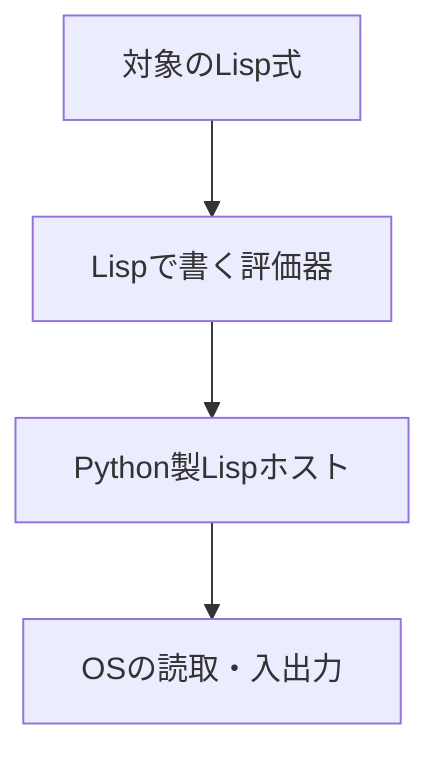

<div class="eyebrow">SOFTWARE DESIGN 2026 / 11</div>

# スクリプト実行

## Lispで評価器を書く準備

<p>情報システム学科 3年・選択・2単位</p>

---

# 今日の到達目標

- ファイル内の複数式を順に評価できる
- 式と文字列・リストを区別できる
- セルフホスティングへの依存関係を説明できる

---

# 前回との接続

REPLで名前と関数を定義できるようになった。

同じ定義を毎回入力する手間を、スクリプト実行で減らす。

定義をファイルに保存して検証を再現する。

---

# スクリプトの実演

```sh
python3 examples/11-lisp-scripts/lisp.py examples/11-lisp-scripts/demo.lisp
```

ファイルを読み、式を順に評価する。

作業ディレクトリとファイルの相対パスを確認する。

---

# 複数式の読取

```lisp
(define square (lambda (x) (* x x)))
(display (square 5))
(newline)
(display (square 7))
(newline)
```

ファイル全体には、独立した式が5個ある。

---

# 読取器の反復

式を1つ読んだ後、入力が残っているか確認する。

残っていれば次の式を読む。

1個の巨大なリストに包む必要はない。

---

# 環境の共有

同じスクリプト内の式は1つの実行環境を共有する。

先の `define` が、後の呼出しで見つかる。

式ごとに環境を初期化すると、定義が消える。

---

# REPLとの違い

<table><thead><tr><th>入口</th><th>入力</th><th>実行の単位</th></tr></thead><tbody><tr><td>REPL</td><td>標準入力</td><td>入力した式</td></tr><tr><td>--eval</td><td>引数文字列</td><td>指定した式</td></tr><tr><td>スクリプト</td><td>ファイル</td><td>複数式</td></tr></tbody></table>

評価規則は共有し、入口を分ける。

---

# 文字列の読取

```lisp
"hello world"
(display "hello world")
```

空白を含む文字列を1つの値として読む。

引用符を単純に空白で分割すると壊れる。

---

# 記号と文字列

`name` は環境で名前を検索する。

`"name"` は文字列の値を返す。

ホスト内の型でも両者を区別する。

---

# コメント

教材方言では `;` から行末までをコメントとして読む。

文字列の中の `;` は文字列の一部。

字句解析の状態を確認する反例になる。

---

# リストの生成

```lisp
(list 1 2 3)
(quote (1 2 3))
```

`list` は引数を評価する。`quote` は内部を評価しない。

同じ値を得ても、評価の経路は異なる。

---

# リストの分解

```lisp
(car (quote (10 20 30)))
(cdr (quote (10 20 30)))
(cons 5 (quote (10 20)))
```

先頭、残り、先頭の追加を使って木や環境を操作する。

---

# 空リスト

`(quote ())` は空のリスト。

再帰でリストを処理するときの停止条件に使う。

空リストの `car` を呼ぶ場合の診断も決める。

---

# リストの再帰

```lisp
(define total
  (lambda (xs)
    (if (null? xs)
        0
        (+ (car xs) (total (cdr xs))))))
(total (quote (2 3 4)))
```

結果は `9`。空リストの結果は `0`。

---

# 入出力の役割

`display` は値を表示し、`newline` は改行する。

後の `read` は入力をS式として読み取る。

言語の評価規則と、OSの入出力を結ぶ境界になる。

---

# 失敗の位置

ファイルが見つからない場合は、読取の前に失敗する。

括弧不足は読取時、未定義名は評価時に失敗する。

同じ「動かない」でも対処する場所が違う。

---

# 検証の再現

関数定義と入力を同じファイルに保存する。

実行コマンドと期待値をREADMEに書く。

別の人が同じ条件で実行できるようにする。

---

# セルフホスティングの目標

Lispで書いた評価器が、Lispの式を評価する。

必要な操作を、今のLisp方言で表現できるか調べる。

今日はスクリプトとデータ操作から実装を始める。

---

# 実行の層



各層の仕事を分け、どこまでLispへ移したか記録する。

---

# 必要機能の棚卸し

評価器は式の種類を判断し、リストを分解し、環境で名前を探す。

不足する組込み操作をリスト化する。

すべてを一度に追加せず、最小の評価例から試す。

---

# 演習1 スクリプト

複数式を読取り、同じ環境で順に評価する。

定義の後に2回の関数呼出しを置く。

ファイルの終端で自然に終了することを確かめる。

---

# 演習2 リスト

空・1要素・複数要素のリストで `total` を検証する。

データとして渡す式に `quote` が必要な理由を説明する。

---

# 演習3 評価器の入口

Lispの関数に、`(quote (+ 1 2))` を渡す。

まず式をそのまま返し、次に先頭と引数を取り出す。

実際の評価規則は次回で拡張する。

---

# 確認とまとめ

同じファイル内で環境を共有する理由は何か。

文字列と記号を同じ型にした場合、どの式が曖昧になるか。

次回は必要機能を契約にし、Lisp製評価器を育てる。

---

# 参考

- 本教材: `examples/11-lisp-scripts/`
- Python 3.12 [入出力](https://docs.python.org/3.12/tutorial/inputoutput.html)
- SICP [評価器](https://sicp.sourceacademy.org/chapters/4.1.html)
