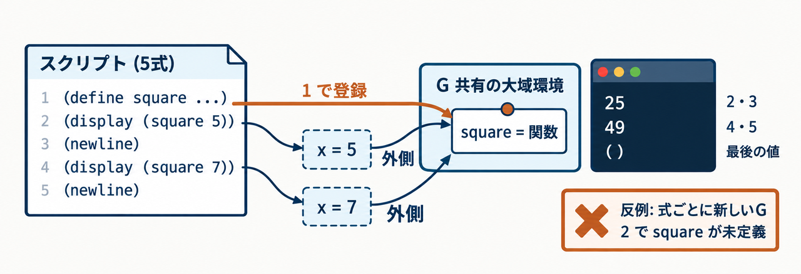
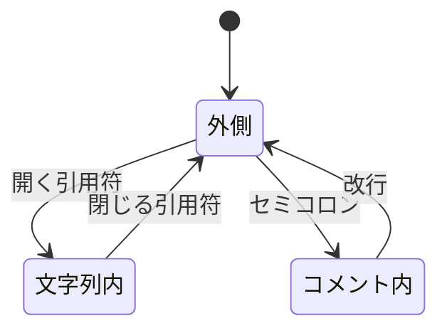
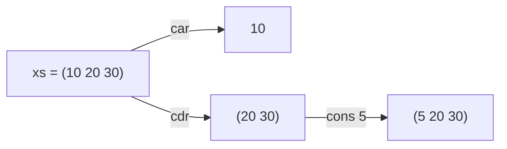
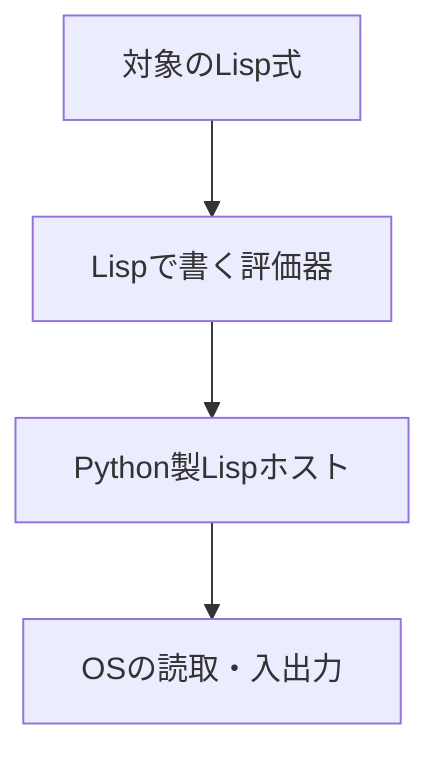

<LearningStylesCourse />


<div class="eyebrow">SOFTWARE DESIGN 2026 / 11</div>

# スクリプト実行

## Lispで評価器を書く準備

<p>情報システム学科 3年・選択・2単位</p>
---
class: learning-course
---


# 今日の到達目標

- ファイル内の複数式を順に評価できる
- 式と文字列・リストを区別できる
- セルフホスティングへの依存関係を説明できる
---
class: learning-course
---


# 前回との接続

REPLで名前と関数を定義できるようになりました。

同じ定義を毎回入力する手間を、スクリプト実行で減らします。

定義をファイルに保存し、検証を再現できるようにします。
---
class: learning-course
---


# 当日の中心と継続する改修

| 進める順序 | 確かめること |
| --- | --- |
| 主経路 | 複数式を読み、同じ環境で順に評価 |
| 操作の観察 | 文字列・記号、リストの分解と再帰 |
| 自作版の不足を改修 | 文字列・コメントのlexerを追加 |

完成ホストで観察した部分と、自分で直した部分を区別してください。

到達目標の必要機能はそのまま含みます。未実装の差分は、継続作業として記録してください。
---
class: learning-course
---


# スクリプトの実演

```sh
python3 examples/11-lisp-scripts/lisp.py \
  examples/11-lisp-scripts/demo.lisp
```

ファイルを読み、式を順に評価します。

実行前に、作業ディレクトリとファイルの相対パスを確認してください。
---
class: learning-course
---


# 複数式の読取

```lisp
(define square (lambda (x) (* x x)))
(display (square 5))
(newline)
(display (square 7))
(newline)
```

ファイル全体には、独立した式が5個あります。
---
class: learning-course
---


# 読取器の反復

式を1つ読んだ後、入力が残っているか確認します。

残っていれば、次の式を読みます。

ファイル全体を1個の巨大なリストに包む必要はありません。
---
class: learning-course
---


# 環境の共有

同じスクリプト内の式は、1つの実行環境を共有します。

先の `define` が、後の呼出しで見つかります。

式ごとに環境を初期化すると、定義が消えてしまいます。
---
class: learning-course diagram-page
---

<LearningStylesCourse />

# 5式の登録と、2回の呼出しを追う



前の5式例です。1で登録、2と4で別々の局所環境を作り、どちらも外側はGです。<br>
右下は架空の誤り案。参照版はGを共有し、最後のnewlineの戻り値 `()` も表示します。

---
class: learning-course
---


# 5個の式と、1個の共有環境

| 順番 | 評価する式 | 共有環境・出力 |
| --- | --- | --- |
| 1 | `(define square ...)` | squareの定義を保存 |
| 2・3 | display、newline | 同じsquareを使い、25を表示 |
| 4・5 | display、newline | 同じsquareを使い、49を表示 |

各呼出しの仮引数xは、別の局所環境に置きます。

共有するのは、スクリプトの大域環境です。CLIは最後の値`()`も表示します。
---
class: learning-course
---


# REPLとの違い

<table><thead><tr><th>入口</th><th>入力</th><th>実行の単位</th></tr></thead><tbody><tr><td>REPL</td><td>標準入力</td><td>入力した式</td></tr><tr><td>--eval</td><td>引数文字列</td><td>指定した式</td></tr><tr><td>スクリプト</td><td>ファイル</td><td>複数式</td></tr></tbody></table>

評価規則は共有し、入口だけを分けます。
---
class: learning-course
---


# 文字列の読取

```lisp
(display "a (b); c") ; memo
```

文字列内の空白・括弧・`;`を、そのまま1個の値にします。

| トークンの種類 | 読み取る内容 |
| --- | --- |
| 括弧 | `(` と `)` |
| 記号 | `display` |
| 文字列 | `a (b); c` |
---
class: learning-course
---


# lexerが文字を読む状態

<div v-if="false" class="sd-figure-reference">



</div>

<Figure11 :index="3" />

文字列内では`;`も括弧も普通の文字です。

外側の `; memo` は、改行までコメントとして読み飛ばします。

この図は読取手順を表します。参照版は、内側のループで状態を表します。
---
class: learning-course
---


# 入力を左から追う

| 読む部分 | 状態 | 行う処理 |
| --- | --- | --- |
| `(display ` | 外側 | 括弧と記号を確定 |
| 開く`"` | 文字列内へ | 文字列の蓄積を開始 |
| `a (b); c` | 文字列内 | 空白・括弧・`;`も蓄積 |
| 閉じる`"` | 外側へ | 文字列トークンを確定 |

閉じる引用符を読んだ後の`)`が、呼出しを閉じます。

エスケープした引用符`\"`は、文字列を閉じません。
---
class: learning-course
---


# コメントと改行

| 読む部分 | 状態 | トークンへの影響 |
| --- | --- | --- |
| `"a;b"` | 文字列内 | `;`を文字列に含める |
| `; memo` | 外側からコメント内 | 行末まで捨てる |
| 次の行 | 外側へ戻る | 再び式を読み始める |

単純な空白分割では、状態ごとに異なる意味を守れません。

閉じない文字列は読取エラーです。続きを勝手に記号と解釈しません。
---
class: learning-course
---


# 記号と文字列の違い

| 入力 | 読取後の型 | 評価すると |
| --- | --- | --- |
| `name` | Symbol | 環境でnameを検索 |
| `"name"` | 文字列 | 文字列の値name |
| `(quote name)` | quoteとSymbol | 記号の値name |

参照版は、Tokenのstring印とSymbol型で区別します。

同じ文字の並びでも、引用符の有無で評価規則が変わります。
---
class: learning-course
---


# リストの生成

```lisp
(list 1 2 3)
(quote (1 2 3))
```

`list` は引数を評価します。`quote` は内部を評価しません。

同じ値を得ても、評価の経路は異なります。

`(list (+ 1 2) 4)` と `(quote ((+ 1 2) 4))` の表示を予想してください。

---
class: learning-course diagram-page
---

# list は評価、quote は停止

list は引数を評価してから呼び、quote は読んだ式をデータのまま返します。

<Figure11 :index="0" />

<div class="course-check">別入力: <code>(car (quote ((+ 1 2) 4)))</code> の値と型を予想し、<code>list?</code> で確かめます。</div>
---
class: learning-course
---


# リストの分解

```lisp
(car (quote (10 20 30)))
(cdr (quote (10 20 30)))
(cons 5 (quote (10 20)))
```

先頭、残り、先頭の追加を使って、木や環境を操作します。
---
class: learning-course
---


# 先頭と残りを、同じリストで見る

<div v-if="false" class="sd-figure-reference">



</div>

<Figure11 :index="4" />

教材方言のcdrとconsは、新しいリストを返します。

元のxsは`(10 20 30)`のままです。空リストのcar/cdrはエラーになります。
---
class: learning-course
---


# 空リスト

`(quote ())` は空のリストです。

再帰でリストを処理するときの停止条件に使います。

空リストの `car` を呼ぶ場合の診断も決めておきます。
---
class: learning-course
---


# リストの再帰

```lisp
(define total
  (lambda (xs)
    (if (null? xs)
        0
        (+ (car xs) (total (cdr xs))))))
(total (quote (2 3 4)))
```

結果は `9` です。空リストを渡した結果は `0` です。
---
class: learning-course
---


# totalの呼出しでは、xsが縮む

| 呼出し | xs | 今の先頭 | 次のxs |
| --- | --- | --- | --- |
| 1 | `(2 3 4)` | 2 | `(3 4)` |
| 2 | `(3 4)` | 3 | `(4)` |
| 3 | `(4)` | 4 | `()` |
| 4 | `()` | 取り出さない | 停止して0 |

xsが空になった時点で止めるため、空リストのcarを呼ばずに済みます。

各呼出しのxsは別のものです。関数totalの定義は同じものを使います。
---
class: learning-course
---


# totalの復帰では、足し算が進む

| 戻る呼出し | 待っていた計算 | 返す値 |
| --- | --- | --- |
| `total ()` | 停止条件 | 0 |
| `total (4)` | `(+ 4 0)` | 4 |
| `total (3 4)` | `(+ 3 4)` | 7 |
| `total (2 3 4)` | `(+ 2 7)` | 9 |

下へ呼ぶときはリストを分解し、上へ戻るときに合計します。

`(cdr xs)`が元のリストを削除するわけではありません。
---
class: learning-course
---


# 入出力の役割

`display` は値を表示し、`newline` は改行します。

後で扱う `read` は、入力をS式として読み取ります。

これらは、言語の評価規則とOSの入出力を結ぶ境界になります。
---
class: learning-course
---


# 失敗の位置

ファイルが見つからない場合は、読取の前に失敗します。

括弧不足は読取時に、未定義名は評価時に失敗します。

同じ「動かない」でも、対処する場所が違います。

2式目に閉じ括弧の不足があるファイルで、1式目の display が表示されるか予想してください。

---
class: learning-course diagram-page
---

# 全体を読んでから評価

ファイル全体を read_all で読み終えてから、同じ G で順に評価します。

<Figure11 :index="1" />

<div class="course-check">別入力: <code>(display 1)</code> と <code>(+ 1</code> の2式で、表示と終了コードを確認します。</div>
---
class: learning-course
---


# 検証の再現

関数定義と入力を同じファイルに保存してください。

実行コマンドと期待値をREADMEに書いてください。

別の人が同じ条件で実行できるようにします。
---
class: learning-course
---


# セルフホスティングの目標

Lispで書いた評価器が、Lispの式を評価します。

必要な操作を、今のLisp方言で表現できるか調べます。

今日は、共有環境のスクリプトを主経路にし、データ操作を確かめます。
---
class: learning-course
---


# 実行の層

<div v-if="false" class="sd-figure-reference">



</div>

<Figure11 :index="5" />

各層の仕事を分け、どこまでLispへ移したかを記録します。
---
class: learning-course
---


# 必要機能の棚卸し

評価器は式の種類を判断し、リストを分解し、環境で名前を探します。

不足する組込み操作を一覧にしてください。

すべてを一度に追加せず、最小の評価例から試してください。

`(quote (+ 1 2))` の値に `car` を使うと、どの型の値が得られるか予想してください。

---
class: learning-course diagram-page
---

# 式をデータとして分解

quote で止めた式はリストなので、car/cdr と型判定で部品に分けられます。

<Figure11 :index="2" />

<div class="course-check">別入力: <code>(quote (* (+ 1 2) 4))</code> で、2番目の要素の型を予想し <code>list?</code> で確かめます。</div>
---
class: learning-course
---


# 演習1 スクリプト

複数式を読み取り、同じ環境で順に評価してください。

定義の後に、2回の関数呼出しを置きます。

ファイルの終端で自然に終了することを確かめてください。
---
class: learning-course
---


# 演習2 リスト

空・1要素・複数要素のリストで `total` を検証してください。

データとして渡す式に `quote` が必要な理由を説明してください。
---
class: learning-course
---


# 演習3 評価器の入口

Lispの関数に、`(quote (+ 1 2))` を渡してください。

まず式をそのまま返し、次に先頭と引数を取り出します。

実際の評価規則は、次回に拡張します。
---
class: learning-course
---


# 確認とまとめ

同じファイル内で環境を共有する理由は何か。

文字列と記号を同じ型にした場合、どの式が曖昧になるか。

次回は、必要機能を契約にして、Lisp製評価器を育てます。
---
class: learning-course
---


# 解答 環境を共有する理由

```lisp
(define square (lambda (n) (* n n)))
(square 4)
```

同じGで順に評価すれば、後の式が先の定義を見つけ、`16` を返します。

式ごとに新しい大域環境を作る反例では、2式目の `square` が未定義になります。
ファイルは複数式でも、定義を引き継ぐ1回の実行として扱います。
---
class: learning-course
---


# 解答 記号と文字列

先に `(define x 5)` を同じ環境で評価しておきます。

<table><thead><tr><th>入力</th><th>評価</th><th>結果</th></tr></thead><tbody><tr><td><code>x</code></td><td>Symbolとして名前を検索</td><td><code>5</code></td></tr><tr><td><code>"x"</code></td><td>文字列の値を返す</td><td><code>"x"</code></td></tr></tbody></table>

両方を同じ型で検索する反例では、文字列まで `5` に変わってしまいます。
名前を指す記号と、その文字自体の値を区別します。
---
class: learning-course
---


# 参考

- [検証済み公開Gist：環境・クロージャ・複数式](https://gist.github.com/biwakonbu/f66824f69d4b2dd127e19d0c3cea8866)
- 本教材: `examples/11-lisp-scripts/`
- Python 3.12 [入出力](https://docs.python.org/3.12/tutorial/inputoutput.html)
- SICP [評価器](https://sicp.sourceacademy.org/chapters/4.1.html)
