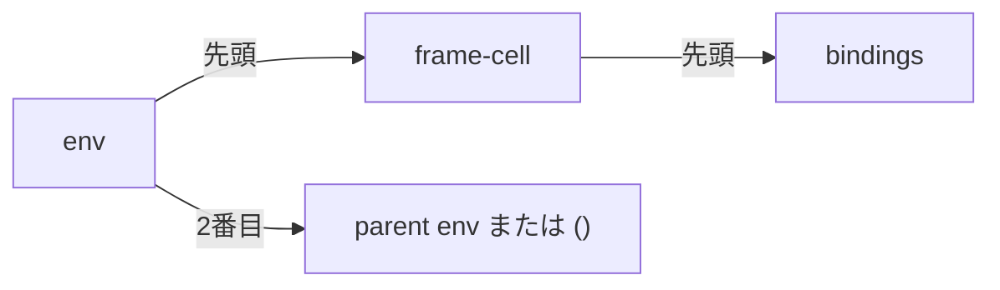

<div class="eyebrow">SOFTWARE DESIGN 2026 / 12</div>

# セルフホスティングの機能

## 評価器をLispで表す

<p>情報システム学科 3年・選択・2単位</p>

---

# 今日の到達目標

- 評価器が必要とする操作を列挙できる
- 対象言語の環境とホスト環境を区別できる
- Lisp製評価器の最小例を動かして拡張できる

---

# 前回との接続

ファイル、リスト、関数を使えるようになりました。

今度は評価器自身をLispのプログラムとして書きます。

足りない操作を、具体的な式から見つけます。

---

# 対象言語とホスト

ホスト言語は評価器を動かす言語です。

対象言語は評価器が処理する言語です。

両方がLispでも、それぞれ別の環境と評価段階を持ちます。

---

# 当日実装と、後続の設計

| 区分 | この回で扱う範囲 |
| --- | --- |
| 当日実装 | 数値、二項四則、quote、ifの最小meta |
| 契約を設計 | 名前検索・定義、対象の関数と環境 |
| 後続へ接続 | 第13回で説明、第14回で対象関数とREPL |

ホストにlambdaがあっても、対象のlambdaが実装済みとは限りません。

当日実装の受入例を通し、自作版の未対応機能を明記してください。

---

# 機能と用途

<table><thead><tr><th>ホスト側の機能</th><th>評価器での用途</th></tr></thead><tbody><tr><td>型の判定</td><td>数値・記号・リストの分類</td></tr><tr><td>リスト操作</td><td>式の分解</td></tr><tr><td>再帰関数</td><td>式と環境の探索</td></tr><tr><td>入出力</td><td>結果と診断の表示</td></tr></tbody></table>

---

# 当日の型判定

| 対象の入力 | 最小metaの処理 |
| --- | --- |
| 数値 | そのまま返す |
| 記号 | 未対応の名前として診断 |
| リスト | quote・if・算術の先頭を調べる |

第12回参照では、真偽値と文字列も自己評価されます。

対象の名前を探す環境は、契約を決めて第14回へつなぎます。

---

# 評価器の入力

入力には文字列と、読取済みのS式の2種類があります。

Lisp製評価器の中心にはS式を渡します。

文字列をS式にする入口は別に用意します。

---

# 数値の受入例

```lisp
(define number-eval
  (lambda (expr)
    (if (number? expr) expr
        (error "expected number"))))
(number-eval 7)
```

説明用の最小例です。未定義記号を黙って返しません。

---

# quoteの受入例

対象式 `(quote (+ 1 2))` の結果はリスト `(+ 1 2)` です。

対象式をホストに渡すときにも引用が必要になります。

どの層が引用を処理するかを図に書いてください。

---

# 二重quoteを渡すホストの呼出し

```lisp
(m-eval (quote (quote (+ 1 2))) (m-global) 0)
```

evaluator.lispをロードしたホストで呼ぶ例です。

ホストは外側のquoteを処理し、対象式をデータとして渡します。

m-globalはこの回では`()`です。envはまだ名前検索に使いません。

---

# データは各層でどう変わるか

| 処理する層 | 入力・データ | 得る値 |
| --- | --- | --- |
| ホストのquote | `(quote (quote (+ 1 2)))` | `(quote (+ 1 2))` |
| 対象のm-eval | `(quote (+ 1 2))` | `(+ 1 2)` |
| 結果の表示 | リスト値`(+ 1 2)` | `(+ 1 2)`と表示 |

最後の値をもう一度評価しません。結果は3ではありません。

3を得るには、そのリストを別の評価呼出しに渡します。

---

# 対象のquoteを分解する途中値

対象評価器へ届いたexprは`(quote (+ 1 2))`です。

| 操作 | 取り出すデータ |
| --- | --- |
| `(car expr)` | 記号quote |
| `(cdr expr)` | `((+ 1 2))`という引数リスト |
| `(car (cdr expr))` | `(+ 1 2)`という値 |

quote分岐は引数1個を確認し、その値をそのまま返します。

算術分岐へ再帰しないので、内部の+はまだ適用しません。

---

# ifの受入例

対象式 `(if #f (/ 1 0) 7)` は `7` を返します。

ホストで条件を評価してしまうと、対象環境の名前を扱えません。

条件も対象評価器へ渡します。

---

# 算術は引数の内側から評価する

対象式は`(+ 1 (* 2 3))`です。

| 途中の処理 | 得る値・データ |
| --- | --- |
| 先頭+を確認 | 許可したホストprimitiveを取得 |
| 引数1と内側の`(* 2 3)`を評価 | 1と6 |
| 外側の引数値をそろえる | リスト`(1 6)` |
| primitiveへ値を適用 | 7 |

引数の評価順序はLisp側が決め、算術だけをホストへ委譲します。

---

# 第12回で委譲する組込み

対象の算術名は`+ - * /`だけを認めます。

先頭の記号を確認し、primitiveと引数値をホストのapplyへ渡します。

`quote`と`if`の評価規則は、Lisp側の分岐で実装します。

未知の演算子を、ホスト環境へ黙って渡しません。

---

# 完成参照の実演

```sh
cd examples/12-meta-evaluator
python3 lisp.py --meta --eval "(+ 1 (* 2 3))"
```

`evaluator.lisp` の `m-eval` が計算し、結果は `7` になります。

第12回の対象機能は数値・四則・引用・分岐が中心です。

---

# 当日の実装チェックポイント

| 順序 | 確かめる対象の例 |
| --- | --- |
| 1 数値 | `7`をそのまま返す |
| 2 quote | `(quote (+ 1 2))`がリストを返す |
| 3 二項四則 | 入れ子の`(+ 1 (* 2 3))`が7 |
| 4 if | 非選択枝の0除算を評価せず7 |

名前と対象関数は、ここへ同時に追加せず契約設計へ進みます。

正常例だけでなく、未対応名・演算子・型の違いを調べてください。

---

# 環境をデータにする：後続の設計

```lisp
(quote ((x 3) (y 4)))
```

名前と値の組を並べた、bindingsの説明例です。

この表現だけでは、親環境や更新の共有方法はまだ決まりません。

第12回のm-globalは空です。以下は第14回へ向けた契約設計です。

---

# 第14回参照の環境へつなぐ

| 段階 | データの役割 |
| --- | --- |
| bindings | `((x 3) (y 4))` |
| frame-cell | bindingsを包む、共有できる1要素リスト |
| env | `(frame-cell parent)`、親がなければ`()` |

後続の環境表現を読むための表です。第12回のenvはまだ空です。

---

# 束縛表を参照する道筋



後続のm-bindingsは、envの先頭の先頭を読みます。

```lisp
(m-bindings env)
(car (car env))
```

どちらも同じbindingsを得ます。parentは別に保持します。

---

# 環境の操作を契約にする

| 操作の契約 | 第14回参照の対応 |
| --- | --- |
| 名前とenvから値を探す | m-lookup、親も探索 |
| 名前・値・envを定義する | m-define、フレームを更新 |
| 呼出し用の子環境を作る | m-new-envとm-bind |

内部表現を操作の中に隠し、評価器の分岐から呼びます。

第12回は契約と反例を設計する段階です。対象関数の完成は後続の回で扱います。

---

# ホストの名前と対象の名前

ホストのexprやenvは、Lisp製評価器の実装変数です。

対象の`(define x 3)`は、別の対象環境へ束縛を作る設計です。

対象のxを、ホストの辞書からそのまま探しません。

同じ名前でも、どちらの環境を検索するかを図に書いてください。

---

# 通常の関数適用：後続の設計

対象の先頭式を評価して、対象の関数値を得ます。

対象の引数式を評価し、得た値を適用処理へ渡します。

対象関数なら、新しい環境でその本文を評価します。

第12回の算術分岐から、第14回の対象関数へ広げる契約です。

---

# evalとapply：後続の設計


式の規則と、関数の規則を分けます。

---

# 対象のクロージャ：第14回へ

対象関数にも、仮引数、本文、定義時環境が必要です。

ホストの `lambda` と対象の `lambda` を区別して表します。

対象関数を呼ぶとき、その環境を拡張します。

---

# 保存と共有：第14回へ

再帰関数は、自身の定義を後から環境で見つける必要があります。

環境を単なるコピーにするか、共有するかで振る舞いが変わります。

`fact` を受入例にして判断します。

---

# 開発順序は、回ごとに分ける

| 回・段階 | 開発と説明の焦点 |
| --- | --- |
| 第12回の当日実装 | 数値・quote・二項四則・if |
| 第12回の契約設計 | 名前・環境・対象関数の入力と失敗 |
| 第13回の理解確認 | 自作最小metaと完成参照を区別して議論 |
| 第14回の統合 | 対象の名前・関数、Lisp製REPL |

各段階の達成と未対応を記録し、完成参照の観察と混同しないでください。

---

# 演習1 機能契約

必要な操作を1個選び、入力・出力・失敗条件を書いてください。

その契約を使う対象式を示してください。

便利だから追加する、という説明だけでは足りません。

---

# 演習2 最小評価器

数値と二項加算が通る入口を作ってください。

次に未定義名と未知の演算子を試してください。

どの機能をまだ扱えないか明記してください。

---

# 演習3 段階拡張

対象の `if` を追加し、非選択枝のゼロ除算を避けてください。

名前と関数の契約を設計し、第13回の理解確認を経て第14回で統合します。

ホスト環境との混同を検出してください。

---

# 確認問い

なぜホストの評価関数へ対象式を渡すだけでは不十分か。

組込みを委譲するとき、Lispで実装した範囲をどう説明するか。

---

# 解答 Lisp製評価器の担当

```lisp
(if #f (/ 1 0) (+ 1 (* 2 3)))
```

第12回の最小metaでも結果は `7` です。非選択枝のゼロ除算は起こりません。

Lisp側が `quote`、`if` の評価規則と引数の再帰評価を決めます。
算術primitiveへは、評価済みの数値を渡します。

対象式全体をホスト評価器へ渡すだけの案では、これらの意味を自分のLisp評価器で実装したことになりません。

---

# 実装の境界

現段階はPython製Lispホスト上で動くLisp製評価器です。

読取・数値表現・OS入出力などのホストへの依存が残ります。

ネイティブ起動や独立ブートストラップの達成とは区別して報告してください。

---

# まとめと次回

数値・四則・quote・ifを、Lisp製の最小評価器で扱いました。

名前・環境・対象関数は契約を設計し、第14回へつなぎます。

次回は自作版と完成参照を区別し、予測と反例で理解を確認します。

---

# 参考

- 本教材: `examples/12-meta-evaluator/`
- SICP [メタ循環評価器](https://sicp.sourceacademy.org/chapters/4.1.html)
- [The Scheme Programming Language](https://www.scheme.com/tspl4/)

参照資料と教材方言の機能差は仕様書で確認してください。
