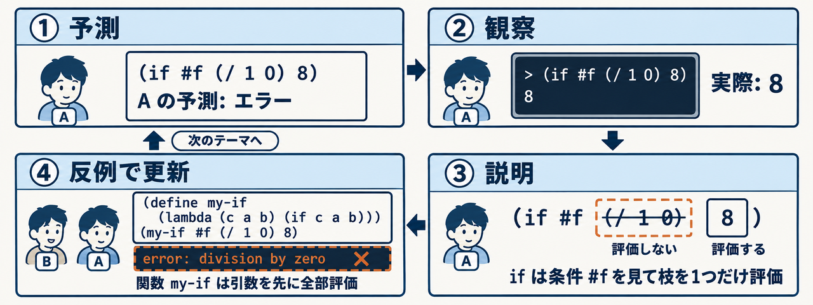
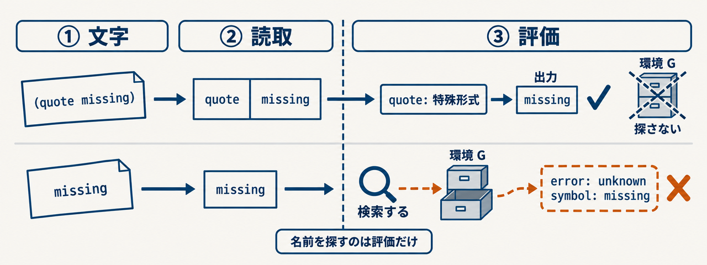

<LearningStylesCourse />


<div class="eyebrow">SOFTWARE DESIGN 2026 / 13</div>

# 理解確認と議論

## 実行の理由を説明する

<p>情報システム学科 3年・選択・2単位</p>
---
class: learning-course
---


# 今日の到達目標

- 実行前に結果と理由を予測できる
- 環境と評価順序を図で説明できる
- 他者の説明を反例で確かめられる
---
class: learning-course
---


# 前回との接続

Lispで書いた評価器を段階的に開発しました。

今日は新機能よりも、動く理由の説明を確かめます。

自分の実装と参照実装の違いも議論の材料になります。

引用と `#f` の分岐は自作の最小評価器で、比較を含む分岐と関数は対応ホストか完成参照で確かめます。
使う版を記録し、自作版の対応範囲と区別してください。
---
class: learning-course
---


# 議論の進め方

個人で予測を書いてから、ペアで理由を比較します。

コードを実行し、予測との違いを調べます。

説明を修正し、その説明を崩せる入力を探します。

授業内は2〜3のテーマを選び、この流れを最後まで行います。残る問いは予復習で検討します。
---
class: learning-course diagram-page
---

<LearningStylesCourse />

# 1つの式で回す議論



if は条件を見て枝を1つだけ評価し、通常の関数として定義した my-if は引数 (/ 1 0) を先に評価して失敗します<br>
(examples/13-language-review/lisp.py で確認)。

---
class: learning-course
---


# 証拠の持ち寄り

各自、成功例1個と説明しづらい例1個を持ち寄ってください。

入力、期待、実際、関連コードを分けて示してください。

他者が再実行できるコマンドを添えてください。
---
class: learning-course
---


# 予測1 引用

```lisp
(quote (+ 2 3))
(+ 2 3)
```

各結果を実行せずに書いてください。

どの名前を検索するかも説明してください。
---
class: learning-course
---


# 議論1 評価の停止

相手の説明に、引用された未定義名を加えてください。

`(quote missing)` は成功するだろうか。

成功する理由を、読取と評価の区別で説明してください。
---
class: learning-course diagram-page
---

<LearningStylesCourse />

# 読取は名前を探さない



quote は読み取ったデータをそのまま返し、環境 G を探しません。<br>
裸の missing だけが評価で検索され、unknown symbol になります。

---
class: learning-course
---


# 予測2 分岐

```lisp
(if #f (/ 1 0) 8)
(if (= 1 1) 9 missing)
```

結果だけでなく、評価しない部分に印を付けてください。
---
class: learning-course
---


# 議論2 ifの実装

通常の関数と同じ方法で `if` を実装できるか。

相手の案を、非選択枝のゼロ除算で確かめてください。

「特殊形式」の説明を自分の言葉に直してください。

if を通常の関数にした案で、`(if #f (/ 1 0) 8)` がどこで失敗するか予想してください。

---
class: learning-course diagram-page
---

# 特殊形式と関数の評価順

関数は引数を全部先に評価し、特殊形式 if は条件を見てから枝を1つ評価します。

<Figure13 :index="0" />

<div class="course-check">別入力: <code>(define my-if (lambda (c a b) (if c a b)))</code> の後、<code>(my-if #f (/ 1 0) 8)</code> を予想して実行します。</div>
---
class: learning-course
---


# 予測3 クロージャ

```lisp
(define make-adder
  (lambda (x) (lambda (y) (+ x y))))
(define plus2 (make-adder 2))
(plus2 7)
```

`x` がどこに残るかを図にしてください。
---
class: learning-course
---


# 議論3 環境の寿命

`make-adder` の呼出しが終わった後、なぜ `x` を使えるか。

保存する環境が呼出し元の環境だった場合の反例を提案してください。

ペアで異なる値の加算器を作って検証してください。

`(begin (define x 10) (define f (lambda (y) (+ x y))) ((lambda (x) (f 1)) 99))` の値を予想してください。

---
class: learning-course diagram-page
---

# f の外側は G、呼出し元ではない

f は定義時の G を保存するので、呼出し元 E99 の x=99 は見えません。

<Figure13 :index="1" />

<div class="course-check">別入力: <code>(define x 10)</code> を <code>(define x 20)</code> に変えた値を予想し、ホストと <code>--meta</code> で確かめます。</div>
---
class: learning-course
---


# 予測4 名前の隠蔽

```lisp
(define x 100)
(define f (lambda (x) (+ x 1)))
(f 4)
x
```

各名前検索が到達する環境を記入してください。
---
class: learning-course
---


# 議論4 共有と分離

すべての関数呼出しで同じ辞書を使う案を検討してください。

どの式で外側の `x` を壊してしまうか。

実行前に予測し、検証後に説明を更新してください。
---
class: learning-course
---


# 追跡の観察

```sh
cd examples/13-language-review
python3 lisp.py --trace --meta --eval "(+ 1 (* 2 3))"
```

結果は `7` です。標準エラーの `[host depth=N]` と
`[meta depth=N]` で評価の層を区別します。

出力された順序と、自分の木を照合してください。
---
class: learning-course
---


# 議論5 追跡の限界

追跡ログに名前が出ても、その環境の中身が分かるとは限りません。

不足する証拠を1つ挙げ、追加する方法を考えてください。

ログの量と読みやすさも比較してください。

`--trace --meta` の meta 行に、`(* 2 3)` の結果 6 が現れるか予想してください。

---
class: learning-course diagram-page
---

# meta ログが示すもの

meta 行は m-eval に入った式と深さだけで、戻り値や環境は出ません。

<Figure13 :index="2" />

<div class="course-check">別入力: <code>((lambda (x) (+ x 1)) 4)</code> の meta 行を depth 付きで予想し、標準エラーと照合します。</div>
---
class: learning-course
---


# 予測5 二重の評価

ホストが引用された対象式を読み、その後Lisp製評価器が処理します。

どの層で `quote` が1つ外れるか、順に書いてください。

対象の記号をホストが先に検索する誤りを説明してください。
---
class: learning-course
---


# 議論6 セルフホスティング

Lisp製評価器のどの処理が、まだPythonホストへ依存するか。

対象の `eval`、読取、入出力を別々に確かめてください。

達成したことを、実行コマンドで裏付けてください。
---
class: learning-course
---


# 相互質問の準備

自分が説明できる箇所から、問いを1個作ってください。

正答を当てる問いに加え、理由を追う追質問を用意してください。

相手のコードを無断で変更せず、小さな入力で確かめてください。
---
class: learning-course
---


# 設計レビュー

相手の評価器から、変更が複数箇所へ広がる機能を探してください。

環境操作を1箇所にまとめる案を説明してください。

変更前後で同じ受入例が通るか検討してください。
---
class: learning-course
---


# 不具合の切り分け

「構文が読めない」「名前がない」「適用できない」を分類します。

自分の不具合を分類し、最小の再現入力へ縮めてください。

ペアは別の分類にならないか問い直してください。
---
class: learning-course
---


# AI回答の検討

AIへ同じ実装の説明を求めてください。

説明中の環境・評価順序を、実行ログと比較してください。

誤った箇所があれば、反例を示して修正してください。
---
class: learning-course
---


# 理解の記録

最初の予測、観察した事実、修正後の説明を残してください。

未解決の問いに、次の検証入力を添えてください。

動作成功だけで理解したと判断しないでください。
---
class: learning-course
---


# 到達の確認

初めて見る小さな式を説明できるか。

異なる実装の誤りを検出する反例を作れるか。

相手の指摘を受け、自分の説明を更新できるか。
---
class: learning-course
---


# まとめと次回

議論で曖昧な環境や評価順序を特定しました。

次回はその理解を使ってLisp製評価器とREPLを仕上げます。

未解決の点を開発順序に反映してください。
---
class: learning-course
---


# 参考

- 本教材: `examples/13-language-review/`
- 第10〜12回の演習ログと仕様
- SICP [評価器](https://sicp.sourceacademy.org/chapters/4.1.html)

今日の主資料は、自分と相手の実行結果です。
