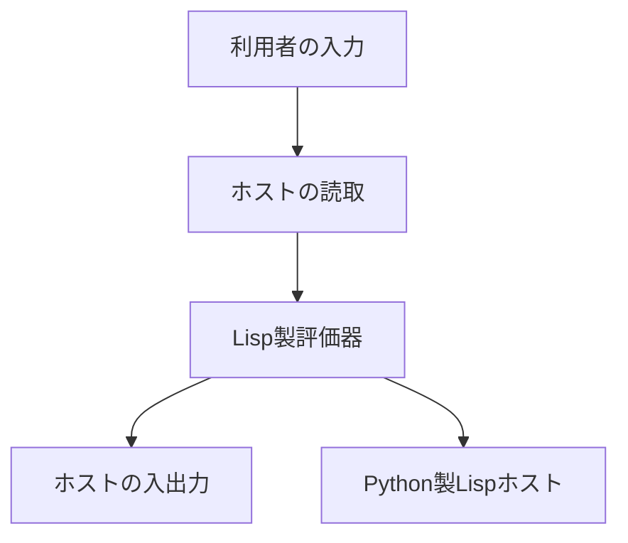

<div class="eyebrow">SOFTWARE DESIGN 2026 / 14</div>

# Lisp製評価器とREPL

## 自作言語の上で自作言語を動かす

<p>情報システム学科 3年・選択・2単位</p>

---

# 今日の到達目標

- Lisp製評価器で対象の関数を評価できる
- LispでREPLの循環を実装できる
- ホストへの委譲範囲と実行証拠を説明できる

---

# 前回との接続

議論で、名前の探索先と特殊形式の評価順序を確かめた。

今日は対象関数とREPLを統合する。

理解が曖昧だった例を回帰検証に使う。

---

# 本日の実行構成



Lispの評価器とREPLがPython製ホスト上で動く。

---

# 完成参照の起動

```sh
python3 examples/14-selfhosting/lisp.py --selfhost-repl
```

起動後、対象のLisp式を1行にして入力する。

ホスト側の無引数REPLとは、評価する層が異なる。

---

# 入口の切替

ホストのREPLはホスト評価器を呼ぶ。

Lisp製REPLは、読取済みの式をLisp製評価器へ渡す。

同じ入力結果でも、呼び出す評価器をログで区別する。

---

# 対象式の分類

数値・文字列・真偽値、記号、リストを分類する。

リストは特殊形式を先に判断する。

残りを通常の呼出しとして処理する。

---

# quoteの統合

対象の `(quote (1 2))` はデータを返す。

ホストはすでに入力をS式へ読んでいる。

対象式の内部をホストで先に評価しない。

---

# 対象の定義

対象の `define` は対象環境に値を登録する。

次の入力でも対象環境を保持する。

REPLを繰り返すたびに初期化すると、定義が消える。

---

# 対象の関数

```lisp
(define square
  (lambda (x) (* x x)))
(square 6)
```

Lisp製REPLで実行し、結果 `36` を確認する。

---

# クロージャの構造

```lisp
(list 'closure (car args) (cdr args) env)
```

参照 `m-eval` の関数値を作る断片。
仮引数、本文、定義時環境をタグと一緒に保存する。

---

# 対象の適用

引数を対象評価器で評価してから、仮引数へ束縛する。

クロージャの保存環境を外側にした新しい環境で本文を評価する。

引数個数の不一致は束縛前に診断する。

---

# 対象の再帰

```lisp
(define fact
  (lambda (n)
    (if (= n 0) 1
        (* n (fact (- n 1))))))
(fact 4)
```

結果は `24`。対象の環境で `fact` を検索する。

---

# クロージャの検証

```lisp
(define make-adder
  (lambda (x) (lambda (y) (+ x y))))
(define add5 (make-adder 5))
(add5 3)
```

`8` を確認し、定義時環境の保持を説明する。

---

# REPLの状態

循環をまたいで保持するのは対象環境。

1回の入力に属する式、値、エラーは次の入力へ持ち越さない。

状態の寿命を分けて設計する。

---

# 読取の委譲

```lisp
(m-sequence (read-all line) env 0)
```

参照 `m-repl` の断片。`read-all` はPythonの読取器へ委譲。
対象の実行順序は `m-sequence`、式の意味は `m-eval` が決める。

---

# 入出力の委譲

`read-line`、`display`、`newline`、`guard` をホストへ委譲する。

Lisp側は循環と継続条件を決め、反復にはホストの `while` を使う。

OSへ直接アクセスする実装とは区別する。

---

# 終了条件

EOFでは次の入力が無いので終了する。

`:quit` でも終了できる入口を使う。

正常な終了を、構文や評価の失敗と分ける。

---

# エラーと循環

未定義名やゼロ除算を報告し、次の入力を受ける。

エラー処理にはホストの保護機能を利用する。

失敗後に対象環境を保持できるかも確認する。

---

# 一連の受入例

```lisp
(define x 5)
(+ x 2)
(/ 1 0)
(+ x 3)
```

`7`、診断、`8` を順に観察する。

エラーを挟んでも定義と循環が残る。

---

# 実行証拠

ホスト起動コマンド、入力、結果を1つのログへまとめる。

Lisp製評価器の呼出し箇所も示す。

同じ結果が出るだけでは、どの評価器が動いたか分からない。

---

# 段階演習1 評価器

第12回の最小評価器へ対象の `lambda` と適用を加える。

`(square 6)` を通し、引数個数の反例を残す。

---

# 段階演習2 環境

`make-adder` と `fact` を通す。

呼出しごとの環境と、共有する外側環境を図にする。

第13回の反例を再実行する。

---

# 段階演習3 REPL

読取、対象評価、表示の循環をLispで実装する。

定義の継続、エラー後の回復、EOF終了を検証する。

参照版との違いと未対応機能を記録する。

---

# 確認問い

ホストに依存する部分を1つ取り除くなら、何が必要か。

対象環境とホスト環境の両方に `x` があるとき、どちらを検索するか。

---

# 達成範囲の報告

「Python製Lispホスト上で、Lisp製評価器とREPLを実行した」と報告する。

対応構文と委譲する組込み操作を添える。

ネイティブ実行や独立ブートストラップは、本教材の達成範囲に含めない。

---

# 改善の優先順位

まず意味の正しさと回復を確認する。

その後、診断の位置や追跡の読みやすさを改善する。

新しい機能は、受入例を先に書いてから追加する。

---

# まとめと次回

Lispのデータと関数で対象の評価規則を表した。

REPLを通して、継続する環境とホスト境界を確かめた。

次回は実装を講評し、設計の学びを総括する。

---

# 参考

- 本教材: `examples/14-selfhosting/`
- 第12〜13回の機能契約と議論記録
- SICP [メタ循環評価器](https://sicp.sourceacademy.org/chapters/4.1.html)
