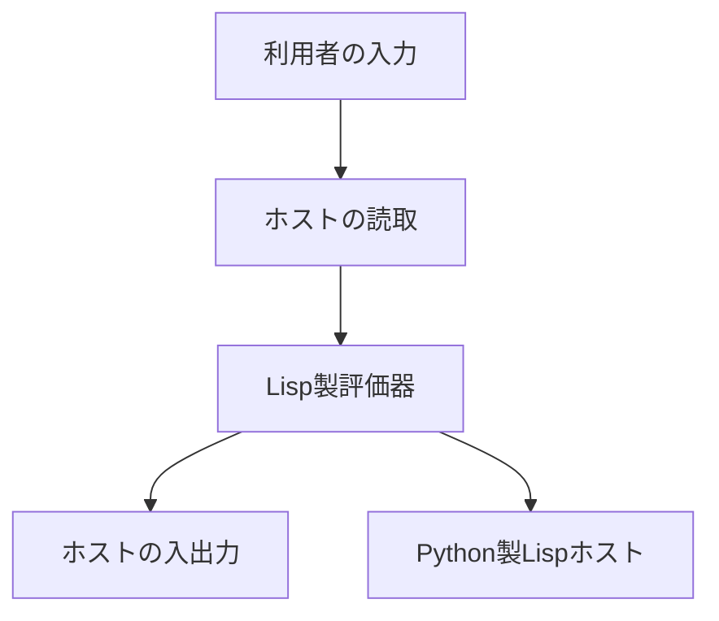
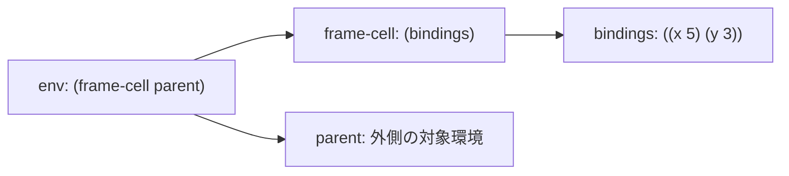
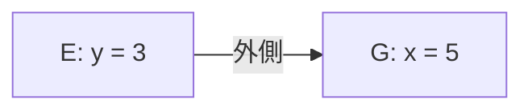
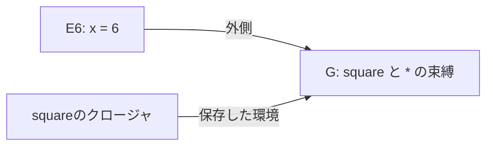

<div class="eyebrow">SOFTWARE DESIGN 2026 / 14</div>

# Lisp製評価器とREPL

## 自作言語の上で自作言語を動かす

<p>情報システム学科 3年・選択・2単位</p>

---

# 今日の到達目標

- Lisp製評価器で対象の関数を評価できる
- LispでREPLの循環を実装できる
- ホストへの委譲範囲と実行証拠を説明できる

---

# 前回からの開始状態

第12回は数値・四則・引用・分岐の最小評価器でした。

第13回は予測と討論でした。対象の名前や関数が全員完成済みとは限りません。

今日は開始時点を確かめてから、対象評価器とREPLを接続します。

---

# 開始チェック

<table>
<thead><tr><th>確かめる対象</th><th>入力と期待</th></tr></thead>
<tbody><tr><td>Pythonホスト</td><td>自作Lispスクリプトを実行できる</td></tr><tr><td>自作の最小評価器</td><td>数値42、算術7、引用、選択枝のみのif</td></tr><tr><td>完成参照</td><td><code>--meta --eval</code> で算術7</td></tr></tbody>
</table>

成功した機能と未対応機能を分けて、作業を始めてください。

---

# 今日の中心

対象の関数が値を返す過程を追い、REPLへ接続します。

当日は `square 6` と、定義を保つ正常・失敗・正常を中心に確かめます。

以下は授業内の進め方です。提出課題の仕様は、この進め方では変わりません。

---

# 作業の経路

<table>
<thead><tr><th>開始時点</th><th>授業内の進め方</th></tr></thead>
<tbody><tr><td>名前・関数まで動く自作評価器</td><td>既存の受入例を確認し、REPL統合へ</td></tr><tr><td>最小評価器まで動く</td><td>完成参照で不足部分を追い、作業用コピーで接続</td></tr></tbody>
</table>

未完の実装は継続して仕上げてください。参照を使った範囲と本人の変更を記録してください。

---

# 本日の実行構成



Lispの評価器とREPLがPython製ホスト上で動きます。

---

# 評価器だけの起動

```sh
python3 examples/14-selfhosting/lisp.py --meta --eval "(+ 1 (* 2 3))"
```

結果は `7` です。入力を読んだ後、`evaluator.lisp` の `m-eval` を呼びます。

まずREPLの循環を含めず、式の評価を確かめます。

---

# 最小版からの差分

<table>
<thead><tr><th>段階</th><th>追加する仕事</th></tr></thead>
<tbody><tr><td>名前・define</td><td>対象環境で検索し、束縛を登録</td></tr><tr><td>lambda</td><td>仮引数・本文・定義時環境を保存</td></tr><tr><td>apply</td><td>引数値で新しい環境を作り、本文を評価</td></tr><tr><td>REPL</td><td>同じ対象環境を次の入力へ渡す</td></tr></tbody>
</table>

読み取りと入出力のホスト依存は、引き続き明示してください。

---

# 対象式の分類

数値・文字列・真偽値、記号、リストを分類します。

リストは特殊形式を先に判断します。

残りを通常の呼出しとして処理します。

---

# 対象環境の形



参照版は束縛を入れたセルと外側への参照を持ちます。
環境の形式を、検索・定義・拡張の関数で隠します。

---

# 環境を作る操作

```lisp
(define m-new-env
  (lambda (parent) (list (list '()) parent)))
(define m-bindings
  (lambda (env) (car (car env))))
```

完成参照の定義の抜粋です。新しい環境は空の束縛と指定した外側を持ちます。

`m-bindings` は現在の環境の束縛を取り出します。

---

# 対象の名前検索



Eで `y` を探すと `3` です。Eにない `x` はGで見つかり、`5` になります。

どこにもない名前は診断します。ホスト環境からは探しません。

---

# 対象の定義

```lisp
(m-define (car args)
  (m-eval (m-second args) env (+ depth 1))
  env)
```

`define` 分岐の登録処理の抜粋です。右辺を対象評価器で評価してから登録します。
対象の `(define x (+ 2 3))` は、現在の対象環境に `x = 5` を置きます。

---

# 定義と共有セル

クロージャは、作成時の対象環境への参照を保存します。

`m-define` は共有するframe-cellの束縛を更新します。

同じ環境を参照する関数は、後から登録した自分の名前も検索できます。

---

# 対象のsquare

```lisp
(define square
  (lambda (x) (* x x)))
(square 6)
```

対象大域環境Gで定義し、Lisp製評価器で呼び出します。
改行は表示用です。REPLへは各定義を1行にして入力してください。

---

# クロージャの内容

<table>
<thead><tr><th>要素</th><th>squareの保存内容</th></tr></thead>
<tbody><tr><td>タグ</td><td><code>closure</code></td></tr><tr><td>仮引数</td><td><code>(x)</code></td></tr><tr><td>本文の列</td><td><code>((* x x))</code></td></tr><tr><td>定義時環境</td><td>対象大域環境Gへの参照</td></tr></tbody>
</table>

本文が1式でも、参照版は本文の列として保存します。

---

# クロージャの生成

```lisp
(list 'closure (car args) (cdr args) env)
```

`lambda` 分岐の生成処理の抜粋です。本文はここでは評価しません。

`env` はホストの環境でなく、`m-eval` の引数である対象環境です。

---

# 適用前の値

<table>
<thead><tr><th>処理</th><th>対象式 <code>(square 6)</code></th></tr></thead>
<tbody><tr><td>先頭の評価</td><td>名前squareを検索し、クロージャを得る</td></tr><tr><td>引数の評価</td><td>数値6を評価し、引数値の列 <code>(6)</code> を得る</td></tr><tr><td>個数の確認</td><td>仮引数 <code>(x)</code> と引数値 <code>(6)</code> は各1個</td></tr></tbody>
</table>

`m-apply` に渡すのは、関数の値と評価済みの引数値です。

---

# 新しい対象環境



Gを外側に持つE6を作り、`x = 6` を束縛します。
関数を呼び出した場所の環境へ付け替えません。

---

# 適用の実装

```lisp
(m-sequence (m-third function)
  (m-bind (m-second function) values
    (m-new-env (m-fourth function)))
  (+ depth 1))
```

クロージャ適用の本文部分の抜粋です。保存環境の子を作り、仮引数を束縛します。
その環境で本文の列を評価します。

---

# 本文と戻り値

<table>
<thead><tr><th>処理</th><th>結果</th></tr></thead>
<tbody><tr><td>E6で <code>(* x x)</code> を評価</td><td><code>*</code> はG、2個の <code>x</code> はE6で検索</td></tr><tr><td>組込みへ引数値を渡す</td><td><code>6</code> と <code>6</code> を乗算</td></tr><tr><td>適用が呼出し元へ返る</td><td><code>36</code></td></tr></tbody>
</table>

E6の引数束縛は、Gの束縛を書き換えません。

---

# 評価器のチェックポイント

`square 6 = 36` を通してから、個数違いの反例を試してください。

`make-adder` では保存環境、`fact` では自己参照と復帰を確認してください。

失敗した段階を直してからREPLへ進んでください。確認には演習の受入例を使います。

---

# クロージャの検証

```lisp
(define make-adder
  (lambda (x) (lambda (y) (+ x y))))
(define add5 (make-adder 5))
(add5 3)
```

`8` を確認し、定義時環境の保持を説明してください。

---

# 対象の再帰

```lisp
(define fact
  (lambda (n)
    (if (= n 0) 1
        (* n (fact (- n 1))))))
(fact 4)
```

結果は `24` です。各呼出しは別の `n` を持ち、外側には同じ `fact` の定義があります。
下降と復帰は第10回の `fact 2` の表で確認してください。

---

# REPLへ渡す状態


同じ対象環境を各入力へ渡します。
入力のたびに `m-global` を呼ぶと、前の定義が消えます。

---

# 循環の順序

<table>
<thead><tr><th>順序</th><th>処理</th></tr></thead>
<tbody><tr><td>入力</td><td><code>read-line</code> で1行を読む</td></tr><tr><td>終了判定</td><td>EOFまたは単独の <code>:quit</code> なら終了</td></tr><tr><td>保護した処理</td><td>読取・対象評価・結果表示を <code>guard</code> で保護</td></tr><tr><td>次の入力</td><td>診断後も同じ対象環境で続ける</td></tr></tbody>
</table>

反復機構はホストの `while` を使います。

---

# 読取と対象評価

```lisp
(m-sequence (read-all line) env 0)
```

`read-all` はPython側の字句・構文解析へ委譲します。

式の列の実行順序は `m-sequence`、式の意味は `m-eval` が決めます。

---

# guardの範囲

```lisp
(define outcome
  (guard (lambda ()
    (display (m-sequence (read-all line) env 0))
    (newline)
    #t)))
```

参照 `m-repl` の抜粋です。読取・評価だけでなく表示も保護します。
成功なら先頭が `#t`、失敗なら `#f` と診断を含む値を得ます。

---

# 正常・失敗・正常

<table>
<thead><tr><th>入力</th><th>出力</th><th>次の入力の環境</th></tr></thead>
<tbody><tr><td><code>(define x 5)</code></td><td><code>x</code></td><td>x = 5</td></tr><tr><td><code>(+ x 2)</code></td><td><code>7</code></td><td>x = 5</td></tr><tr><td><code>(/ 1 0)</code></td><td>ゼロ除算の診断</td><td>x = 5</td></tr><tr><td><code>(+ x 3)</code></td><td><code>8</code></td><td>x = 5</td></tr></tbody>
</table>

失敗は入力単位です。既に登録した束縛は取り消しません。

---

# Lisp製REPLの起動

```sh
python3 examples/14-selfhosting/lisp.py --selfhost-repl
```

同じセッションで前の4入力を試し、`:quit` またはEOFで終了してください。

無引数の `lisp.py` はホストのREPLです。入口を区別してください。

---

# REPLのチェックポイント

定義の継続、エラー後の回復、終了を1つのログで確認してください。

対象関数が動いた後に循環へ接続し、問題の段階を切り分けてください。

実装途中なら、最後に通った地点と次の修正を記録してください。

---

# 本人の変更と証拠

自作した関数、参照を利用した関数、変更箇所を対応付けてください。

同じ結果だけでなく、`m-eval` と `m-apply` の処理を図で説明してください。

補足 `checkpoints.py` は観察用です。提出条件には含みません。

---

# 段階演習1 対象環境

自分の開始状態で、名前検索と `define` を確認してください。

`square` のクロージャとE6を追い、`36` を返す箇所を示してください。

未対応なら完成参照で観察し、自作版の差分を特定してください。

---

# 段階演習2 クロージャ

`make-adder` と `fact` を演習の受入例で確認してください。

対象の保存環境と呼出し環境を図にしてください。

未完の機能は、当日の確認結果を使って継続して実装してください。

---

# 段階演習3 統合

読取・対象評価・表示を循環へ接続してください。

演習の受入例で定義の継続、回復、終了を検証してください。

進め方の分岐は提出仕様を変えません。本人の変更範囲を明記してください。

---

# 確認問い

ホストに依存する部分を1つ取り除くなら、何が必要か。

対象環境とホスト環境の両方に `x` があるとき、どちらを検索するか。

---

# 解答 対象の探索先

ホストに `x = 100` がある場合も、対象の名前は対象環境で探します。

<table><thead><tr><th>対象環境</th><th>対象式 <code>x</code> の結果</th></tr></thead><tbody><tr><td><code>x = 5</code> を登録済み</td><td><code>5</code></td></tr><tr><td><code>x</code> が未定義</td><td>未定義名の診断</td></tr></tbody></table>

未定義ならホストへ検索を戻す反例では、内部の `100` が対象へ漏れます。
対象の束縛と、評価器自身の束縛を分けます。

---

# 解答 読取器の移植

```text
入力文字列: "(+ 1 2)"
トークン列: (  +  1  2  )
読取結果: 入れ子を表せるS式
```

読取をLispへ移すなら、文字列の字句解析とS式構築を実装します。
関数名を `read` に変えるだけでは、この処理は移りません。

キーボード入力やEOF取得は別の仕事です。OS入力支援の委譲方法も決めます。

---

# 達成範囲の報告

Python製Lispホスト上で、Lisp製評価器とREPLを実行したと報告してください。

読取、算術・リスト操作、入出力、`guard`、反復機構はホストへ依存します。

ネイティブ実行や独立ブートストラップは本教材の範囲に含めません。

---

# まとめと次回

Lispのデータと関数で対象の評価規則を表しました。

REPLを通して、継続する環境とホスト境界を確かめました。

次回は実装を講評し、設計の学びを総括します。

---

# 参考

- 本教材: `examples/14-selfhosting/`
- 補足観察: `checkpoints.py` と第10回の環境図
- [公開教員補足](../instructor/14.md)・[演習](../exercises/14.md)
- SICP [メタ循環評価器](https://sicp.sourceacademy.org/chapters/4.1.html)
